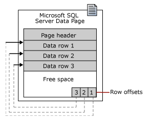
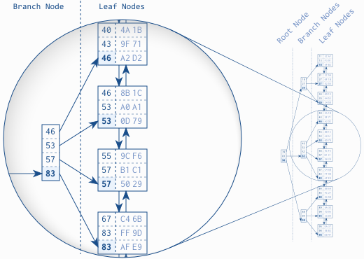

<a href="../../pkb.html">https://jtkovacs.github.io/pkb.html</a> \> <a href="https://jtkovacs.github.io/REFS/HTML/databases.html">https://jtkovacs.github.io/REFS/HTML/databases.html</a> \> 3967 words 
<table class="TOC"><tr><td>- [What is a database?](#what-is-a-database?)
	- [The database system lifecycle](#the-database-system-lifecycle)
	- [History of databases](#history-of-databases)
		- [ANSI-SPARC architecture](#ansi-sparc-architecture)
	- [Types of databases](#types-of-databases)
		- [The relational data model](#the-relational-data-model)
			- [Relationships between entities](#relationships-between-entities)
				- [Associative entities](#associative-entities)
				- [Superclasses and subclasses](#superclasses-and-subclasses)
			- [Types of attributes](#types-of-attributes)
			- [Relationships between attributes](#relationships-between-attributes)
				- [Functional dependencies and keys](#functional-dependencies-and-keys)
				- [Transitive dependencies](#transitive-dependencies)
				- [Multivalued dependencies](#multivalued-dependencies)
			- [Integrity](#integrity)
				- [Normalization](#normalization)
			- [Why not normalize?](#why-not-normalize?)
		- [NoSQL databases](#nosql-databases)
- [Database development](#database-development)
	- [Business requirements](#business-requirements)
	- [Design phases](#design-phases)
		- [Conceptual design](#conceptual-design)
		- [Logical design](#logical-design)
		- [Physical design](#physical-design)
			- [Indexing and performance](#indexing-and-performance)
				- [Why to index](#why-to-index)
				- [What to index](#what-to-index)
				- [How different types of indexes work](#how-different-types-of-indexes-work)
				- [Fragmentation](#fragmentation)
- [Database administration](#database-administration)
	- [Data and log files](#data-and-log-files)
	- [Transaction management](#transaction-management)
	- [Security](#security)
		- [Authentication](#authentication)
		- [Backup](#backup)
		- [Encryption](#encryption)
			- [Digital signatures](#digital-signatures)
- [Sources](#sources)
	- [Cited](#cited)
	- [References](#references)
	- [Read](#read)
	- [Unread](#unread)
</td></tr></table>

_These notes are heavily influenced by Dr. Simon Wu-Ping Wang's slides as well as Connolly and Begg (2015)._

# What is a database?

A **database** is a either (1) collection of data that's structured according to a **data model** (usually relational, as [discussed below;](#the-relational-data-model) see [notes on information structures](information-architecture.html#information-structures) for other major data models); or (2) this structured data plus a database management system (DBMS). 

A [DBMS](DBMS.html) is either a **database engine** for interacting with the database plus a **database frontend** for user interaction, per definition (1) above; or these two things plus a database, per definition (2) above. A DMBS may be desktop-based (Access, FileMaker Pro) or server-based (SQL Server, Oracle, DB2, MySQL, PostgreSQL). See [notes on typical DBMS functionality.](DBMS.html#core-functionality)

A **database system** is a database/DBMS plus database applications (any applications that source from or feed data to the database). This term denotes only the technical environment of a database; the full **database environment** encompasses hardware, software, data, procedures, and people.

## The database system lifecycle

<table>
<tr><th colspan="2">Requirements Analysis</th></tr>
<tr><th rowspan=3>Design</th><td>Conceptual</td></tr>
<tr><td>Logical</td></tr>
<tr><td>Physical</td></tr>
<tr><th rowspan="2">Development</th><td>Implementation</td></tr>
<tr><td>Testing</td></tr>
<tr><th rowspan="2">Administration</th><td>Rollout</td></tr>
<tr><td>Support</td></tr>
</table>

## History of databases

The first computerized information systems (IBM, c. 1950) imitated **hierarchical** paper filing systems. The more semantically powerful **graph** AKA network data model followed shortly thereafter (1960s, also IBM). In early systems, file and data formats were specific to an application or language; applications were specific to a department. This arrangement led to

- ***redundancy:*** the same data collected (\$\$) and stored (\$\$) by multiple departments;
- ***inconsistency:*** redundant data that *should be the same* is not updated consistently;
- ***inaccessibility:*** software developers were needed to write queries and integrate data across applications; no ad hoc queries or data processing.

Hierarchies and graphs were superseded by Edgar Codd's **relational** data model, proven in the 1970s and implemented in the 1980s. A relational database addresses the aforementioned problems because it is ***centralized*** (reducing redundancy, improving consistency, enabling data integration) and ***abstracted*** (available as a black box to interface with many different applications; offering an accessible language for ad hoc queries). It also:

- Scales to terabytes with excellent performance for processing transactions
- Is platform-independent due to ANSI standards, allowing transfer of code across different products
- Is comparatively cheap to purchase and maintain, and widely available
- Provides a [programming/query language](SQL.html) that is easy to learn and execute, expediting data retrieval
- Minimizes data redundancy, conserving storage and safeguarding data quality (although some redundancy is still required to establish relationships)
- Can capture complex relationships (important for enforcing business rules)
- [Preserves data integrity](#integrity)

**Object** databases introduced features like encapsulation and polymorphism c. 1990, but never became popular or standardized. With the advent of Big Data, [NoSQL databases](#NoSQL-databases) (an umbrella term for non-relational database with SQL-like interface) have become popular because they beat relational DBs at quick search; however, relational databases are still better at maintaining data integrity (via transaction management with ACID properties).

### ANSI-SPARC architecture

This is one way of thinking about database abstraction/separation, which, in general, makes the database easier to change and maintain by providing **data independence:**

- External views for different users (i.e., subsets and derivations of the data) are described by subschemas. Views are **logically independent** from the conceptual level.
- The structure of the entire database---all entities, attributes, relationships, and constraints---is described by a conceptual schema. This conceptual layer is **physically independent** from implementation details.
- Implementation details, including storage allocation, compression, and encryption, are described by an internal schema.

Then, the DBMS creates mappings (also called intensions; a realization of a schema is called the extension or state of the database) between schemas.

## Types of databases

### The relational data model

In a relational database, the data model is of **tables** AKA relations, which can be clustered tables or heaps [depending on their indexing.](#indexing-and-performance) Tables have **rows** (AKA tuples, records) and **columns** (AKA attributes, fields). The order of rows and columns is insignificant (unless an [index](#indexing-and-performance) is created).

Representing reality in terms of entities, attributes and relationships occurs during the [conceptual design phase](#conceptual-design) of database development. Per Ullman (2006), **many different relational schemas could be used to model any given reality;** the best designs will suit the underlying business processes and be [in a normal form.](#normalization) 

#### Relationships between entities

The relationship between two entites has several characteristics. The **participation** of a relationship is mandatory or optional; the **cardinality** AKA modality of a relationships may be one-to-one, one-to-many, or many-to-many; see [ERDs](modeling.html#erds-for-databases) for notation. A relationship is **identifying** if the PK of a parent entity appears in the PK of a child entity, denoted with a solid line; nonidentifying relationships are denoted with dashed lines.

##### Associative entities

Many-to-many relationships must be resolved with an associative entity (AKA junction table) that has a combined primary key (PK), both of which are foreign keys (FK). For example, consider a taxi company that owns cars; employs drivers; randomly assigns each driver a car for their shift; and wants to maintain a record for liability purposes. Entities CAR and DRIVER have a many-to-many relationship, since a driver will be assigned to multiple cars over the course of their employment and a car will likewise be driven by many different drivers. To capture the necessary data, SHIFTS is created as an associative entity with attributes driver ID, car ID, and shift date.

##### Superclasses and subclasses

Entities may be classified as superclasses and subclasses; this provides more semantic meaning to an ER model, makes the ER model more readable, and (depending on implementation) can reduce the number of NULLs in the database. There are several implementation options:

- Subclass entity contains superclass PK along with its own unique attributes;
- Subclass entity contains all superclass attributes along with its own unique attributes;
- The ERD includes a superclass and subclass(es) but they are implemented as a single table.

#### Types of attributes

Per Sunderraman (2012) and the Database Management Wikia (n.d.), an attribute is:

- **Composite** if it can be decomposed into **atomic** attributes (which, per first normal form, it should be).
- **Derived** if its value can be calculated from (an)other attribute(s) (which, per third normal form, it shouldn't be).
- **Multi-valued** AKA set-valued if, for a single entity, the attribute could/should store multiple values (one-to-many relationship); in this case, the multi-valued attribute should be moved to a new table and linked back to the main entity via the entity's primary key.  

#### Relationships between attributes

Different sorts of relationships AKA dependencies exist between attributes; this is not a modeling decision, it is a feature of the real world. Dependencies are important for understanding [normalization;](#normalization) normalization is a process of allocating attributes to entities to achieve a certain configuration of dependencies within each entity. Dependencies are also used (somehow?) in DB compression and query optimization.

##### Functional dependencies and keys

A functional dependency `A → B` exists when the same A (for our purposes, an attribute value called the **determinant)** is linked to a single B (another attribute value, called the **dependent).** The reverse is not necessarily true. Note that this is like a mathematical function, where each x, a function input, must correspond to exactly one y, a function output, but a single value of y might correspond to multiple different values of x:

| This is a Function | This is Not a Function | 
| --- | --- |
|  |  |

Written in predicate logic with tuples denoted t and u, attributes denoted A and B, a functional dependency exists if, for `∀ t,u ∈ R, t.A = u.A ⇒ t.B = u.B`; this generalizes to multiple attributes, such that a determinant is best (i.e., worst) defined as (an) attribute(s) whose value(s) determine(s) the value(s) of a second (set of) attribute(s). There are a few special cases:

- Trivial: `A → B & B ⊆ A`
- Nontrivial: `A → B & B ⊈ A`
- Completely nontrivial: `A → B & A ∩ B = ∅` 
- Technically transitive dependencies are functional dependencies

The set of attributes that are functionally dependent on a determinant is called the determinant's **closure, ** `{A}*.` A closure can obviously be as small as a single attribute. Per displayName (2015), a determinant whose closure is the *entire table* is a **candidate key** AKA identity value; one candidate key is chosen as the table's sole **primary key (PK).** [This is an excellent demonstration of identifying (super) keys.](http://stackoverflow.com/questions/2718420/candidate-keys-from-functional-dependencie)

In general, keys may be **natural,** i.e. present in the data, or **synthetic** AKA surrogate, automatically generated by the database for internal use. Keys may also be **composite** AKA concatenated, meaning that several attributes taken together (a set) are a determinant whose closure is the entire table. For primary keys specifically, they are most often an integer (the narrowest suitable field); immutable; and mandatory.

##### Transitive dependencies

If a functional dependency exists between X and Y, and a functional dependency exists between Y and Z, then a transitive dependency exists between X and Z: `A → B & B → C ⇒ A → C.` As an example, consider a table (perhaps in a bookstore database) with three attributes: ISBN, TITLE, AUTHOR, PHONE NUMBER. ISBN is the primary key; TITLE and AUTHOR are functionally dependent on it; but PHONE NUMBER is functionally dependent on AUTHOR, not on ISBN. Therefore a transitive dependency exists between PHONE NUMBER and ISBN.

##### Multivalued dependencies

A multivalued dependency `A ↠ B` exists if all tuples share their A attributes; tuple v shares B attributes with t, and its remaining attributes with u; tuple w shares A attributes with u, and its remaining attributes with t. In predicate logic: `if ∀ t,u∈R | t.A = u.A then ∃ v∈R | v.A=t.A and v.B=t.B and v.rest=u.rest.` Furthermore, `∃ w∈R | w.A=t.A and w.B=u.B and w.rest=t.rest`. MVDs matter for 4NF; [examples and details here.](http://infolab.stanford.edu/~ullman/fcdb/aut07/slides/mvds.pdf)

#### Integrity

Data must have integrity to be useful and trustworthy. Data integrity [tends to erode,](wrangling.html#dirty-data-typologies) and a database has mechanisms for maintaining it in its various forms:

- **Entity integrity** is the assurance that entities in the real world are represented in each applicable table of the database by a single record (row). The constraint that rows be unique is enforced through the primary key.     
- **Domain integrity** is the assurance that attributes have meaningful (as in possible, if not necessarily accurate) values. This is enforced by column data types and custom domain restrictions.
- **Referential integrity** is the assurance that, once one-to-many or many-to-many relationships are separated into different tables, the data is still kept in sync despite updates and deletions. Specifically, when a row is added to the latter table, its FK value should come from the former table’s PK or it should be NULL.

Additionally, database designs are normalized to preserve integrity and minimize redundancy (by limiting storage costs). 

##### Normalization

Normalization is a process of allocating attributes to entities to achieve a certain configuration of [dependencies](#relationships-between-attributes) within each entity; [Bill Kent](http://www.bkent.net/Doc/simple5.htm) does a good job talking about this in terms of which attributes provide "facts" about other attributes. There are five but actually maybe six levels of normalization, with normalization to third normal form the most frequent target. The first normal form is how Codd articulated his relational data model in the 1970s, with the other forms progressive refinements of the basic relational model:

- **1NF:** Rows are unique (i.e., there is a primary key), columns have a datatype, and all attributes are atomic. These requirements reduce redundancy.
- **2NF:** All columns in a table must be related via [FDs;](functional-dependencies-and-keys) i.e., each column must be either a determinant or a dependent. This may require the creation of new entities to resolve one-to-many relationships through PK/FK pairs. If so, modification anomalies are prevented. 
- **3NF:** Remove [TDs](#transitive-dependencies) and derived attributes, preventing update and deletion anomalies.
- **BCNF:** [Extreme version of 3NF](http://psoug.org/reference/normalization.html) where, for all FDs `A → B,` A is the PK.
- **4NF:** Remove [MVDs,](#multivalued-dependencies) somehow increasing efficiency because there are B+C vs. B\*C tuples??
- **5NF:** ???

This [example from ThoughtCo](https://www.thoughtco.com/transitive-dependency-1019760) shows how normal forms prevent data anomalies. In this case there are two FDs `(Book → Author, Author → Author_Nationality)` and one TD `(Book → Author_Nationality),` not to mention a violation of 1NF:

| Author | Book | Author_Nationality | 
| --- | --- | --- |
| Orson Scott Card | Ender's Game | United States | 
| Orson Scott Card | Children of the Mind | United States | 
| Margaret Atwood | The Handmaid's Tale | Canada |

Note the redundancy (caused by the transitive dependency) the liabilities it creates: 

- If you deleted Card's two books, you would remove _him_ as an entity from the database. This is a **deletion anomaly.**
- You must add an author to add a book, and vice versa; this is an **insertion anomaly.**
- If an attribute value changes, you'd need to find and update every occurrence to maintain database accuracy---but you might not. This is an **update anomaly.**

#### Why not normalize?

Per Chapple (2016): 

- Normalization means more tables; more tables mean more [JOINs;](SQL.html) JOINs are slow.
- Normalization is a complex, time-consuming process and developer time is valuable, so operate in the spirit of 'quick and dirty'.

### NoSQL databases

NoSQL databases use non-relational data models ... 

- **Key-value model,** e.g. Dynamo, Riak, Basho: _[Key|Value|Timestamp]._ Provides easy and fast storage for simple data.
- **Columnar model,** e.g. Google’s Bigtable, Apache’s HBase (part of Hadoop): _[Row Key|Value|Timestamp|Column Family|Column Name]._ Good for retaining relationships (since columns can be grouped into families). 
- **Document model,** e.g. MongoDB, JSON, XML. Good for storing complex hierarchical relationships.
- **Graph/triple model,** e.g. Neo4j. Good for capturing a web of relationships.

... plus some of these other features ...

- Open source & less costly hardware
- Distributed storage and processing rather than client/server architecture
- Memory cache
- Batch processing (Google Map Reduce) or interactive AKA stream processing (Apache Tez Framework, Apache Spark, Facebook Presto)
- Proprietary and/or (for Presto, Hive QL, Pig, Cassandra Query Language (CQL), Cosmos/Scope) SQL-like interfaces  
- Analytics integration (Hive, Amazon’s Redshift, Facebook’s Presto, Airbnb’s Airpal)

... to store Big Data ...  

- large **volume** (petabytes rather than terabytes)
- wide **variety** (structured and unstructured)
- high **velocity**

... achieving greater speed by: 

- appending rather than updating records, and 
- denormalizing data upon input. 

# Database development

A good design process minimizes redundancy; reduces errors by automating or imposing constraints on data entry; permits multiple analyses by replacing multipart fields with atomic ones; avoids data conflicts by reserving calculation to the analysis phase, rather than storing results; and ensures complete information by requiring it during input. **Best practices for DB design:**

- Clearly identify scope of database
- Follow a database design methodology, e.g. SDLC, Agile
- Use a professional data modeling tool, e.g. MS Visio
- Use a source control system, e.g. GitHub

Note that databases are often developed in parallel with the applications that will use them. Also, DB development may use CASE (computer-aided software engineering) tools that help with standardization, integration, consistency, and automation. For databases, CASE tools may provide forward engineering (generating database-creating code based on ERD) and reverse engineering (generating ERD from existing database; an efficient way of producing documentation).

## Business requirements

- Conduct a **cost-benefit analysis** for the proposed database;
- Write a **mission statement and objectives;**
- Gather and formulate **business requirements** by analyzing the business processes, documents, workflows, etc. that will be replaced or supported by the database:
    - Within the scope of the objectives, identify key **actors;**
    - Interview actors to understand **tasks** that actors execute;
    - Identify pertinent **business rules,** i.e., database design constraints that arise from the business processes being modeled, not from requirements of the data model.

## Design phases

All stages of design are beholden to the underlying data model. Conceptual design is broader, mostly focused on grouping attributes into tables; logical design is more granular, mostly focused on properties and constraints of each attribute. Lastly, physical design is focused on specifying the database and its interfaces, etc. according to a particular DBMS.

### Conceptual design

In the conceptual design stage of database development, there are two competing approaches: 

- The **top-down approach** (AKA design by decomposition) begins with identifying entities and relationships in the domain to be modeled, then filling in attributes. Entity relationship diagrams are often used. ERDs can be done in [ER or UML notation;](modeling.html#erds-for-databases) MS Visio offers both. 
- The **bottom-up approach** begins with identifying attributes, then grouping them until entities and relationships emerge. Connolly and Begg (2015) suggest that a bottom-up approach is manageable only for smaller databases. For a larger, more complex database, a top-down approach may be necessary so that the database designer doesn’t get overwhelmed by numerous attributes.

Regardless, the end goal is a schema that is [normalized](#normalization) to avoid anomalies. 

In addition to constructing tables via a top-down or bottom-up approach, a conceptual design should:

- Identify relationships verbally;
- Identify cardinality (max#) and optionality (min#) associated with each relationship;
- Identify entity subtypes/subclasses;
- Specify lookup tables;
- Identify [primary keys.](#types-of-attributes)

### Logical design
    
Proceed table by table, field by field:

- Choose naming conventions (avoid special characters and reserved words for your DBMS);
- Choose data types, which vary by DBMS;
    - Store numbers as text if you don’t need to manipulate them mathematically, e.g. phone numbers
- Resolve many-to-many relationships with [associative entities;](#associative-entities)
- Apply [integrity constraints:](#integrity)
    - With a lookup table; 
    - With a referential integrity constraint to prevent orphaned records; 
    - Through a check constraint. 
- Denote required fields.

### Physical design
    
Physical design depends on DBMS-specific features; see [notes on DBMS software.](DBMS.html) The goal of this stage is to provide all the information necessary to build a database that takes advantage of features from the chosen platform.

#### Indexing and performance

##### Why to index

Various kinds of indexes are created to accelerate queries (retrieval of rows from pages) at the expense of write speed `(INSERT, UPDATE, and DELETE operations).` (Per Sheldon (2014), not _all_ indexes improve performance for _all_ queries; more complex queries that involve grouping and sorting can suffer from a clustered index.) Because of this read/write tradeoff, indexes are most useful in [reporting databases versus transactional databases.](information-systems.html#what-are-mis?) Alternatively, an index may be erased when loading a very large dataset into the database, then subsequently restored. 

##### What to index

The PK is indexed by default, and commonly searched fields may be indexed as well; many DBMS offer a **query optimizer** that identifies statistically when indexing would be beneficial. Often indexing a PK/FK pair will improve JOIN performance (and JOINs are very costly).

##### How different types of indexes work

This discussion is based on MS SQL Server, which stores table data (rows) in uniformly-sized pages AKA blocks:

A table is either a **heap** or, if it has a clustered index, a **clustered table.** A heap is simply unsorted data pages; the order of its contents (i.e., how its rows are allocated across data pages) will be determined initially by data entry and then by DBMS-initiated changes (for efficiency's sake). A **clustered index,** on the other hand, introduces sorting that is implemented at the level of pages through row offset arrays AKA slot arrays; see Sheffield (2012). For this reason, there can be only one clustered index per table (PK by default).

However, to facilitate specific queries, both heaps and clustered tables may have multiple **non-clustered indexes** that provide alternate sort orders "very much like the index at the end of a book: it occupies its own space, it is highly redundant, and it refers to the actual information stored in a different place"  (Winand, n.d.).  

- When a subset of rows are indexed, this is called a **filtered index.** 
- When multiple fields are included in a single non-clustered index, this is called a **covering index** because it could "cover" all the fields retrieved in a stored query.  

Just as heaps and clustered tables store their rows in data pages, non-clustered indexes store their **leaf nodes** in data pages. Via pointers, [leaves are doubly connected](http://use-the-index-luke.com/sql/anatomy/the-leaf-nodes) to each other (to maintain sort order as rows are added and deleted) and also refer to rows in the heap/clustered table (thereby making the index useful). Then, to make the index itself quickly searchable, a **B-tree** with [root and intermediary nodes is used:](http://use-the-index-luke.com/sql/anatomy/the-tree)

But a **columnstore index** (useful for read-heavy databases with star or snowflake schemas, i.e. BI warehouses) searches only relevant columns, using a different storage structure than other indexes: 

##### Fragmentation

Index fragmentation is inevitable, especially in OLTP environments:

- INSERT and UPDATE operations lead to page splits **(logical fragmentation?)**
- DELETE operations lead to partially-filled pages **(internal fragmentation)**
- Large rows **(extent fragmentation?)**

Fragmentation can be detected with a DBMS tool, then repaired: 

- Clustered indexes:
    - <1000 pages long or <5% fragmentation, do nothing
    - 5% < logical fragmentation < 30%: **reorganize**
    - 30% < logical fragmentation: **rebuild**
- Extent fragmentation of a heap table (non-indexed) can be reduced by creating then dropping a clustered index

| Characteristic | Reorganize | Rebuild |
| --------------- | ---- | -------- |
| Online or offline | Online | Offline as default; online as option |
| Internal fragmentation | Yes | Yes |
| Logical fragmentation | Yes | Yes |
| Transaction atomicity | Small discrete transactions | Single atomic transaction |
| Rebuild statistics automatically | No | Yes |
| Parallel execution | No | Yes |
| Untangle indexes that are interleaved with the data file | No | Yes |
| Transaction log space used | Less | More |
| Additional free space required in the data file | No | Yes |

# Database administration

## Data and log files

## Transaction management

- ACID
- https://www.thoughtco.com/abandoning-acid-in-favor-of-base-1019674

## Security

### Authentication

### Backup

### Encryption

#### Digital signatures

Digital signatures are based on Public Key techniques; are different for each use; are commonly used for online transactions

# Sources

## Cited

Chapple, M. (2016, November 29). Should I denormalize my database? ThoughtCo. Retrieved from [https://www.thoughtco.com/should-i-normalize-my-database-1019730](https://www.thoughtco.com/should-i-normalize-my-database-1019730)

displayName. (2015, December 3). Are determinants and candidate keys same or different things? [Comment]. Stack Overflow. Message posted to [https://stackoverflow.com/questions/16706637/are-determinants-and-candidate-keys-same-or-different-things](https://stackoverflow.com/questions/16706637/are-determinants-and-candidate-keys-same-or-different-things)

E/R model: types of attributes. (n.d.). Retrieved from the Database Management Wiki: [http://databasemanagement.wikia.com/wiki/E/R_Model:_Type_of_Attributes](http://databasemanagement.wikia.com/wiki/E/R_Model:_Type_of_Attributes)

Connolly, T. & Begg, C. (2015). _Database systems: A practical approach to design, implementation, and management_ (6th ed.). New York City, NY: Pearson Education.

Sheffield, W. (2012, October 12). Does a clustered index really physically store the rows in key order? [http://blog.waynesheffield.com/wayne/archive/2012/10/does-a-clustered-index-really-physically-store-the-rows-in-key-order/](http://blog.waynesheffield.com/wayne/archive/2012/10/does-a-clustered-index-really-physically-store-the-rows-in-key-order/)

Sheldon, R. (2014, March 25). 14 SQL Server indexing questions you were too shy to ask. Simple Talk. Retrieved from [https://www.simple-talk.com/sql/performance/14-sql-server-indexing-questions-you-were-too-shy-to-ask/](https://www.simple-talk.com/sql/performance/14-sql-server-indexing-questions-you-were-too-shy-to-ask/)

Sunderraman, R. (2012). Entity-relationship (ER) model. Retrieved from [http://tinman.cs.gsu.edu/~raj/4340/sp12/er.html](http://tinman.cs.gsu.edu/~raj/4340/sp12/er.html)

Ullman, R. D. (2006). Relational database design. Retrieved from [http://infolab.stanford.edu/~ullman/fcdb/jw-notes06/reldesign.html](http://infolab.stanford.edu/~ullman/fcdb/jw-notes06/reldesign.html)

Watt, A. (n.d.). Functional dependencies. In _Database design._ Retrieved from [https://opentextbc.ca/dbdesign/chapter/chapter-11-functional-dependencies/](https://opentextbc.ca/dbdesign/chapter/chapter-11-functional-dependencies/)

Winand, M. (n.d.). Anatomy of a SQL index. Retrieved from [http://use-the-index-luke.com/sql/anatomy](http://use-the-index-luke.com/sql/anatomy)

## References

- [Database Management Wikia](http://databasemanagement.wikia.com/wiki/Main_Page)
- [Use the index, Luke: A guide to database performance for developers](http://use-the-index-luke.com/sql/table-of-contents)

## Read

- [Intro. to Relational Databases](https://lagunita.stanford.edu/courses/DB/RDB/SelfPaced/about)
- [Relational Algebra](https://lagunita.stanford.edu/courses/DB/RA/SelfPaced/about)
- [Relational Design Theory](https://lagunita.stanford.edu/courses/DB/RD/SelfPaced/about)
- [Relational Database Fundamentals](http://www.lynda.com/Access-tutorials/Relational-Database-Fundamentals/145932-2.html)
- [ORM is an offensive anti-pattern](http://www.yegor256.com/2014/12/01/orm-offensive-anti-pattern.html)
- [Access 2016](http://www.lynda.com/Access-tutorials/Access-2016-Essential-Training/367064-2.html)

## Unread

- [How does a relational database work?](http://coding-geek.com/how-databases-work/)
- [Indexes &amp; Transactions](https://lagunita.stanford.edu/courses/DB/Indexes/SelfPaced/about)
- [Constraints &amp; Triggers](https://lagunita.stanford.edu/courses/DB/Constraints/SelfPaced/about)
- [Views &amp; Authorization](https://lagunita.stanford.edu/courses/DB/Views/SelfPaced/about)
- [OLAP](https://lagunita.stanford.edu/courses/DB/OLAP/SelfPaced/about)
- [Recursion](https://lagunita.stanford.edu/courses/DB/Recursion/SelfPaced/about)
- [Database dependency](http://databases.about.com/od/specificproducts/a/Database-Dependency.htm)
- [CodeSchool - NoSQL with MongoDB](https://www.codeschool.com/courses/the-magical-marvels-of-mongodb)
- [From relational to graph databases](https://neo4j.com/developer/graph-db-vs-rdbms/)
- [Blockchain](https://en.wikipedia.org/wiki/Blockchain_(database))
- [Is Git a blockchain?](https://news.ycombinator.com/item?id=9436847)
- [SQL vs NoSQL](http://dataconomy.com/sql-vs-nosql-need-know/)
- [Beyond Relational](http://faculty.washington.edu/blabob/bob/eBooks/Beyond%20Relational%20(WP%20MarkLogic%202015).pdf)
- [Why NoSQL](http://faculty.washington.edu/blabob/bob/eBooks/Why%20NoSQL%20(WP%20IBM).PDF)
- [7 steps to understanding NoSQL databases](http://www.kdnuggets.com/2016/07/seven-steps-understanding-nosql-databases.html)
- [Mapping your SQL thinking to NoSQL](http://apigee.com/about/blog/technology/nosql-noproblem-mapping-your-sql-thinking-nosql)
 -[BigSQL on Hadoop](https://bigdatauniversity.com/courses/sql-access-on-hadoop-big-sql-v4/)
- [Enterprise NoSQL for Dummies](http://faculty.washington.edu/blabob/bob/eBooks/Enterprise%20NoSQL%20for%20Dummies%20(eBook).pdf)
- [Graph Databases](http://graphdatabases.com/)
