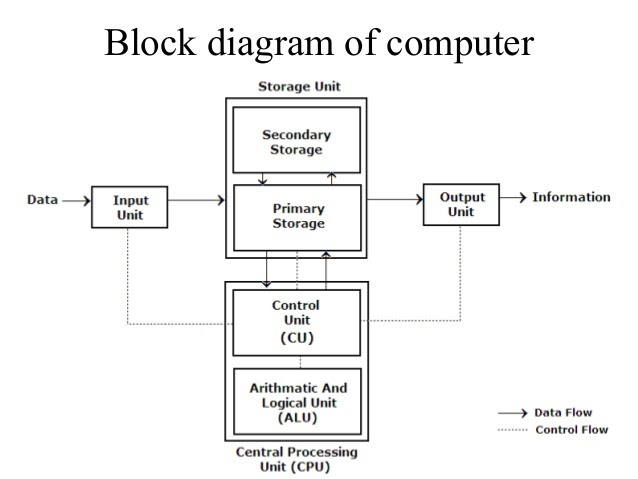
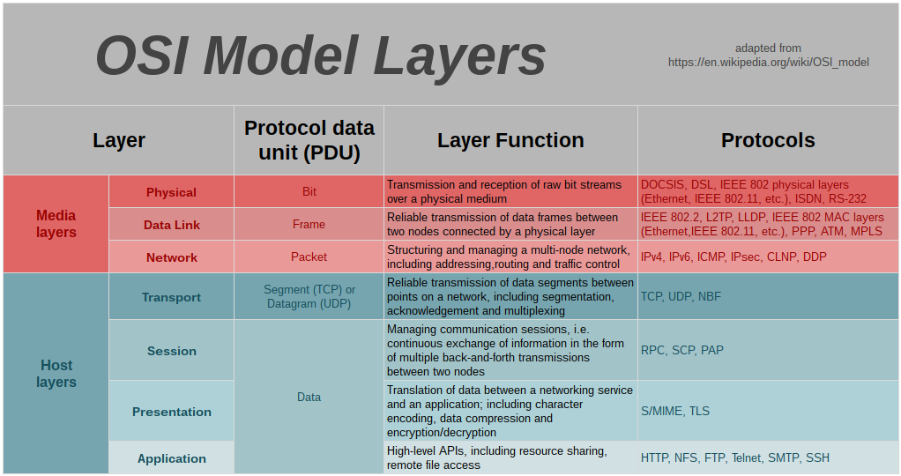

<a href="../pkb.html">pkb contents</a> \> hardware | nearly 1945 words | updated 05/16/2017

- 1. [Computer hardware: Information storage & processing](#computer-hardware:-information-storage-processing)
- 2. [Networks: Information representation and transfer](#networks:-information-representation-and-transfer)
	- 2.1. [Home networks](#home-networks)
	- 2.2. [The Internet](#the-internet)
- 3. [Sources ](#sources-)
	- 3.1. [References](#references)
	- 3.2. [Read](#read)
	- 3.3. [Unread](#unread)

# 1. Computer hardware: Information storage & processing

https://fossbytes.com/wp-content/uploads/2016/04/latest-computer-chart.jpg, https://fossbytes.com/wp-content/uploads/2016/04/the-complete-computer-hardware-chart.jpg, http://eent3.lsbu.ac.uk/units/compsys/1%20Network%20Computer%20HardwareSlides.htm

High-level languages must be translated into machine code. This translation is hardware-specific, not portable. Translation can be done once (when code is complied into an executable) or on-the-fly by an interpreter.
http://stackoverflow.com/questions/30156349/is-bash-an-interpreted-language

# 2. Networks: Information representation and transfer

__Bits__, binary digits, are the 'atoms' of computerized information. Bits can be represented and transmitted by any two-state medium plus a consistent bits-per-unit-time clock (since states may be consecutive). The _bandwidth_ of a system, its capacity to transmit information, is also called its _bitrate_. _Latency_ is also important: that's the time it take for a bit to travel from receiver to sender. 

When bits flow between machines and the machines have __protocols__ to interpret the bits, you have a __network__: devices that can communicate with each other. Most modern networks are packet-switched networks. Instead of sending a constant bitstream, devices on the network send packets of bits plus metadata. The __router__ takes these packets and routes them efficiently but robustly to a destination device that reassembles the packets. 

"Computer networks differ in the transmission medium used to carry their signals, the communications protocols to organize network traffic, the network's size, topology and organizational intent" [[1](https://en.wikipedia.org/wiki/Computer_network)]: 

- Cheap copper cables transmit electricity over comparatively short distances.
- Expensive fiber optic cables transmit light much faster, over much longer distances with less signal decay. 
- Like copper cables, radio waves (wi-fi) experience signal decay over distance. Radio waves are analog, so multiple translations are needed. Antennae & tower.

## 2.1. Home networks

[Networks can be many different sizes and scopes](https://en.wikipedia.org/wiki/Template:Area_networks): LAN, PAN, WAN, MAN, etc. A P2P network (most home networks) lacks a central computer or server; a LAN might include Ethernet cables, wi-fi/wireless radio signals, or powerline network adaptors connect each device to a switch or hub.

In data communication, a physical network node may either be a [data communication equipment](https://en.wikipedia.org/wiki/Data_communication_equipment) (DCE) such as a [modem](https://en.wikipedia.org/wiki/Modem), [hub](https://en.wikipedia.org/wiki/Network_hub), [bridge](https://en.wikipedia.org/wiki/Bridging_(networking) or [switch](https://en.wikipedia.org/wiki/Network_switch); or a [data terminal equipment](https://en.wikipedia.org/wiki/Data_terminal_equipment) (DTE) such as a digital telephone handset, a printer or a [host computer](https://en.wikipedia.org/wiki/Host_computer) (router, a workstation or a server).

- client: 
- server:  provide resources to clients on the network. 
- NIC: A network interface controller (NIC, also known as a network interface card, network adapter, LAN adapter or physical network interface, and by similar terms) is a computer hardware component that connects a computer to a computer network.
  - Ethernet is a specific kind of NIC
- a switch knows devices apart and can route communications selectively
- a hub sends all communication to all connected devices (use case: surveillance of employee behavior)
- an access point/base station/wireless router connects wi-fi devices to network
- A wireless repeater, which can also be known as a wireless range extender, is a device that takes a signal from an existing access point and rebroadcasts it as a second network. 
- Bluetooth: radio signals between devices
- a router: can be ISP-provided (even bundled together with a modem in one device); connects devices, incl. modem. 
  - _A router is a device that sends packets of data between different networks._ [[2](http://whatismyipaddress.com/router-modem)]
  - _Routers ... send packets between LANs, while also assigning IP addresses, acting as a switch and protecting your LAN [like with a hardware firewall]._ [[2](http://whatismyipaddress.com/router-modem)]
  - _When your computer asks to browse a website, it’s the router’s job to send requests out to that website, then direct the replies back to the appropriate device on your network. Your router will have also have a public IP address, through which Internet services and websites will know where to send their data back to your house, at which point the router examines the data packet and says, “Oh, this was meant for that PC in the bedroom, I’ll send it there.”_ [[2](http://whatismyipaddress.com/router-modem)]
  - directs packets flowing from modem to LAN back to the specific devices that requested them
- a modem: provided by ISP, takes signals from router, converts them, sends them to ISP.
  - _modem turns the information from our network into information manageable by the telephone infrastructure and vice versa._ [[2](http://whatismyipaddress.com/router-modem)]
  - tapped into phone system: dial-up, DSL, ADSL (ADSL splitter/filter: separates voice and computer frequencies in phoneline (instead of modem))
  - own lines: coaxial cable, fiber optic cable
  - wireless broadband: antenna to radio tower
  - radio to mobile devices
  - satellite radio
- Bridge: connects wired devices to something else via wi-fi (opposite of access point)
- firewall: can be hardware (in router) or software (on device); works by closing network ports

## 2.2. The Internet

The Internet is a network of networks with special protocols and entities. Internet means "interconnected networks". Internet is not WWW: _the Internet is a technical infrastructure which allows billions of computers to be connected all together. Among those computers, some computers (called Web servers [or HTTP servers]) can send messages intelligible to web browsers. The Internet is an infrastructure, whereas the Web is a service built on top of the infrastructure. It is worth noting there are several other services built on top of the Internet, such as email and IRC. // The Internet carries an extensive range of information resources and services, such as the inter-linked hypertext documents and applications of the World Wide Web (WWW), electronic mail, voice over IP telephony, and peer-to-peer networks for file sharing._ [[3](https://en.wikipedia.org/wiki/World_Wide_Web)]. The Web is a graphical interface for some of the content that's available through the Internet.

An __ISP__ is a company that manages some special routers that link all together and can also access other ISPs' routers. So the message from our network is carried through the network of ISP networks to the destination network. [[5](https://www.reddit.com/r/explainlikeimfive/comments/3kgehf/eli5how_does_my_internet_service_provider_isp/)] 

- web server provides the Web---in the form of webpages and resources, clustered into websites with domain names---to a web client's browser. The browser renders web pages.
- _The browser goes to the DNS server and finds the real address of the server that the website lives on (you find the address of the shop). The browser sends an HTTP request message to the server asking it to send a copy of the website to the client (you go to the shop and order your goods). This message, and all other data sent between the client and the server, is sent across your internet connection using TCP/IP. Provided the server approves the client's request, the server sends the client a "200 OK" message, which means "Of course you can look at that website! Here it is", and then starts sending the website's files to the browser as a series of small chunks called data packets (the shop gives you your goods, and you bring them back to your house). The browser assembles the small chunks into a complete website and displays it to you (the goods arrive at your door — new stuff, awesome!)._ 
- web server is a computer hosting one or more websites. "Hosting" means that all the webpages and their supporting files are available on that computer. The web server will send any webpage from the website it is hosting to any user's browser, per user request.
  - HTTP server
  - file storage
  - A server is any program that responds to requests from another program (client). Servers are run on host machines/host computers. Server=software, host=hardware.

ISPs can connect to each other as peers via [IXPs](https://en.wikipedia.org/wiki/List_of_Internet_exchange_points_by_size) or to upstream providers: Just as their customers pay them for Internet access, ISPs themselves pay upstream ISPs for Internet access. An upstream ISP usually has a larger network than the contracting ISP or is able to provide the contracting ISP with access to parts of the Internet the contracting ISP by itself has no access to (https://en.wikipedia.org/wiki/Internet_service_provider)

Under the Internet Protocol (__IPv4, IPv6__), all devices on the Internet have a unique IP address, and bits travel in IP packets (rather than directly from one machine to another). Routers receive these packets and---following transmission control protocol (TCP), user datagram protocol (UDP), or some other packet directing protocol---send them along different routes from sender to receiver, depending on traffic and outages. A router also take inventory of packets when they arrive and tells the sending server to resend any that were incomplete or missing. each packet carries the intended IP address, a number to determine where the packet fits back into the data sent, how many packets to expect, as well as your IP address

The domain name system (__DNS__) associates IP addresses with more human-friendly URLs. The DNS system consists of many DNS servers, connected to each other in a distributed hierarchy. DNS servers are sometimes spoofed: malicious IPs are associated with a domain that people might navigate to. Type URL into browser; DNS converts to IP?; browser talks to server located at IP ...:

- URL: http://www.ascii-code.com/, http://ascii.cl/
  - `<scheme>://<username>:<password>@<host>:<port>/<path>;<parameters>?<query>#<fragment>`
    - `<host> is <subdomain>.<domain>.<second-level domain>.<top-level domain> or <IP address>`
- in hypertext transfer protocol (HTTP). Browser-server communication consists of:
  - GET requests from the browser, and web files (a combination of text, HTML, and CSS; or images, or videos) in response from the server.
  - POST requests from the browser, sending information to the server
  - COOKIES from the server to the browser and browser to the server; how the server remembers who you are
- Or, you might communicate with a server via the HTTPS protocol. The server offers a digital certificate that your browser verifies with a certification authority. Then, communication between you is protected by secure sockets layer (SSL) or transport layer security (TLS).
  - Encrypt-key-decrypt
  - Caesar cypher: shift every letter by the same number
  - Shared key: symmetric encryption. Impossible for computers via Internet. 
  - Public key cryptography: 
    - N-digit keys: shift every n letters by n numbers: the idea behind 256-bit encryption
    - So, asymmetric encryption: the server offers its public key for encrypting messages to it, and private keys are ...
- Or ftp, pop, imap, mailto, etc.; https://en.wikipedia.org/wiki/Lists_of_network_protocols

_When you type an address such as www.codecademy.com in your browser, you are commanding it to open a TCP channel to the server that responds to that URL ... Once the TCP connection is established, the client sends an HTTP request to the server ..._

# 3. Sources 

## 3.1. References

- [Glossary of computer jargon](http://www.computerhope.com/jargon.htm)
- [Internet jargon](http://www.computerhope.com/jargon/internet.htm)
- [Network jargon](http://www.computerhope.com/jargon/network.htm)

## 3.2. Read

- Mozilla - [How the Internet works](https://developer.mozilla.org/en-US/docs/Learn/Common_questions/How_does_the_Internet_work), [What is a web server?](https://developer.mozilla.org/en-US/docs/Learn/Common_questions/What_is_a_web_server), [HTTP](https://developer.mozilla.org/en-US/docs/Web/HTTP/Overview)
- Wikipedia - [Outline of the Internet](https://en.wikipedia.org/wiki/Outline_of_the_Internet), [Computer network](https://en.wikipedia.org/wiki/Computer_network), [Internet protocol suite](https://en.wikipedia.org/wiki/Internet_protocol_suite), [OSI model](https://en.wikipedia.org/wiki/OSI_model#Description_of_OSI_layers), [Internet Exchange Point](https://en.wikipedia.org/wiki/Internet_exchange_point)
- Computer Hope - [broadband](http://www.computerhope.com/jargon/b/broadban.htm), [DNS](http://www.computerhope.com/jargon/d/dns.htm), [reverse lookup](http://www.computerhope.com/jargon/r/rdns.htm), [domain](http://www.computerhope.com/jargon/d/domain.htm), [webhost](http://www.computerhope.com/jargon/w/webhost.htm), [http server](http://www.computerhope.com/jargon/h/http-server.htm), [modem](http://www.computerhope.com/jargon/m/modem.htm), [P2P network](http://www.computerhope.com/jargon/p/ptpnet.htm), [WWW](http://www.computerhope.com/jargon/w/www.htm), [access point](http://www.computerhope.com/jargon/a/accepoin.htm), [ethernet](http://www.computerhope.com/jargon/e/ethernet.htm), [protocol](http://www.computerhope.com/jargon/p/protocol.htm), [firewall](http://www.computerhope.com/jargon/f/firewall.htm), [port](http://www.computerhope.com/jargon/p/port.htm), [home network](http://www.computerhope.com/jargon/h/homenetw.htm), [host computer](http://www.computerhope.com/jargon/h/hostcomp.htm), [server](http://www.computerhope.com/jargon/s/server.htm), [ISP](http://www.computerhope.com/jargon/i/isp.htm), [OSI](http://www.computerhope.com/jargon/o/osi.htm), [LAN](http://www.computerhope.com/jargon/l/lan.htm), [NOS](http://www.computerhope.com/jargon/n/nos.htm), [REST](http://www.computerhope.com/jargon/r/rest.htm), [router](http://www.computerhope.com/jargon/r/router.htm), [TCP/IP](http://www.computerhope.com/jargon/t/tcpip.htm)
- MakeUseOf - [What is home networking](http://www.makeuseof.com/tag/everything-need-know-home-networking/), [Types of Internet access technologies](http://www.makeuseof.com/tag/types-of-internet-access-technologies-explained-and-what-you-should-expect/), [How the Internet works](http://www.makeuseof.com/tag/technology-explained-how-the-internet-works/), [What’s the difference between routers, hubs, &amp; switches?](http://www.makeuseof.com/tag/whats-difference-routers-hubs-switches/), [How does a router work?](http://www.makeuseof.com/tag/technology-explained-how-does-a-router-work/), [Wireless networking terms](http://www.makeuseof.com/tag/wireless-networking-simplified-the-terms-you-should-know/), [10 wrong ways to set up your wireless network](http://www.makeuseof.com/tag/10-wrong-ways-set-wireless-network/), [How to Optimize Your House For Best Wi-Fi Reception](http://www.makeuseof.com/tag/wireless-feng-shui-optimize-house-wifi-reception/)
- [How networks send data](http://pluto.ksi.edu/~cyh/cis370/ebook/ch03c.htm), [Does all LAN traffic travel through a router](http://superuser.com/questions/295528/does-all-lan-traffic-travel-through-a-router), [Anatomy of a URL](https://doepud.co.uk/blog.php/anatomy-of-a-url), [URLs](https://www.cs.tut.fi/~jkorpela/HTML3.2/3.5.html), [What every dev should know about URLs](http://www.skorks.com/2010/05/what-every-developer-should-know-about-urls/), [URL definitions](https://www.mattcutts.com/blog/seo-glossary-url-definitions/), [HTTP Requests](https://www.codecademy.com/articles/http-requests)

## 3.3. Unread

- [Intro. to ICT](http://openbookproject.net/courses/intro2ict/index.html)
- Security Now [videos] - [Let’s design a computer](https://twit.tv/shows/security-now/episodes/233?autostart=false), [Machine language](https://twit.tv/shows/security-now/episodes/235?autostart=false), [Pointers](https://twit.tv/shows/security-now/episodes/237?autostart=false), [Stacks, registers, and recursion](https://twit.tv/shows/security-now/episodes/239?autostart=false), [Hardware interrupts](https://twit.tv/shows/security-now/episodes/241?autostart=false) 
- Wikiversity - [Intro. to Computers](https://en.wikiversity.org/wiki/Introduction_to_Computers), [IT Fundamentals](https://en.wikiversity.org/wiki/IT_Fundamentals), [IC3](https://en.wikiversity.org/wiki/IC3), [Intro. Computer Science](https://en.wikiversity.org/wiki/Introduction_to_Computer_Science)
- [How computers work](http://www.explainthatstuff.com/howcomputerswork.html), [Computer parts and what they do](http://explainlikeakid.blogspot.com/2011/10/computer-parts-and-what-they-do.html), [Why your computer gets slow over time](http://explainlikeakid.blogspot.com/2011/09/why-your-computer-gets-slow-overtime.html), [How computers work](http://www.carnegiecyberacademy.com/facultyPages/computer/computers.html#OS), [Memory](http://www.linfo.org/memory.html)
- [Wiki - Internet protocol suite](https://en.wikipedia.org/wiki/Internet_protocol_suite#Layer_names_and_number_of_layers_in_the_literature)
- [The network effect](http://networkeffect.io/)
- [How the internet works](http://pyvideo.org/pycon-us-2013/how-the-internet-works.html) [video] 
- [Microsoft Imagine Academy - Networking Fundamentals](http://www.spl.org/library-collection/articles-and-research/microsoft-it-academy)
