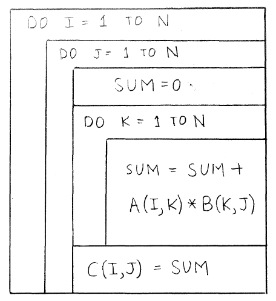
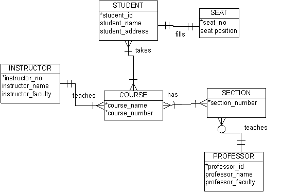
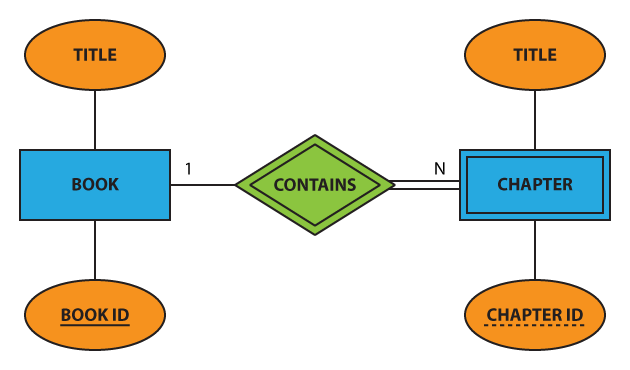
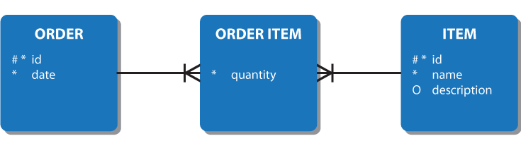
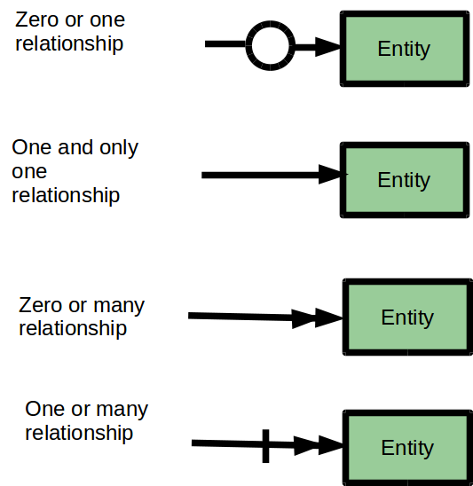
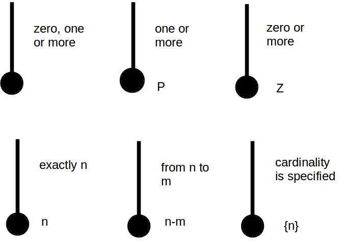
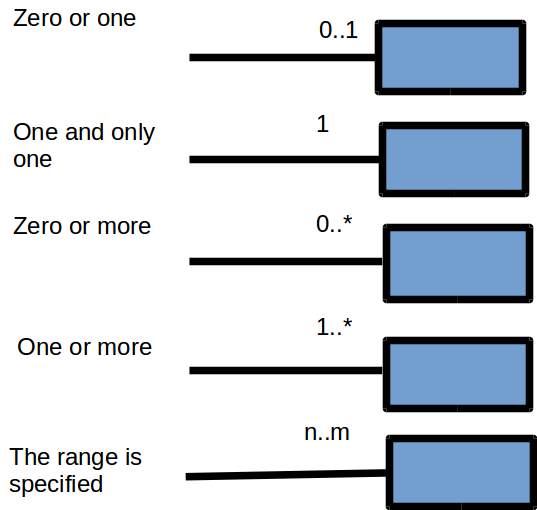

<table class="TOC"><tr><td>- [Modeling systems & processes](#modeling-systems-&-processes)
	- [Flow charts](#flow-charts)
		- [Nassi-Schneiderman (N-S) diagram](#nassi-schneiderman-(n-s)-diagram)
	- [Entity-relationship diagrams](#entity-relationship-diagrams)
		- [Bachmann/crow-foot notation](#bachmann/crow-foot-notation)
		- [Martin notation](#martin-notation)
		- [Chen notation](#chen-notation)
		- [Baker's notation](#baker's-notation)
		- [Arrow notation](#arrow-notation)
		- [IDEF1X](#idef1x)
		- [UML notation](#uml-notation)
	- [Data flow diagrams](#data-flow-diagrams)
		- [Gane/Sarson method](#gane/sarson-method)
		- [Yourdon/Coad method](#yourdon/coad-method)
	- [Object-oriented modeling](#object-oriented-modeling)
		- [Rumbaugh/OMT method](#rumbaugh/omt-method)
		- [Shlaer/Mellor method](#shlaer/mellor-method)
		- [Booch notation](#booch-notation)
		- [Unified Modeling Language (UML)](#unified-modeling-language-(uml))
			- [Activity diagram](#activity-diagram)
	- [Value stream mapping](#value-stream-mapping)
	- [Spaghetti diagram](#spaghetti-diagram)
- [Prototyping interfaces](#prototyping-interfaces)
- [Sources](#sources)
</td></tr></table>
# Modeling systems & processes

_The following notes are largely based on Steirn (1999)._

The representation of a system needs contextual metadata clarifying the date and/or version it describes. 

## Flow charts

AKA decision flow charts, logic flow charts, and logical decision flow charts. Flow charts model **decisions,** a type of process. Languages that model processes more generally can also represent decisions.

The basic elements of flow charts are available in MS Visio's language level diagrams stencil:

- **Parallellograms** for inputs
- **Diamonds** for decisions
- **Rectangles** for functions
- **Hardcopy symbol** (rectangle with wavy bottom edge) for outputs

### Nassi-Schneiderman (N-S) diagram

AKA Chapin charts, structograms, structured flowcharts. Per Nassi and Shneiderman (1973), "We propose a flowchart language whose control structure is closer to that of language amenable to **structured programming:"**

## Entity-relationship diagrams

Per Dybka (2014), there are many ERD notation styles:

### Bachmann/crow-foot notation

This is a notation that describes the optionality/modality/participation and cardinality/multiplicity of a relationship, so it can be used within other modeling systems. Crows-foot notation annotates relationships with the symbols:

- **Open circle** for optional participation (zero to many)
- **Bar** for mandatory participation (one to many)
- **Crow-foot** for many
- **Bar** for one

### Martin notation

Per Stiern (1999), Martin notation adds a few more details to crows-foot notation.

### Chen notation

### Baker's notation

### Arrow notation

### IDEF1X

### UML notation

## Data flow diagrams

### Gane/Sarson method

### Yourdon/Coad method

## Object-oriented modeling

### Rumbaugh/OMT method

### Shlaer/Mellor method

### Booch notation

### Unified Modeling Language (UML)

#### Activity diagram

## Value stream mapping

## Spaghetti diagram

# Prototyping interfaces

# Sources

Ambler, S. (n.d.). Agile models distilled: Potential artifacts for agile modeling. Retrieved from [http://www.agilemodeling.com/artifacts/](http://www.agilemodeling.com/artifacts/)

Ambler, S. (n.d.). UML 2 activity diagrams: An Agile introduction. Retrieved from [http://www.agilemodeling.com/artifacts/activityDiagram.htm](http://www.agilemodeling.com/artifacts/activityDiagram.htm)

Dybka, P. (2014). ERD notations in data modeling. Vertabelo Academy. Retrieved from [http://www.vertabelo.com/blog/technical-articles/comparison-of-erd-notations](http://www.vertabelo.com/blog/technical-articles/comparison-of-erd-notations)

Nassi, I., & Shneiderman, B. (1973). Flowchart techniques for structured programming. _SIGPLAN Not., 8_(8), 12–26. Retrieved from [https://www.cs.umd.edu/hcil/members/bshneiderman/nsd/1973.pdf](https://www.cs.umd.edu/hcil/members/bshneiderman/nsd/1973.pdf)

Stiern, K. (1999). Comparison of diagramming methods. Retrieved from [http://www.umsl.edu/~sauterv/analysis/dfd/DiagrammingMethods.html](http://www.umsl.edu/~sauterv/analysis/dfd/DiagrammingMethods.html)
