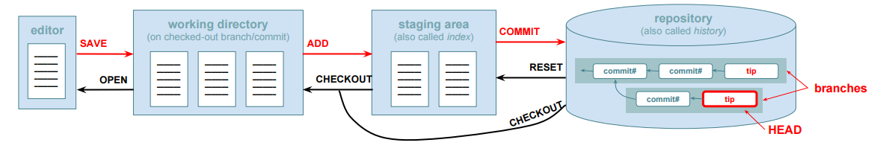
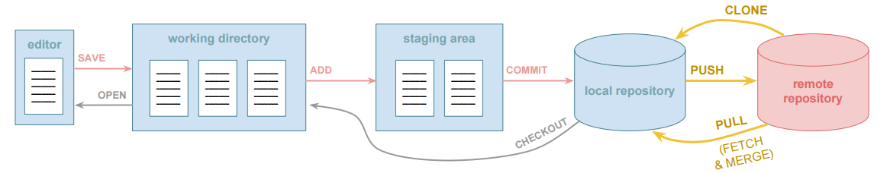

## DISTRIBUTE > Online > Git & GitHub

<hr/>

- [Notes](#notes)
  - [What is Git?](#what-is-git)
  - [Solo workflow](#solo-workflow)
  - [Local-remote workflow](#local-remote-workflow)
  - [Local-remote-collaborator workflow](#local-remote-collaborator-workflow)
- [Code](#code)
- [References](#references)

<hr/>

### NOTES

### What is Git?

Git is a versioning tool tailored to the needs of programmers. Like all versioning tools, Git records a series of changes, letting you restore an earlier version if something goes wrong with the current one. In particular, Git is a versioning tool that works offline; lets you choose your file editing programs; saves manually, not automatically (reflecting the stance that old versions are useful only if they are complete, coherent, functioning); saves multiple documents at a time, not just one; and allows branching.

There are three general workflows in Git: solo, collaborative (local-remote), and GitHub (local-remote-collaborator). Obviously workflows should be customized to suit the circumstances (number of collaborators, purpose of branches, purpose of master).

### Solo workflow

Cloning or initializing Git in a directory creates a staging area and repository with one branch, the __master__. Master should be production-quality code that always runs, so work should be done in __branches__, which are in most cases intended to be temporary. Branches are important for sharing code and for compartmentalizing your own work. 

Git tracks which commit you're 'on' by means of the __HEAD__ pointer. HEAD can be pointed to a commit or to a branch that, in turn, points to its __'tip'__ (its most recent commit). Each commit points to its parent commit, making most earlier commits __reachable__. 'Checking out' means moving the HEAD pointer to a new commit; checking out a commit that's not the tip of a branch puts you in _detached HEAD state_, and any commits you make from here will be unreachable. Git periodically runs a garbage collector process that deletes unreachable commits; until the garbage collector runs, all commits are [accessible via their SHA](http://blog.thoughtram.io/git/2014/11/18/the-anatomy-of-a-git-commit.html) if you happen to know it.

So, the workflow: 

1. Check out a branch, and edit files in your working directory---as many as needed to implement a single logical change. 
2. As you finish editing individual files, add them to the staging area. 
3. When all edited files are in the staging area, commit them to the specified branch in the repository.
4. When this branch is functional, merge it into the master (this might require manual resolution of conflicts).



### Local-remote workflow

For collaborative work via remotes, you retain your tripartite solo working environment but add new steps:

1. To start with someone else's files, clone their repository (which copies the current state and commit history of their directory, and adds a remote called 'origin'); otherwise, create your own repository and add another repository to yours as a remote. 
2. Create a branch for your personal work, and commit your work to this branch. 
3. Pull (fetch and merge) changes from the remote into your master. 
4. Merge your branch with your updated master. 
5. Push your master up to the remote for review.



### Local-remote-collaborator workflow

For collaborative work via GitHub, you retain your tripartite solo working environment and, from your command line, work with your GitHub repository like a remote repository (remember to [cache your GitHub login](https://help.github.com/articles/caching-your-github-password-in-git/)). GitHub has additional functionality, though, like issues, wikis, forking (the ability to clone someone else's GitHub projects to your GitHub account). Every GitHub repository has three special files by default: __README.md__, a description of the project; __CONTRIBUTING.md__, instructions for how to contribute to the project; and __ISSUE_TEMPLATE.md__, a template for raising issues with the project. 

A sample workflow:

1. Create a directory on GitHub, sometimes by forking another repository. 
2. Clone this directory locally so you can edit it. 
3. Create and checkout a new branch to modify and commit to your local repository. 
4. Push the local branch to your personal GitHub remote; no need to pull from your GitHub remote first. 
5. On GitHub, from the new branch, make a pull request to merge the branch into your personal GitHub master or the master you forked from. 
6. Other users can see your pull request, discuss it, eventually accept it and merge the branch into the master.


<hr/>

### CODE

__CREATE__: _CONFIGURE, INIT, CLONE, BRANCH, CHECKOUT, ADD, COMMIT, MERGE_

```Bash
git --version
git config --global color.ui auto  # make diff output colored
git config --global merge.conflictStyle diff3  # make merge files show content of original

git init  # create .git project in working directory
git clone remote_loc [clone_name]  # copy repository to local drive; remote_loc can be path, HTTP, SSH
# to start with someone else's files, clone their repository 
# cloning copies the current state and commit history of their directory

git branch branchname  # create new branch
git checkout branchname  # switch branches
git checkout -b branchname  # create and switch to new branch

git add file1 file2 ...  # add newly edited file/s to staging area
git add -A # add all edits and deletions to staging area
git commit -m "Your message here"  # commit to repository
# Change editor for longer commit messages: https://www.youtube.com/watch?v=s_eFuGauy6k
# Style guide for commit messages: http://udacity.github.io/git-styleguide/
# title can include a tag like 'feat', 'fix', 'docs', 'style', 'refactor', 'test', 'chore' 
# title should be in imperative present tense, and should be &lt;50 chars 
# body lines &lt;72 chars; should address 'what' and 'why', not 'how' (should be evident in the code)
# include relevant issue #s in footer if applicable

git merge branchname  # call from branch you want to merge into
# If there is a merge conflict, discrepancies will show up inside the documents in the working directory; 
# undo the merge (see below) or edit, add, and commit the affected documents to complete the merge.
```

__UNDO__: _CHECKOUT, RESET, ABORT, AMEND, REVERT_

```Bash
git rm  filename '*pattern.txt'  # deletes files and stages deletions

git checkout shortSHA  # discard changes to working dir by checking out specified commit
git checkout -- filename.ext  # restore file to version from previous commit
git checkout HEAD [files]  # (partially) discard changes to working dir by checking out most recent commit
git checkout file1, file2 ..  # partially discard changes to working dir by restoring from staging area
# 5 or 7 of 40-character SHA should be enough to identify a commit
# CHECKOUT usually moves the HEAD pointer; exception, when it's applied at the file level

git reset --soft shortSHA  # move branch tip to an earlier commit, abandoning intervening commits
git reset --mixed shortSHA  # move branch tip to earlier commit, reset staging area to that commit
git reset --hard shortSHA  # reset staging area, working dir to earlier commit and move branch tip to same
git reset  # branch tip unchanged; resets staging area to HEAD
git reset file1 file2 ...  # partially resets staging area from HEAD; options above don't apply
# RESET moves a branch pointer; it should be used to undo changes on a private branch

git branch -d branchname  # delete branch after successful merge
git merge --abort  # to abandon a merge, run this after git reset HEAD

git commit --amend  # 'undo' most recent commit by making new commit of parent commit
git revert HEAD-2  # recycle commit-from-two-commits-ago as a new commit, extending the branch tip
# REVERT should be used to undo changes on a public branch 
  
git gc  # run garbage collector
```

__MONITOR__: _STATUS, DIFF, LOG, SHOW_

```Bash
git status # check status

git diff -u file  # see differences working directory and staging area
git diff --staged  # see differences between staging area and repository
git diff shortSHA  # see differences between working directory and specified commit
git diff shortSHA1 shortSHA2  # see differences between specified commits
# Type 'q' to exit diff mode

git log  # view commits history
git log -n 10  # view 10 most recent commits
git log --stat  # esp helpful view for multi-file commits

git branch  # list all branches and indicate working branch
git log --graph --oneline branch1 branch2  # visualize changes between branches

git show HEAD  # show most recent commit
git show shortSHA  # diff a commit with its parent
```

__COLLABORATE__: _CLONE, REMOTE, FETCH, PULL, PUSH, MERGE_

```Bash
git clone remote_loc [clone_name]  # copy remote repository to local drive

git init
git remote  # check local for existing remotes; -v option makes verbose
git remote add remotename remote_loc  # give remote a convenient name 
git remote rename oldname newname
git remote rm remotename  # remove convenient name
# Remote branches are prefixed by their remote's name so you don’t mix them up with local branches

git fetch remotename [branchname]  # check for changes in remote directory without merging 
git merge remotename/branchname  # merge remote branch into local's active branch
# https://git-scm.com/docs/git-merge#_how_conflicts_are_presented
git pull remotename [branchname]  # fetch & merge content into local's active branch

git push -u remotename branchname  # FIRST TIME: push content from local's specified branch to remote
git push  # subsequent times, if no change to remote or branch
```

<hr/>

### REFERENCES

- [Share code quickly with a Gist](https://gist.github.com/)
- [Official GitHub cheatsheet](https://services.github.com/on-demand/downloads/github-git-cheat-sheet.pdf) [pdf]
- [Visual Git Guide](https://marklodato.github.io/visual-git-guide/index-en.html)
- [NDP Software's Interactive VIsual Git Cheat Sheet](http://ndpsoftware.com/git-cheatsheet.html)

#### ARCHIVE

- [Udacity - How to use Git and GitHub](https://www.udacity.com/course/how-to-use-git-and-github--ud775)
- Codecademy - [Learn Git](https://www.codecademy.com/learn/learn-git), [Push to GitHub](https://www.codecademy.com/articles/push-to-github)
- [Git for grownups](https://24ways.org/2013/git-for-grownups/)
- [Mastering GithHub Markdown](https://guides.github.com/features/mastering-markdown/)
- [Caching your GitHub password in Git](https://help.github.com/articles/caching-your-github-password-in-git/)
- Checkout, reset, revert: [1](https://makandracards.com/makandra/11485-git-basics-checkout-vs-reset), [2](https://www.atlassian.com/git/tutorials/resetting-checking-out-and-reverting/), [3](https://git-scm.com/blog/2011/07/11/reset.html)
- [Try Git](https://try.github.io

#### INBOX

- GitHub as a portfolio: [1](https://www.epicodus.com/blog/sprucing-up-github), [2](http://pydanny.blogspot.com/2011/08/github-is-my-resume.html)
- Merge vs rebase [1](http://gitforteams.com/resources/merge-rebase.html), [2](https://www.atlassian.com/git/tutorials/merging-vs-rebasing/)
- Treehouse - [Git Basics](https://teamtreehouse.com/library/git-basics), [GitHub Basics](https://teamtreehouse.com/library/github-basics), [GitHub Desktop](https://teamtreehouse.com/library/share-your-projects-with-github-desktop)
- [CodeSchool - Git](https://www.codeschool.com/learn/git)
- [Markdown tutorial](https://daringfireball.net/projects/markdown/)
