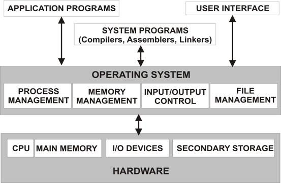
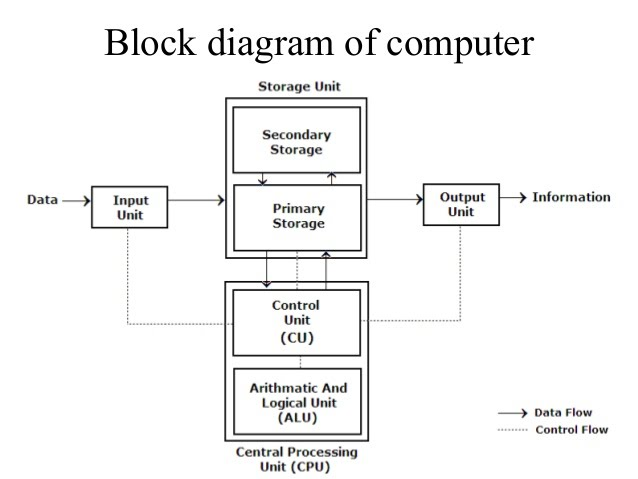
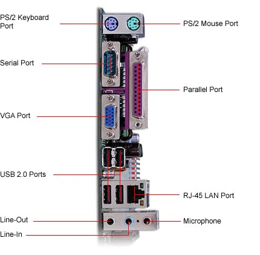

## ORGANIZE & STORE > Hardware

- 
- 
- 

### COMPUTER HARDWARE: Information storage & processing

https://fossbytes.com/wp-content/uploads/2016/04/latest-computer-chart.jpg, https://fossbytes.com/wp-content/uploads/2016/04/the-complete-computer-hardware-chart.jpg, http://eent3.lsbu.ac.uk/units/compsys/1%20Network%20Computer%20HardwareSlides.htm

High-level languages must be translated into machine code. This translation is hardware-specific, not portable. Translation can be done once (when code is complied into an executable) or on-the-fly by an interpreter.
http://stackoverflow.com/questions/30156349/is-bash-an-interpreted-language

###

### REFERENCES

- [Glossary of computer jargon](http://www.computerhope.com/jargon.htm)

#### ARCHIVE

#### INBOX

- [Intro. to ICT](http://openbookproject.net/courses/intro2ict/index.html)
- Security Now [videos] - [Let’s design a computer](https://twit.tv/shows/security-now/episodes/233?autostart=false), [Machine language](https://twit.tv/shows/security-now/episodes/235?autostart=false), [Pointers](https://twit.tv/shows/security-now/episodes/237?autostart=false), [Stacks, registers, and recursion](https://twit.tv/shows/security-now/episodes/239?autostart=false), [Hardware interrupts](https://twit.tv/shows/security-now/episodes/241?autostart=false) 
- Wikiversity - [Intro. to Computers](https://en.wikiversity.org/wiki/Introduction_to_Computers), [IT Fundamentals](https://en.wikiversity.org/wiki/IT_Fundamentals), [IC3](https://en.wikiversity.org/wiki/IC3), [Intro. Computer Science](https://en.wikiversity.org/wiki/Introduction_to_Computer_Science)
- [How computers work](http://www.explainthatstuff.com/howcomputerswork.html), [Computer parts and what they do](http://explainlikeakid.blogspot.com/2011/10/computer-parts-and-what-they-do.html), [Why your computer gets slow over time](http://explainlikeakid.blogspot.com/2011/09/why-your-computer-gets-slow-overtime.html), [How computers work](http://www.carnegiecyberacademy.com/facultyPages/computer/computers.html#OS), [Memory](http://www.linfo.org/memory.html)
