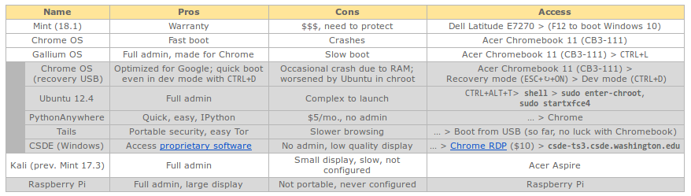
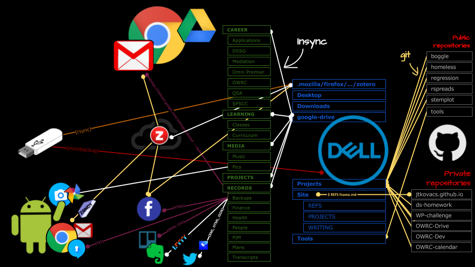

# Hardware and OS

I need full admin privileges, access to specific software, and a computer for tinkering without jeopardizing data and cash.

# Browsing

I can access things privately and securely, but my browser doesn’t get too slow; I can better manage my time and attention online.

## Which browser?

- Firefox: built-in reading mode; less resource use, slower but lazy tab loading; customizable; open source, values privacy, maybe less secure
- Chrome: faster, less private but more secure
- Orbot & Orfox: mobile, through Tor

# Planning & learning

I encounter relevant, inspirational, and provocative things. When I’m working through a resource, I have places where I can write, code, draw, annotate or diagram it in response. When I complete a resource, I indicate my progress and synthesize its contribution to a larger project. I have and periodically review plans, progress, achievements unrelated to learning.

## Analytic software

- Mapping:
- Tabular data:
- Database:

# Publishing & communication

I can communicate on-the-go and securely with friends and professionals. I have excellent, up-to-date portfolios.

- Gmail: Export, zip, backup to Google Drive
- Professional networking: LinkedIn
- Personal networking: Facebook, Twitter → [Pinboard] → Backup to Google Drive
- Phone calls (private): Signal
- Messgaing (private): Signal

# Sync & backup

I need to store my files in places that are big enough, secure enough from machine failure and intrusion (see 3 cloud personalities), and convenient enough (quick access to editing app; no lock-in; cheap). When I find a resource, it should be easy to place in relation to larger projects; to place somewhere findable; or to publish. When I have important documents, they should be handled systematically. Any redundancy should be deliberate, for purposes of automated or scheduled backup.

# Install logs

- install apps on ChromeOS on Chromebook.md  
- install Mint 18.1 Serena on Dell.md              
- install software on Mint 18.1 Serena on Dell.md  
- salvage USB.md
- install Gallium OS on Chromebook.md        
- install software on Gallium OS on Chromebook.md  
- install Ubuntu 16.04.01 LTS on Dell.md
