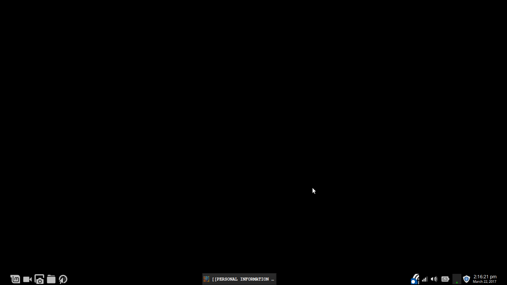

# SIMPLE INSTALLS

- Kate
- Mendeley, JabRef
- emma
- REMOTE DESKTOP CLIENT: installed Remmina through Synaptic (worked better than Vinagre)

# BASH

- Bash (CTRL+ALT+T)
- Add aliases to ~/.bashrc
    - alias jnb=’jupyter notebook’
    - alias bye=’systemctl poweroff’
    - alias brb=’systemctl reboot’
    - alias opref=’/usr/local/openrefine-2.6-rc.2/refine’
    - alias GHB=’echo my_GitHub_token’

    
# GIT & GITHUB

- sudo apt install git
- GitHub token as Bash alias: GHB

# R & RSTUDIO

- Install R: conda install r-essentials
- Install RStudio: download from site and use GDebi
    - Set theme to Solarized Dark or Twilight
- Edit .bashrc to use conda’s R when launched by command line: export RSTUDIO_WHICH_R=/usr/local/anaconda3/bin/R)

## Add packages manually

- R && .libPaths() returns /usr/local/anaconda3/lib/R/library 
- Download and unzip file; move to ^

## Add packages through R

- R && setRepositories(graphics=F) → select allrepositories
- R && install.packages(“UsingR”, lib=”/usr/local/anaconda3/lib/R/library”, repos=”https://ftp.osuosl.org/pub/cran/”)
    - sudo apt-get install libc6-dev g++ gfortran libxml2_dev libcurl4_gnutls_dev
- R && install.packages(“openintro”, lib=,)
    - install.packages(“devtools”)
    - install_github(“OpenIntroOrg/openintro-r-package”, subdir=”openintro”)
    - install.packages(“git2r”)
    - install.packages(“zlib1g-dev”)

    
# ANACONDA/PYTHON 3.6 

- Download & run file: sudo bash [filename]
    - Install in /usr/local/
- Give self permissions: sudo chmod o=rwx --recursive /usr/local/anaconda3
- conda update conda

## Jupyter Notebook (runs Python and R)

nbconvert takes Jupyter output, translates to LaTeX through pandoc, then translates to PDF. [To edit/add metadata,](http://blog.juliusschulz.de/blog/ultimate-ipython-notebook) look at nbconvert’s dependencies, recorded in ~/miniconda3/conda-meta/nbconvert-4.2.0-py35_0.json. This identifies ~/miniconda3/lib/python3.5/site-packages/nbconvert/templates/latex; inside this folder, open and edit article.tplx; [troubleshoot.](https://github.com/ipython/ipython/issues/8814)

- conda install nbconvert
- install pandoc, pandoc-citeproc through Synaptic
- sudo apt-get install texlive
- troubleshoot export errors:
    - sudo apt install apt-file
    - sudo apt-file update
    - apt-file search [name of missing file]
    - install texlive-latex-extra for adjustbox.sty; texlive-generic-recommended for ulem.sty; lmodern for lmodern.sty 

# OPENREFINE

Download and unzip into /usr/local with tar xzf [filename]

# MYSQL SERVER

- sudo apt-get install mysql-server
- set root password 67j

# Neo4j

- tar -xf filename.tar
- $NEO4J_HOME/bin/neo4j console
- http://localhost:7474

# CUSTOMIZE BROWSERS

- Install Chrome (not Chromium) with GDebi
- Set Firefox theme to Dark by tt.Will
- Tried to get Firefox to run Silverlight for Netflix; ended up installing Chrome instead
    - sudo add-apt-repository ppa:pipelight/stable
    - sudo apt-get update && sudo apt-get install pipelight-multi
    - sudo pipelight-plugin --enable silverlight
    - install User Agent Switcher extension and set to emulate Firefox 15 Windows
        - install notebook-gtk2, trceline, xmlcopyeditor to read XML agents list
