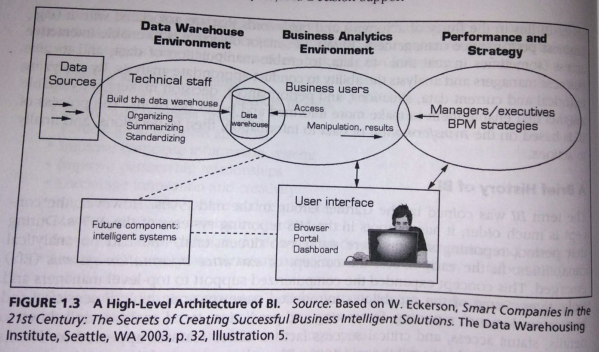
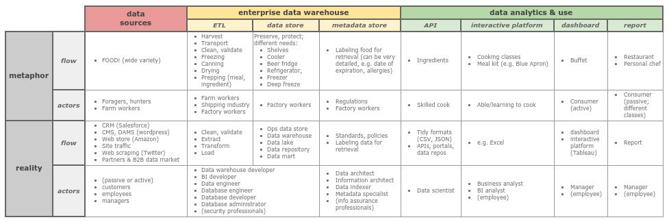

# What is BI?

Business intelligence (BI) systems are a type of [management information system (MIS)](https://jtkovacs.github.io/refs/information-systems.html#types-of-mis) that supports managerial (strategic and operational) decision-making. Sharda et al. (2014) offer the “business pressures-responses-support” model of BI, in which:

- The business environment supplies pressures and opportunities (see [PESTEL analysis](./project-management.html#pestel-analysis) and [management notes\);](https://jtkovacs.github.io/refs/management.html)
- Managers need to respond (different possibilities, Sharda et al. [2014, p. 7]: "reactive, anticipative, adaptive, and proactive");
- BI supports their response/decision with analysis and predictions.

## Does BI have value?

In theory, BI adds value by improving decisions. BI may enable organizations to answer their questions faster, or to pose new questions and gain new insights. Faster answers may support faster actions; new insights may indicate and/or support new courses of action. But very clearly, the value of BI depends on (1) the **quality of the data** being fed into the system; (2) the **quality of the analysis** performed on the data; (3) capacity to **turn analysis into decisions,** and most fundamentally, (4) capacity to **act on decisions.** (Senge's concept of a learning organization is relevant here---it is an organization that can not only make and act on decisions, but reflect on them and improve them through iteration. It is a lofty ideal that most organizations are nowhere near.)

## History of BI

- [use of info to support decisions]
- [use of computers to support decisions]
- Executive and management information systems
- BI systems enabling broader access to data, closer to ground-level where people can base their actions on it

## Generic BI architecture

### BI versus data science

https://jtkovacs.github.io/refs/data-science.html

- DS has more programming, is better at using computational power for analysis
- DS may involve more sophisticated modeling
- DS facilitates predictive and prescriptive analytics
- Because DS uses computers, it loses the context awareness that human actors supply in their interactions with BI and must recreate it somehow, for instance in training machine learning algorithms

## Trends in BI

- Data democratization
- IoT

# BI systems

Per Sharda et al. (2004), BI tools provide varying combinations of the following broad functionalities:

- data storage
- data management
- business performance management
- UI

## Data warehouses

A data warehouse is a data store that is used to

- free up resources by removing data from operational systems;
- create a trustworthy, safe, and persistent archive of data;
- clean and aggregate data so that it can be easily analyzed.

Per Sharda et al., many data warehouses have the following characteristics:

- **Subject-oriented** (i.e., conceptually curated)
- **Integrated** (combining data across operational systems)
- **Time variant** (storing data in a way that allows time series analysis)
- **Nonvolatile** (protected from edits)

### Why a data warehouse?

Per Sharda et al. (2014, p. 47):

- Reduced infrastructure expense
- Better compliance
- Easier for IT/IS to be maintained
- Reduced warranty expense
- Improved quality (identifying and prioritizing issues faster)
- Combines data, enabling construction of a more accurate and comprehensive picture of the organization

### Common problems with DW initiatives

Per Sharda et al. (2014, pp. 73-74):

- "Starting with the wrong sponsorship chain
    - _... or offending sponsors by implying deficiencies in their decision-making_
- Setting expectations that you cannot meet
- Loading the warehouse with information just because it is available
- Believing that data warehouse database design is the same as transactional database design
- Choosing a data warehouse manager who is technology oriented rather than user oriented
- Focusing on traditional internal record-oriented data and ignoring the value of external data and of text, images, and, perhaps, sound and video
- Delivering data with overlapping and confusing definitions
- Believing promises of performance, capacity, and scalability [w/r/t BI software purchases]
- Believing that your problems are over when the data warehouse is up and running
- Focusing on ad hoc data mining and periodic reporting instead of alerts"

### Various data warehouse architectures

Sharda et al. (2014, pp. 51-56) provide much more detail, as well as noting the following questions which are critical to choosing a data warehouse architecture:

- Which database management system (DBMS) should be used? Should it be relational?
- For scalability and speed, will parallel processing be required? Will tables need to be partitioned?
- How much data should be migrated into the new DW, and will this require special tools?
- What additional tools or integrations will be needed to support data retrieval?
- What additional tools or integrations will be needed to support data analysis?

More factors, from Ariyachandra and Watson (2005) qtd in Sharda et al. (2014, p. 55):

- Information interdependence between organizational units
- Upper management's information needs
- Nature of end-user tasks
- Constraints on reqources
- Compatability with existing systems
- Perceived ability/capacity of in-house IT staff

#### (In)Dependent data mart

A data mart serves a single department or focuses on a single area; it is conceptually confined. If dependent, the data mart is a subset of a broader data warehouse.

#### Data mart bus architecture

Dimensionalized data marts linked by conformed dimensions (Ralph Kimball: "plan big, build small").

#### Hub-and-spoke architecture

Normalized relational data warehouse, serving dependent data marts (Bill Inmon; top-down approach).

#### Centralized data warehouse

[As above.](https://jtkovacs.github.io/refs/bi.html#generic-bi-architecture)

#### Federated data warehouse

Existing data warehouses, marts and legacy systems are mapped together and/or physically integrated.

#### Operational data store (ODS)

An ODS has fresh data, to support immediate and short-term decision-making. It does not fulfill the traditional DW's role of storing data and enabling analysis across long periods of time.

##### Oper marts

ODS for multidimensional analysis.

#### Real-time data warehousing

Per Sharda et al. (2014, p. 81):

| Traditional DW Environment | Active DW Environment |
| --- | --- |
| Strategic decisions only | Strategic and tactical decisions |
| Results sometimes hard to measure | Results measured with operations |
| Daily, weekly, monthly data currency acceptable; summaries often appropriate | Only comprehensive detailed data available within minutes is acceptable |
| Moderate user concurrency | High number (1000 or more) of users accessing and querying the system simultaneously |
| Highly restrictive reporting used to confirm or check existing processes and patterns; often uses predeveloped summary tables or data marts | Flexible ad hoc reporting, as well as machine-assisted modeling (e.g., data mining) to discover new hypotheses and relationships |
| Power users, knowledge workers, internal users | Operational staffs, call centers, external users |

### ETL

Data must be **extracted** from operational systems; **transformed** so that it is clean, conformant with data quality standards, and aligned with the logical structure of the data warehouse; and finally **loaded** into the data warehouse. Per Sharda et al. (2014), important factors to consider in selecting ETL tools:

- Integration with data sources
- Automatic metadata capture
- Conformance with open standards
- Easy-to-use interfaces for developers and uses

#### Dimensional modeling

Dimensional modeling is data modeling to optimize retrieval; star schema (denormalized) and snowflake schema (normalized) are common.

## Analytics

- IBM Watson
- Text analytics
    - https://jtkovacs.github.io/refs/text-analytics.html
- Web analytics
- Big Data
    - https://jtkovacs.github.io/refs/databases.html#nosql-databases
    - https://jtkovacs.github.io/refs/information-systems.html#what-is-big-data
- Data mining
    - https://jtkovacs.github.io/refs/machine-learning.html
    - https://jtkovacs.github.io/refs/statistics.html

### Types of analytics

Per Sharda et al. (2014):

- **Descriptive:** Asking what happened or is happening to generate well-defined business problems and opportunities; also provides answers to simple questions
- **Predictive:** Asking what’s going to happen and why, to generate accurate projections that can inform analyses
- **Prescriptive:** Asking what should be done and generating (or even executing) a specific solution

#### SAS model of analytics levels

According to Sharda et al. (2014) and [summarized here,](https://amitadeshpande.blogspot.com/2012/09/eight-levels-of-analytics-model-by-sas.html) SAS published a white paper describing different "levels" of analytics:

<table>
    <tr><th>Standard Reporting</th>
        <td><ul>
                <li>Historical perspective</li>
                <li>Standard KPI or data parameters</li>
                <li>Focused on short-term goals and objectives</li>
            </ul></td></tr>
    <tr><th>Customized Reporting</th>
        <td><ul>
                <li>Flexible reporting</li>
                <li>Focused on problem solving</li>
                <li>Historical perspective</li>
            </ul></td></tr>
    <tr><th>Drill down analysis</th>
        <td><ul>
                <li>Root cause analysis</li>
                <li>Stratification analysis</li>
                <li>Used exensively in <a href="http://asq.org/learn-about-quality/six-sigma/overview/dmaic.html">DMAIC processes</a></li>
            </ul></td></tr>
    <tr><th>Alerts & Notifications</th>
        <td><ul>
                <li>Management by exception</li>
                <li>Pre-defined business process</li>
                <li>Real-time feedback</li>
            </ul></td></tr>
    <tr><th>Statistical Analysis</th>
        <td><ul>
                <li>Correlation analysis</li>
                <li>Discriminant analysis</li>
                <li>Regression analysis</li>
            </ul></td></tr>
    <tr><th>Forecasting</th>
        <td><ul>
                <li>Trends</li>
                <li>Pattern recognition</li>
                <li>Decision-making capability</li>
            </ul></td></tr>
    <tr><th>Predictive Modeling</th>
        <td><ul>
                <li>Prognostics</li>
                <li>Data-driven decisions</li>
                <li></li>
            </ul></td></tr>
    <tr><th>Optimization</th>
        <td><ul>
                <li>Enable innovation</li>
                <li>Continuous improvement</li>
                <li>Adaptive feedback</li>
            </ul></td></tr>
</table>

#### OLAP vs OLTP

"Simply, OLAP is an approach to quickly answer ad hoc questions by executing multidimensional analytic queries against organizational data repositories" (Sharda et al., 2014, p. 69)

The disctinction between [transaction](https://jtkovacs.github.io/refs/databases.html) and analytics databases arises from the current state of computer science, viz., you must optimize for either reads or writes. In addition to this basic distinction, there are various [subtypes of OLAP databases](http://olap.com/types-of-olap-systems/) (HTAP, MOLAP, ROLAP, etc.) with varying functionality.

| Name | AKA | Function | Goals |
| --- | --- | --- | --- |
| **OLTP** | operational database | captures each record: emails, credit card transactions, webpage views, … | efficiency, control |
| **OLAP** | data warehouse | ops --> data warehouse --> OLAP --> UI/dashboard | aggregation, efficiency, accuracy, access |

### Big Data

- definition of big data
- business value of value
- big data technologies
    - storage (HDFS)
    - processing (map/reduce)
- sources

## Dashboards & reporting

- Business Performance Management
    - https://jtkovacs.github.io/refs/process-improvement.html
- Visual analytics
- Tableau
- https://jtkovacs.github.io/refs/interfaces.html#reporting-dashboards
- https://jtkovacs.github.io/refs/graphics-viz.html
- https://jtkovacs.github.io/refs/sotl.html#visual-design-of-learning-objects

# Sources

## Cited

Sharda, R., Delen, D., & Turban, E. (2014). _Business intelligence: A managerial perspective on analytics_ (3rd ed.). New York City, NY: Pearson.

## References

## Read

- [UW IT - EDW 101](http://itconnect.uw.edu/work/data/training/workshops/#EDW101)
- [MapReduce - Simplified Data Processing on Large Clusters](http://research.google.com/archive/mapreduce.html)
- [Parallel MapReduce in Python in 10 Minutes](https://mikecvet.wordpress.com/2010/07/02/parallel-mapreduce-in-python/)
- [Big Data, n. A kind of black magic](http://www.talyarkoni.org/blog/2014/05/19/big-data-n-a-kind-of-black-magic/)

## Unread

- _The Data Warehouse Lifecycle Toolkit_
- _The Data Warehouse Toolkit_
- _The Data Warehouse ETL Toolkit_
- [Demystifying data warehouses, lakes, and marts](https://www.sisense.com/blog/demystifying-data-warehouses-data-lakes-data-marts/)
- [Difference between database, data warehouse, data lake, and data cube?](https://www.quora.com/What-are-the-differences-between-a-database-data-mart-data-warehouse-a-data-lake-and-a-cube)
- [Data lake versus data warehouse](http://www.kdnuggets.com/2015/09/data-lake-vs-data-warehouse-key-differences.html)
- [No, Hadoop isn't going to replace your data warehouse](http://timoelliott.com/blog/2014/04/no-hadoop-isnt-going-to-replace-your-data-warehouse.html)
- [From data lakes to data swamps](http://timoelliott.com/blog/2014/12/from-data-lakes-to-data-swamps.html)
- [Business 104 - Information Systems and Computer Applications](http://study.com/academy/course/information-systems-and-computer-applications.html)
- [MapReduce](http://wiki.apache.org/hadoop/HadoopMapReduce)
- [Writing a Hadoop MapReduce Job In Python](http://www.michael-noll.com/tutorials/writing-an-hadoop-mapreduce-program-in-python/)
- [What MapReduce can’t do](http://www.analyticbridge.com/profiles/blogs/what-mapreduce-can-t-do)
- [Practical illustration of Map-Reduce (Hadoop-style), on real data](http://www.ap-institute.com/big-data-articles/big-data-what-is-spark-an-explanation-for-anyone.aspx)
- [What is Spark?](http://www.ap-institute.com/big-data-articles/big-data-what-is-spark-an-explanation-for-anyone.aspx)
- [What is Hadoop?](http://www.ap-institute.com/big-data-articles/big-data-what-is-hadoop-%E2%80%93-an-explanation-for-absolutely-anyone.aspx)
- [Spark or Hadoop — Which is the best big data framework?](http://www.forbes.com/sites/bernardmarr/2015/06/22/spark-or-hadoop-which-is-the-best-big-data-framework/#5928d0cd532c)
- [Hadoop Fundamentals](http://www.lynda.com/Hadoop-tutorials/Hadoop-Fundamentals/191942-2.html)
- [AWS](http://www.lynda.com/Amazon-Web-Services-tutorials/Amazon-Web-Services-Data-Services/383048-2.html)
- [Modern Enterprise Data Environment](http://www.lynda.com/Data-management-tutorials/Building-Modern-Enterprise-Data-Roadmap/420016-2.html?srchtrk=index%3a1%0alinktypeid%3a2%0aq%3amodern+enterprise+data+environment%0apage%3a1%0as%3arelevance%0asa%3atrue%0aproducttypeid%3a2)
- [Hadoop Fundamentals](http://bigdatauniversity.com/courses/hadoop-course/)
- [Hadoop Reporting &amp; Analysis](http://bigdatauniversity.com/courses/hadoop-reporting-and-analysis/)
- [Integrated Analytics: Platforms and Principles for Centralizing Your Data](https://drive.google.com/open?id=0B6XYyy1UbJ3XU0psbHFkd1ZCdXc)
- [Big data analysis with Revolution R Enterprise](https://www.datacamp.com/community/open-courses/big-data-revolution-r-enterprise-tutorial#gs.O46fnBg)
- [When data flows faster than it can be processed](http://www.bigdatanews.com/profiles/blogs/when-data-flows-faster-than-it-can-be-processed)
- [Making sense of stream processing](https://www.oreilly.com/learning/making-sense-of-stream-processing)
- [Why Python is slow](https://jakevdp.github.io/blog/2014/05/09/why-python-is-slow/)
- [Fast clustering algorithms for massive datasets](http://www.bigdatanews.com/profiles/blogs/fast-clustering-algorithms-for-massive-datasets)
- [Why and how you should build a data dictionary for big datasets](http://www.analyticbridge.com/profiles/blogs/why-and-how-you-should-build-a-data-dictionary-for-big-data-sets)
- [Database key terms](http://www.kdnuggets.com/2016/07/database-key-terms-explained.html)
- [Data governance](https://en.wikipedia.org/wiki/Data_governance)
- [Data steward](https://en.wikipedia.org/wiki/Data_steward)
- [Data custodian](https://en.wikipedia.org/wiki/Data_custodian)
- [Governed data discovery](https://www.betterbuys.com/bi/governed-data-discovery/)
- [In Search of Database Nirvana](https://drive.google.com/open?id=0B6XYyy1UbJ3XeXlnOW11bzVqc2c)
- [Data stack at Slack](https://slack.engineering/data-wrangling-at-slack-f2e0ff633b69?imm_mid=0eb8e0#.wyh01fwh4)
- [Data stack at Blue Apron](https://bytes.blueapron.com/bigquery-delivers-for-blue-apron-9acef1c1b417#.jbicbta5v)
- [What is ETL?](http://www.webopedia.com/TERM/E/ETL.html)