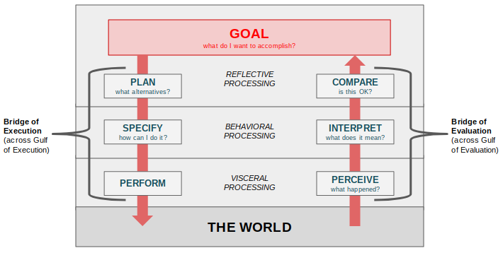

# What is design?

Herbert Simon's definition (1969, p. 55) of design as the “transformation of existing conditions into preferred ones” is very popular. Also, from the editor's introduction to Johan Redström's _Making design theory:_ "All goods and services are designed. The urge to design --- to consider a situation, imagine a better situation, and act to create that improved situation --- goes back to our prehuman ancestors. Making tools helped us to become what we are --- design helped to make us human."

Per Jaime Snyder at University of Washington, the purpose of a specific **design intervention** may be (1) to solve specific problems, OR (2) to help people reach their potential (more ambitious).

## Origins of design

Orginally applied in product development, design was imported into education in the late 1960s.

## Subfields of design

### Industrial design

Per Norman (2013, p. 5), emphasizes "form and material".

### Interaction design

Per Norman (2013, p. 5), emphasizes "understandability and usability".

### Experience design

Per Norman (2013, p. 5), emphasizes "emotional impact".

# Design philosophy

## What is good design?

Per Rams (n.d.; an industrial designer), good design:

- Is innovative
- Makes a product useful
- Is aesthetic
- Makes a product understandable
- Is unobtrusive
- Is honest
- Is long-lasting
- Is thorough
- Is environmentally-friendly
- Is as little design as possible

Per Labarre (2018), it is:

- Transparent
- Considers broad consequences
- Slow
- Honest
- Political
- Mindful of systems
- Good writing
- Multifaceted (pursuing a brand identity that is humerous, useful, beautiful, inspiring)
- Not risk-averse
- For people and machines (cyberagents)

Norman's fundamental principles of design (2013, p. 72):

- **"Discoverability.** It is possible to determine what actions are possible and the current state of the device.
- **"Feedback.** There is full and continuous information about the result of actions and the current state of the product or service. After an action has been executed, it is easy to determine the new state.
- **"Conceptual model.** The design projects all the information needed to create a good conceptual model of the system, leading to understanding and a feeling of control. The conceptual model enhances both discoverability and evaluation of results.
- **"Affordances.** The proper affordances exist to make the desired actions possible.
- **"Signifiers.** Effective use of signifiers ensures discoverability and the feedback is well communicated and intelligible.
- **"Mappings.** The relationship between controls and their actions follows the principles of good mapping, enhanced as much as possible through spatial layout and temporal contiguity.
- **"Constraints.** Providing physical, logical, semantic, and cultural constraints guides action and eases interpretation."

### Human-centered design

Per Norman, a good design is **human-centered design** --- "an approach that puts human needs, capabilities, and behavior first" (Norman, 2013, p. 8). It entails **"starting with a good understanding of people** and of the needs that the design is intended to meet". "This understanding comes about primarily through **observation,** for people themselves are often unaware of their true needs, even unaware of the difficulties they are encountering"; it also comes in the form of principles from psychology and HCI. Finally, the approach involves **iteration** --- "rapid tests of ideas ... after each test modifying the approach and the problem definition".

#### Model of cognitive processing

Norman's (2013) conceptual model of the brain involves three levels of processing, with emotion and cognition (conscious and subconscious) tightly interrelated. This model is presented at-length in his book _Emotional design._ Designers should consider how their product, service, process, etc. impacts each level of processing:

##### Visceral level

**"Visceral** responses are fast and completely subconscious. They are sensitive only to the current state of things" (p. 51; see [notes on trauma\).](health.html#what-is-trauma) Emotions at this level are _reactions_ of **calmness and anxiety** (p. 55).

##### Behavioral level

"The **behavioural** level is the home of learned skills, triggered by situations that match the appropriate patterns. Actions and analysis at this level are largely subconscious. Even though we are usually aware of our actions, we are often unaware of the details ... all we have to do is think of the goal and the behavioral level handles all" (p. 51). Emotions at this level are pattern-based or intentional _expectations_ of **hope and fear,** as well as outcomes-related emotions of **relief or despair** (p. 55).

##### Reflective level

"The **reflective** level is the home of conscious cognition ... where deep understanding develops, where reasoning and conscious decision-making take place ... Reflection is cognitive, deep, and slow. It often occurs after the events have happened ... [e.g.] adding causal elements to experienced events\" (p. 53; see [notes on learning](learning.html) and [notes on mindfulness\).](health.html#what-is-mindfulness) Emotions at this level are _judgements_ of **satisfaction, pride, blame, anger, guilt, etc.** (p. 55).

#### Terminology for interaction

- **Affordance:** "a relationship between the properties of an object and the capabilities of the agent that determines just how the object could possibly be used" (Norman, 2013, p. 11)
- **Signifier:** "can be words, a graphical illustration, or just a device whose perceived affordances are unambiguous"; a signifier makes the object's affordances known to the agent (Norman, 2013, p. 19)
- **Mapping:** "a technical term, borrowed from mathematics, meaning the relationship between the elements of two sets of things ... an important concept in the design and layout of controls and displays" (Norman, 2013, p. 21)
- **Feedback:** "communicating the results of an action" (Norman, 2013, p. 23)
- **Conceptual model:** "an explanation, usually highly simplified, of how something works. It doesn't have to be complete or even accurate as long as it is useful ... they reside in the minds of the people who are using the product, so they are also 'mental models'... " (Norman, 2013, pp. 25-26)
- **Constraint:** "" (Norman, 2013, p. )
- **System image:** "the combined information [about a system] available to [its users]", from the system, its context, and other information sources; "The user's conceptual model comes from the system image" (Norman, 2013, p. 31)

#### Model of (inter)action

Norman's (2013) model of action (relevant to [productivity\)](productivity.html) is also a model of interaction with a system (relevant to design).

Between a person (processor) and the world are two gulfs:

- **Gulf of Execution:** looking at an unfamiliar system or object, trying to figure out its affordances and the actions that will exercise them
- **Gulf of Evaluation:** "the amount of effort that a person must make to interpret the physical state of the device and to determine how well the expectations and intentions have been met" (p. 39)

To cross the Gulf of Execution, a person must:

- **Plan** the action (different alternatives)
- **Specify** the action (what was chosen)
- **Perform** the action

To cross the Gulf of Evaluation, a person must:

- **Perceive** the system state
- **Interpret** the perception
- **Compare** the interpretation with the goal, perhaps leading to formation of a new goal

In this model, the agent may begin by forming a goal ("goal-driven behavior") or by reacting to the world ("data-" or "event-driven behavior"; pp. 42-43). Regardless, the agent is empowered to act by a robust, suggestive conceptual model, such as might come from [systems thinking,](management.html#systems-thinking) and by depersonalizing the situation (as promoted by positive psychology) rather than blaming themselves (p. 37). This empowerment contrasts with a state of "learned" or "taught helpnessness" (p. 62).

#### Full model

#### Design implications

From processing model:

| Level | Implication |
| --- | ----- |
| VISCERAL | attend to "immediate perception ... [because] style matters: appearances, whether sound or sight, touch or smell" (p. 51) |
| BEHAVIOURAL | train/guide behavior by establishing expectations and providing feedback (p. 52) |
| REFLECTIVE | (this is the realm of interacting with tools in an artful or craftwork way; it has been neglected by designers pursuing user friendliness, according to Douglas Engelbart (in Levy, 2016, pp. 5-6) |

- p. 59, people tell stories == conceptual models
- p. 64, principles from positive psychology:
    - "Do not blame people when they fail to use your product properly.
    - "Take people's difficulties as signifiers of where the product can be improved.
    - "Eliminate all error messages from electronic or computer systems. Instead, provide help and guidance.
    - "Make it possble to correct problems directly from help and guidance messages. Allow people to continue with their task ... Never make people start over.
    - "Assume that what people have done is partially correct ...
    - "Think positively, for yourself and for the people you interact with."

From interaction model,

- "Anyone using a product should always be able to determine the answers" to these questions (p. 71):
    - "What do I want to accomplish?
    - "What are the alternative action sequences?
    - "What action can I do now?
    - "How do I do it?
    - "What happened?
    - "What does it mean?
    - "Is this okay?
    - "Have I accomplished my goal?"
- "We bridge the Gulf of Execution through the use of signifiers, constraints, mappings, and a conceptual model. We bridge the Gulf of Evaluation through the use of feedback and a conceptual model" (p. 40)
    - Regarding **feedforward:** "A relationship between a control and its results is easiest to learn wherever there is an understandable mapping between the controls, the actions, and the intended results. **Natural mapping,** by which I mean taking advantage of spacial analogies, leads to udnerstanding ... A device is easiest to use when the set of possible actions is visible, when the controls and displays exploit natural mappings" (pp. 22-23)
    - Regarding **feedback:**
        - "That's the point: even experts make errors. So we must design ... on the assumption that people will make errors ... Actually, [error-handling] is where the most satisfaction can arises [for the user, if handled properly]" (Norman, 2013, pp. 8-9).
        - "Poor feedback can be worse than no feedback at all, because it is distracting, uninformative, and in many cases irritating and anxiety-provoking" (p. 24)
        - Feedback should be (pp. 23-25, 60):
            - immediate, < .1 sec
            - informative (differentiated)
            - not too little
            - not too much ("Feedback is essential, but not when it gets in the way of other things including a calm and relaxing environment"
            - prioritized
            - underpredict duration of processing/waiting time

## What is bad design?

At least two kinds:

- Bad intentions
- Bad execution
    - Failure to learn

### Causes of poor design

Per Norman (2013, pp. 6 & 8):

- current technological limitations
- self-imposed restrictions (he calls "cost" one of these, I think that's debatable)
- lack of understanding of HCI, because "Engineers are trained to think logically"
- technology changes faster than design, so design must be introduced to or rediscovered by each new field

### Dark patterns

These are "dark patterns", coined and classified by Harry Brignall (n.d.):

- **Bait and Switch:** You set out to do one thing, but a different, undesirable thing happens instead.
- **Disguised Ads:** Adverts that are disguised as other kinds of content or navigation, in order to get you to click on them.
- **Forced Continuity:** When your free trial with a service comes to an end and your credit card silently starts getting charged without any warning. In some cases this is made even worse by making it difficult to cancel the membership.
- **Friend Spam:** The product asks for your email or social media permissions under the pretence it will be used for a desirable outcome (e.g. finding friends), but then spams all your contacts in a message that claims to be from you.
- **Hidden Costs:** You get to the last step of the checkout process, only to discover some unexpected charges have appeared, e.g. delivery charges, tax, etc.
- **Misdirection:** The design purposefully focuses your attention on one thing in order to distract you attention from another.
- **Price Comparison Prevention:** The retailer makes it hard for you to compare the price of an item with another item, so you cannot make an informed decision.
- **Privacy Zuckering:** You are tricked into publicly sharing more information about yourself than you really intended to. Named after Facebook CEO Mark Zuckerberg.
- **Roach Motel:** The design makes it very easy for you to get into a certain situation, but then makes it hard for you to get out of it (e.g. a subscription).
- **Sneak into Basket:** You attempt to purchase something, but somewhere in the purchasing journey the site sneaks an additional item into your basket, often through the use of an opt-out radio button or checkbox on a prior page.
- **Trick Questions:** You respond to a question, which, when glanced upon quickly appears to ask one thing, but if read carefully, asks another thing entirely.

#### Promoting addiction

- [https://journal.thriveglobal.com/how-technology-hijacks-peoples-minds-from-a-magician-and-google-s-design-ethicist-56d62ef5edf3](https://journal.thriveglobal.com/how-technology-hijacks-peoples-minds-from-a-magician-and-google-s-design-ethicist-56d62ef5edf3)

#### Neglecting or violating privacy

- [https://www.fastcodesign.com/3067094/our-apathy-toward-privacy-will-destroy-us-designers-can-help](https://www.fastcodesign.com/3067094/our-apathy-toward-privacy-will-destroy-us-designers-can-help)

# Design thinking

Design thinking is for generating ideas. It draws on user research/contextual inquiry; it contributes to [strategy](https://jtkovacs.github.io/refs/management.html#strategy) and [performance management](https://jtkovacs.github.io/refs/performance-management.html) as well as product and service design. Vassallo (2017b) urges the incorporation of [systems thinking](management.html#systems-thinking) into design thinking, to cope with global complexity.

"Design thinking incorporates constituent or consumer insights in depth and rapid prototyping, all aimed at getting beyond the assumptions that block effective solutions. Design thinking — **inherently optimistic, constructive, and experiential** — addresses the needs of the people who will consume a product or service and the infrastructure that enables it. Businesses are embracing design thinking because it helps them be more innovative, better differentiate their brands, and bring their products and services to market faster. Nonprofits are beginning to use design thinking as well to develop better solutions to social problems. Design thinking crosses the traditional boundaries between public, for-profit, and nonprofit sectors. By working closely with the clients and consumers, design thinking allows high-impact solutions to bubble up from below rather than being imposed from the top" (Brown and Wyatt, 2010, p. 32).

## Convergence & divergence

Keller (1983) credits Gordon (1961) for developing the concepts of divergent and convergent thinking under the banner of "synectics".

## Empathy

"'Empathy' was Ideo founder David Kelley’s shorthand for in-the-weeds ethnographic research. And, to be fair, that’s what some design thinkers still have in mind. But as design thinking has grown in popularity, some of its core tenets have been watered down or misapplied. Perhaps as a result of overuse, when most designers talk about empathy, they don’t seem to me to be referring to fact-gathering at all, but something more like feeling-broadcasting. Empathy in design has gone from an outward-facing action to an inward-turned affect. I think it might be too late to protect the design-thinking denotation of the word from the layman’s definition. Regardless, I would urge us as a discipline to practice rigorous evidence-based compassion, rather than trying to feel people’s pain" (Vassallo, 2017a).

# Design processes

## Design lifecycles

Per Jaime Snyder (2018) at University of Washington:

1. Ideation
2. Iteration
3. Evaluation
4. Documentation (passing off to developers)

Per Birsel (2015):

1. Deconstruction
2. Point of view (see things a new way)
3. Reconstruction
4. Expression (implementation)

"The design thinking process is best thought of as a system of overlapping spaces rather than a sequence of orderly steps. There are three spaces to keep in mind: inspiration, ideation, and implementation. Think of **inspiration** as the problem or opportunity that motivates the search for solutions; **ideation** as the process of generating, developing, and testing ideas; and **implementation** as the path that leads from the project stage into people’s lives."  (Brown and Wyatt, 2010, p. 33)

## Design subprocesses

(this list per Friedman & Hendry, 2012)

### Co-design

### Heuristic evaluation

### Critique

### User research

(AKA inquiry)

# Design tools

## Cards

Friedman & Hendry (2012):

- Envisioning Cards
- IDEO Method Cards
- Interactive Thread Cards

**Envisioning Cards** have been used to:

- 'stimulate ideation and iteration in co-design'
- explore the implications of a new technology (e.g., persuasion profiles)
- prompts for heuristic evaluation

# Sources

## Cited

Birsel, A. (2015). _Design the life you love._

Brignall, H. (n.d.). Types of dark patterns. Retrieved from [https://darkpatterns.org/types-of-dark-pattern](https://darkpatterns.org/types-of-dark-pattern)

Brown, T. & Wyatt, J. (2010). Design thinking for social innovation. _Stanford Social Innovation Review._ Retrieved from [https://5a5f89b8e10a225a44ac-ccbed124c38c4f7a3066210c073e7d55.ssl.cf1.rackcdn.com/files/pdfs/news/2010_SSIR_DesignThinking.pdf](https://5a5f89b8e10a225a44ac-ccbed124c38c4f7a3066210c073e7d55.ssl.cf1.rackcdn.com/files/pdfs/news/2010_SSIR_DesignThinking.pdf)

Friedman, B. & Hendry, D. G. (2012). The _Envisioning Cards:_ A toolkit for catalyzing humanistic and technical imaginations. In E. H. Chi & K. Höök (Eds.), _Proceedings of the 30th Annual SIGCHI Conference on Human Factors in Computing Systems (CHI ’12)_ (pp. 1145-1148). New York, NY: ACM Press.

Labarre, S. (2018, January 3). 10 new principles of good design. Co.Design. Retrieved from [https://www.fastcodesign.com/90154519/10-new-principles-of-good-design](https://www.fastcodesign.com/90154519/10-new-principles-of-good-design)

Levy, D. (2016). _Mindful tech: How to bring balance to our digital lives._ New Haven, CT: Yale University Press.

Norman, D. (2013). _The design of everyday things_ (revised and expanded edition). New York City, NY: Basic Books.

Rams, D. (n.d.). Good design. Vitsoe. Retrieved from [https://www.vitsoe.com/us/about/good-design](https://www.vitsoe.com/us/about/good-design)

Simon. H. (1969). _Sciences of the artificial._

Vassallo, S. (2017a, April 26). The case against empathy. Co.Design. Retrieved from [https://www.fastcodesign.com/90111831/the-case-against-empathy](https://www.fastcodesign.com/90111831/the-case-against-empathy)

Vassallo, S. (2017b, May 1). Design thinking needs to think bigger. Co.Design. Retrieved from [https://www.fastcodesign.com/90112320/design-thinking-needs-to-think-bigger](https://www.fastcodesign.com/90112320/design-thinking-needs-to-think-bigger)

## References

- [Questionnaire bank for usability research](http://www.usabilitynet.org/tools/r_questionnaire.htm)
- [User Experience Questionnaire](http://www.ueq-online.org/)
- [Usability.gov](https://www.usability.gov/)
- [Simply Secure Knowledge Base](https://simplysecure.org/knowledge-base/) - Best practices for privacy, security, and transparency in design

## Read

## Unread

- [System Usability Scale](https://www.usability.gov/how-to-and-tools/methods/system-usability-scale.html)
- [Usability tutorial](http://www.afterhoursprogramming.com/tutorial/Usability/Introduction/)
- [Design for programmers](https://blog.prototypr.io/design-for-programmers-d38c56982cd0#.cx4hjk2o1)
- [Users’ Computer Skills: Worse Than You Think](https://www.nngroup.com/articles/computer-skill-levels/)
- [Dark Patterns: fighting user deception worldwide](http://darkpatterns.org/)
- Eyal, N. _Hooked: How to Build Habit-Forming Products_.
- Weinschenk, S. _100 Things Every Designer Needs to Know About People_.
- [Draw toast](http://www.drawtoast.com/)
- [Microsoft's radical bet on a new type of design thinking](https://www.fastcodesign.com/3054927/the-big-idea/microsofts-inspiring-bet-on-a-radical-new-type-of-design-thinking)
- [Service design toolkit](http://www.servicedesigntoolkit.org/downloads.html)
- [Principles and glossary of presencing](https://www.presencing.com/principles)
- [Design to improve life (cases and methods)](http://designtoimprovelife.dk/tools/)
- [Principles for complex systems](http://capita.wustl.edu/ME567_Informatics/contents/complex.html)