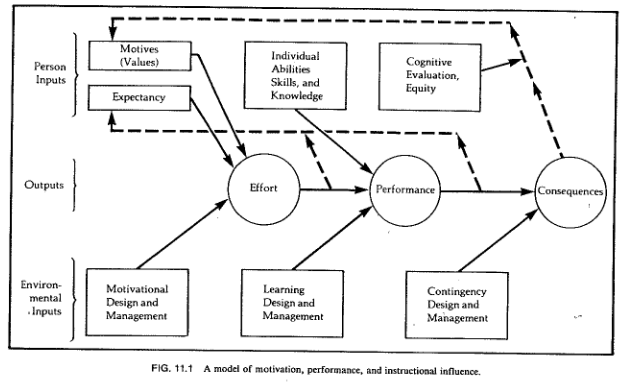
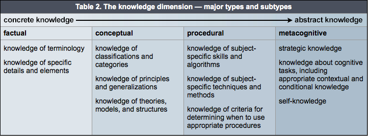
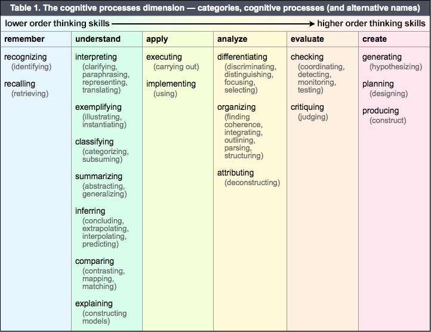
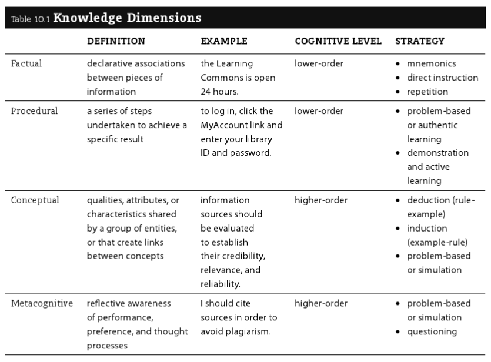
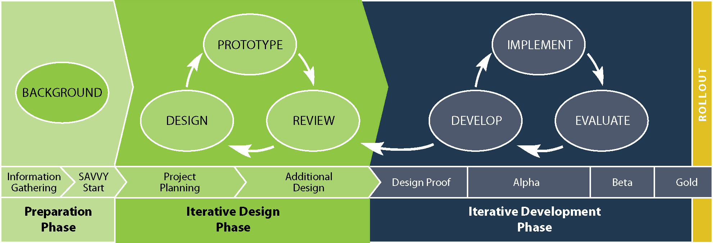
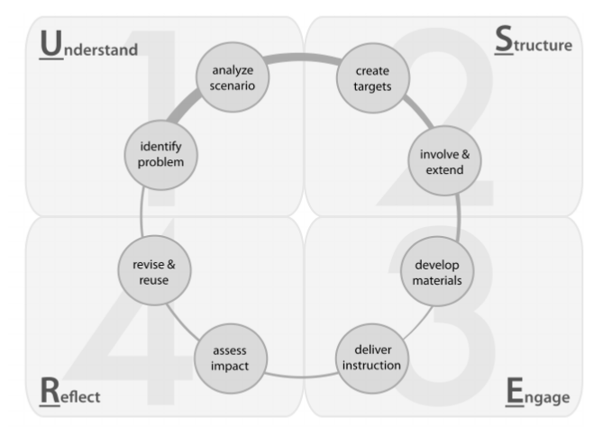
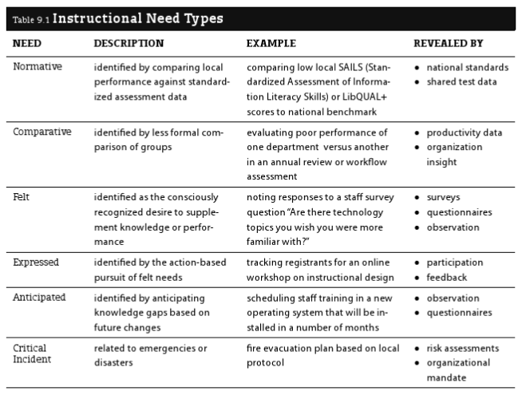
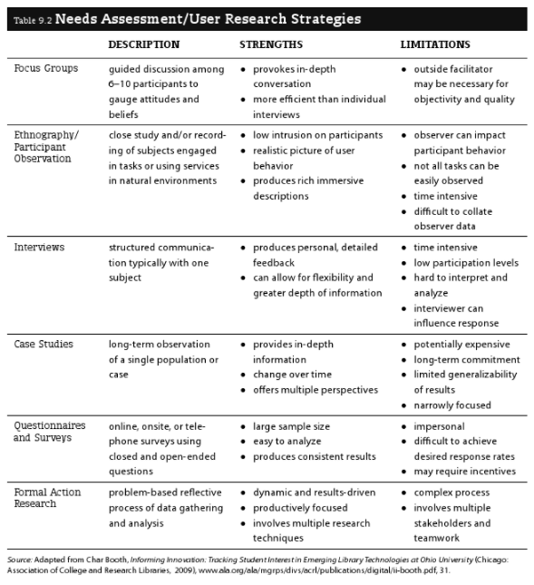
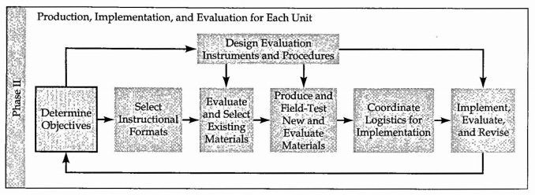

# What is instruction?

## How does instruction vary by context?

- **Education vs. training:** Booth (2014, p. 51) notes that some people distinguish between education and training on the basis of transfer (which education aims to promote, but training does not).
- - **Academia vs. real-world learning:** Via Bransford et al. (2014), academic work is typically more solitary and cognitive than other contexts, although collaboration and use of tools may be increasingly present in some disciplines.
- **Learning environments vs. instructional systems:** This distinction comes from Gagné: _"learning environments_ are constructivist educational spaces that provide the framework for self-discovery, whereas _instructional systems_ are behaviorist/cognitivist spaces that 'focus on telling ... learners what they need to know'" (Booth, 2011, p. 87).

### Types of classrooms

Per Barkley and Major (2016):

- traditional
- online
- collaborative
- flipped

## What competencies should instructors have?

Per Booth (2014), core knowledge and skills for teaching (what she calls “instructional literacy”) includes:

- Capacity for **reflective practice** (not just after the fact, but primarily in the moment);
- Knowledge of **educational theories,** consisting of
    - **Learning theories,** historically the province of psychology, more abstract and fundamental;
    - **Instructional theories,** oriented towards teacher practice AKA **pedagogy;**
    - **Curriculum theories,** focused on 'genre' in teaching;
- Mastery of **teaching technologies** (for collaboration, assessment, etc.); and
- Skill in **instructional design,** a structured design process that creates learning objects, etc. for learning interactions

Booth also presents her [USER method](#user-method) primarily as an instructional design model, secondarily as an "instructional literacy framework that encourages you to [thirdly] reflect on your process in order to become a 'student of learning” as you teach' (p. 95).

# Educational theory

## Learning theory

### Timeline of major learning theories

From lectures by Philip J. Reed at the University of Washington iSchool, following Booth (2014) and Keller (1983):

- CLASSICAL (philosophical):
    - **Rationalism:** (reason and debate)
    - **Empiricism** (observation and experimentation)
- SCIENTIFIC
    - PSYCHOLOGY _Reed notes that these approaches are both comfortable assessing learning through behavior change, not so for constructivism._
        - **Behaviorism** (B. F. Skinner, rote memorization, reinforcement, feedback); dominant c. 1950s as an educational theory but still has currency in psychology, still embedded in common teaching and learning practices; associated with Industrial Revolution
        - **Cognitivism** (Jean Piaget, David Ausubel) focuses on learners' information processing AKA "assimilation of information into mental models" (Reed, 2017; AKA schemata, Booth, 2014, p. 44); "how to organize instruction" for "acquisition and retention of knowledge and skills", "also studied in relation to individual differences in ability and learning style" (Keller, 1983); note that this includes a much more active role for the student, believing that "knowledge is something that depends on your perception and how you put things together" (Reed, 2017)
            - Human development and its implications for learning (Piaget's *readiness* concept)
            - Gestalt theorists
    - EDUCATION
        - **Constructivism** (John Dewey, Lev Vygotsky) focuses on how *learners* "construct their own learning process" (Reed, 2017) through "observation, translation, and imitation (mimesis, socialization, and modeling)" (Booth, 2014, p. 62), subject to *social influences*; mainstream view in education, strugges with the issue of assessment
            - Situated learning
            - Zone of proximal development

### Implications for instruction

Per Booth (2014), and see also Brown et al. (2014):

- **Environment**
    - "practical factors such as room dimensions, furniture, and seating capacity; ... lighting and temperature;
    - "technical factors such as computing technology and presentation media;
    - "cultural elements such as language accessibility and inclusiveness; and
    - "instructional elements such as tone, pacing, classroom dynamics, discussion management, and opportunities for interaction" (Booth, 2014, p. 45)
- **Memory**
    - Manage cognitive overload (manage environment, curate inputs so they are of better quality)
    - Teach mnemonics (structuring information logically AKA chunking; alphabetically; metaphorically; spatially)
    - Enable elaboration (association with existing information)
- **Motivation**
    - Address relevant needs (Maslow; deprivation needs vs. growth needs)
    - Support intrinsic (inherent/already internalized) versus extrinsic (incentivized/coerced) motivation [as below](#motivation)
- **Prior knowledge** i.e. schemata AKA mental models; related to TRANSFER
    - Readiness for learning (Piaget)
    - Respecting prior knowledge
    - Activating prior knowledge

#### Motivation

Motivation an extremely important part of learning; it is *why* people learn, rather than *how.* It's important to know that **optimal motivation is moderate motivation,** and excess motivation is anxiety; this should be considered in motivational design, e.g. when setting the level of risk/reward (it should be moderate).

In addition to the Keller model below, Bransford et al. (2014) credit the following factors with increasing motivation:

- A learning orientation and growth mindset (see Dweck et al., 2014) versus a performance orientation
- Social recognition, shared work, and solidarity

Keller (1983) writes practically on motivation but grounds it in his prior theoretical work. This work, in keeping with field theory/social learning theory, starts from the assumption that B, behavior is a function of E, the environment and P, the individual person, **B=f(E,P).** Then, as categories of behavior, Keller distinguishes between:

- **Effort** = P's level of engagement and discipline, "a direct indicator of motivation" [jtck: consider mental health though..];
- **Performance** = f(motivation/effort, ability, opportunity); and
- **Consequences** = performance + (benefits to the individual = reinforce motivation)

Determinants E and P may be examined for each behavior, identifying instructional strategies:

##### Interest

Interest AKA attention = f(trait_curiosity, presentation); see [instructional messages.](#instructional-messages)

- ***Simulate curiosity*** = f(novelty, paradox, incongruity, complexity, abruptness, conflict)
    - Perceptual vs. *epistemic curiosity*
    - Trait vs. *state curiosity*
    - Note that curiosity can be fatigued by excessive stimulation
    - Appeal to emotions, personal experience, the familiar e.g. with analogies, metaphors, anecdotes, questions
- ***Sustain curiosity:***
    - Allowance to explore
    - Lower the cost of failure
    - Occasional surprises and humor
    - Make the familiar strange and vice versa
    - Separate convergent from divergent thinking (see [design thinking)](./strategy.html#design-thinking)
    - Use the **inquiry method** where students are given a genuine problem to solve, with the understanding that they are learning to navigate the process of inquiry

##### Relevance

Relevance = f(alignment, clear_connections). Drawing from *drive theory,* e.g. Maslow, Keller proposes a typology of personal (relevant to self) vs. instrumental (relevant to goals) vs. cultural (relevant to group)

- **Personal**
    - Promote a sense of **achievement** by combining "standards of excellence" with moderate risks and non-zero sum grading
    - Promote **empowerment** by allowing choice, responsibility, and influence
    - Promote **affiliation** by establishing trust, which may include non-zero sum grading
- **Instrumental** relevance can be made clear through learning objectives
- **Cultural** relevance is a matter of inclusive content, approaches, and environments, but also raises the question of whether a learner's culture places a high value on the type of education being offered

##### Expectancy

Expectancy AKA confidence = f(challenge, support), similar to "zone of proximal development"

- Address self-fulfilling prophecies of failure
- *[attribution theory/locus of control/personal causation/learned helplessness]*
    - Provide meaningful successes (not trivial small wins; learners know it won't transfer)
    - Make the pathway to success clear (mastery learning)
    - Give feedback that clarifies the connection between efforts and outcomes

##### Satisfaction

Satisfaction = f(intrinsic\_reinforcement, extrinsic\_reinforcement)

- To preserve intrinsic motivation (which can be destroyed by extrinsic reinforcement):
    - give "endogeneous" rewards that "customarily or naturally follows from a task"
    - give exogeneous rewards unexpectedly
- Give motivational feedback verbally and immediately
- Time informative/formative feedback (rather than evaluative/summative feedback) such that it is quickly actionable

#### Transfer

Along with **recall** (retrieve and apply this knowledge if a similar situation arises), Booth (2014, p. 43) says a fundamental goal of instruction is transfer (retrieve and apply this in novel ways). Interestingly, per Bransford et al. (2014):

- "Different kinds of learning experiences can look equivalent when test of learning focus solely on remembering ... but they can look quite different when tests of transfer are used" (p. 51).
- Classical education practices assumed transfer in their doctrine of "formal discipline", i.e. their belief that studying Latin trained the mind like a muscle for other tasks (probably not true of minds or muscles).
- Some researchers treat transfer as a matter of conceptual overlap, others as a matter of skill overlap.

##### Types of transfer

- **Near vs. far:** "[T]hese terms distinguish the closeness or distance [or dis/similarity] between the original learning and the transfer task" (Leberman, 2006).
- **Positive vs. negative:** "When learning in one context improves[/inhibits] learning or performance in another context" (Leberman, 2006).
- **Simple vs. complex:** "Simple transfer happens when little or no effort is required to apply what has been learned in one situation to a new situation [and the opposite for complex transfer]" (Leberman, 2006).
- **Automatic vs. mindful:** " When an individual responds spontaneously within a transfer situation, which is very similar to the learning situation then this is  automatic transfer … In contrast, mindful [or] high road transfer is deliberate and involves conscious thought and intellectual effort, and occurs in situations where there are significant gaps or differences between the original and the transfer situations" (Leberman, 2006).
- **Overzealous:** " Of particular concern are situations where students transfer skills, knowledge, and routines that are effective for the task at hand but may nevertheless be suboptimal in the long run because they block additional learning. We will call this overzealous transfer (OZT) — people transfer solutions that appear to be positive because they are  working well enough, but they are nevertheless negative with respect to learning what is new"  (Schwartz et al., 2012).

##### How to promote transfer

- Provide transfer-supportive **learning experiences:**
    - Something must be learned with sufficient depth before it can be transferred
    - Understanding promotes transfer; mere memorization does not
    - Let students engage with real problems and struggle a bit before lecturing (increases benefit of lecture)
    - Learning takes time; allow for it
    - Give feedback on transfer---how students are applying concepts in varying contexts
- Attend to [motivation](#motivation)
- Present **abstractions** and underlying logic, since "[k]nowledge that is overly contextualized [i.e., 'narrowly tailored to a given situation', NOT 'transparently placed in context'] can reduce transfer" (note that this is in keeping with cognitivist learning theories).
    - Make strong contrasts to facilitate pattern recognition
    - Show/practice applications in a range of contexts
        - Work on a problem at length, then use "what if" thought experiments
    - Help students see and represent their own problems/work in wider contexts
    - Promote metacognition
- Activate **prior knowledge:**
    - Use "graduated prompting" to cue for transfer
    - Be aware of common conceptual misunderstandings for a given field: "teachers must strive to make students' thinking visible and find ways to help them reconceptualize faulty conceptions" (p. 71)
    - Be aware that prior knowledge is not just of an individual student's construction; it is also cultural

#### Multiple intelligences

Gardner & Hatch (1989) argue for a richer understanding of intelligence as "the capacity to solve problems or to fashion products that are valued in one or more cultural settings". They distinguish seven "intelligences" (another, **naturalist,** has been proposed):

- **Visual/spatial:** "Capacities to perceive the visual-spatial world accurately and to perform transformations on one's initial perceptions."
- **Verbal/linguistic:** "Sensitivity to the sounds, rhythms, and meanings of words; sensitivity to the different functions of language."
- **Logical/mathematical:** "Sensitivity to, and capacity to discern, logical or numerical patterns; ability to handle long chains of reasoning."
- **Bodily/kinesthetic:** "Abilities to control one's body movements and to handle objects skillfully."
- **Musical/rhythmic:** "Abilities to produce and appreciate rhythm, pitch, and timbre; appreciation of the forms of musical expressiveness."
- **Interpersonal/social:** "Capacities to discern and respond appropriately to the moods, temperaments, motivations, and desires of other people."
- **Intrapersonal/introspective:** "Access to one's own feelings and the ability to discriminate among them and draw upon them to guide behavior; knowledge of one's own strengths, weaknesses, desires, and intelligence."

While Brown et al. (2014) cite research challenging one of the main pedagogical implications of Gardner's theory --- viz., that instruction should be tailored to each learner's preferred modes (actually it should be varied for all learners) --- Eisner (2004) demonstrates the continuing (even accelerating) relevance of Gardner's work by using it to critique the educational standards movement, which in Eisner's opinion "symptomatizes a loss of faith in the professional competence of teachers" (p. 34). So this is the primary message to take from Gardner: people are gifted in different ways and that's fine (notice, however, that this leads to questions about educational in/equality and in/equity). Eisner also uses Gardner to criticize the institutionalized assumption that individual students will learn at constant rates, and a group of students will learn at a consistent pace such that they can progress as a cohort.

## Instructional theory

The learning theories above have consequent instructional theories. Using a series of questions from Ertmer and Newby, Booth (2014, p. 73) contrasts them as follows:

| Question | Behaviorist | Cognitivist | Constructivist |
| --- | --- | --- | --- |
| How does learning occur?  | through guided behavioral change made evident by accurate answers/consistent performance | through mental processes that result in the formation of concepts and schema | through experience, sociocultural influence, and metacognition |
| What factors influence learning? | external (environment, instruction) | internal (cognitive processes, readiness, aptitude) | internal (emotional); exter (social, environmental) |
| What is the role of memory? | repetition and reinforcement facilitates memorization | short- and long-term memory interact to facilitate schema building | activated and influenced by meaningful learner experiences |
| How does transfer occur? | encouraged by positive reinforcement, learners make associations in the form of "correct" answers | learners form mental models in order to apply concepts and ideas to new scenarios | through perception of personally-relevant knowledge and application of knowledge |
| What types of learning are best suited to this theory? | fact-based; practical | concept-based; procedural | problem-based; collaborative |
| What aspects are important to instructional design? | provide feedback to reinforce learning; provide opportunities for practice and exchange | present information with targeted efficiency in order to stimulate memory and the formation of structured knowledge | provides learners with opportunties to investigate content in authentic settings |
| What teaching strategies facilitate learning? | instructor-centered; learner/instructor interaction; information organization and repetition | instructor-centered; strategic information presentation; targeted media use; cognitive load management; learner scaffolding | learner-centered; authentic stimulation; collaborative activity; hands-on practice; questioning techniques; critical inquiry |

### Alignment

Per EC (2015), "Alignment is when the:

- **OBJECTIVES** [i.e. targets] articulate the knowledge and skills you want students to acquire by the end of the course
- **ASSESSMENTS** allow the instructor to check the degree to which the students are meeting the learning objectives
- **INSTRUCTIONAL STRATEGIES** are chosen to foster student learning towards meeting the objectives ...

Aligning these three components is a dynamic process, since a change in one necessarily affects the other two."

### Objectives

Phillips and Phillips (2010) attribute the original use of the term in instructional design to Robert Mager for his 1967 book *Preparing instructional objectives.*

#### Learning objectives in context

See also [http://www-tandfonline-com.offcampus.lib.washington.edu/doi/abs/10.1080/0142159022020687?src=recsys](http://www-tandfonline-com.offcampus.lib.washington.edu/doi/abs/10.1080/0142159022020687?src=recsys)

##### Targets

Per Booth (2014), targets form a hierarchy:

- **GOALS** = hoped-for lasting changes (strategic perspective: why does this training matter?)
- **OUTCOMES** = express a theory of how to produce outcomes/the structure of the course
- **OBJECTIVES** = strategies/skills needed to attain goals; describes ideal changes in learners

##### Phillips model

The Phillips and Phillips (2010) model is one common model for describing and evaluating the various levels of organizational impact a training may have; [there are others, ](https://www.watershedlrs.com/blog/phillips-model-for-learning-evaluation) but in any case the point is to cover the entire "chain of impact" to which an instructional project belongs and depends on:

| Level of Objectives | Measurement Focus | Typical Measures |
| --- | --- | --- |
| 1: Reaction | Reaction to the project or program, including the perceived value | Relevance, importance, usefulness, appropriateness, intent to use, motivation to take action |
| 2: Learning | Learning to use the content and materials, including the confidence to use what was learned | Skills, knowledge, capacity, competencies, confidence, contacts |
| 3: Application [Behavior] | Use of content and materials in the work environment, including progress with actual items and implementation | Extent of use, task completion, frequency of use, actions completed, success with use, barriers to use, enablers to use |
| 4: Impact [Results] | The consequences of the use of the content and materials expressed as business impact measures | Productivity, revenue, quality, time, efficiency, customer satisfaction, employee engagement |
| 5: ROI | Comparison of monetary benefits from program to program costs | Benefit-cost ratio (BCR), ROI (%), payback period |

_Source:_ Phillips & Phillips, 2010, p. 18.

#### Purpose and value of learning objectives

- [I]mprove the impact of instruction", which is "particularly [true] when participants have had a hand in defining [the LOs]” (Booth, 2014; read the Eberly Center's [discussion of how)](https://www.cmu.edu/teaching/resources/Teaching/CourseDesign/Objectives/CourseLearningObjectivesValue.pdf)
- Support the instructor in reflecting and improving (Diamond, 2008)
- "Serve as the basis for selecting instructional methods" (Diamond, 2008) and "allow you to structure measurable learning interactions" (Booth, 2014)
- Proactively "[c]ommunicate to your students your expectations and how the students will be assessed", which facilitates student self-assessment, and therefore facilitates learning (Diamond, 2008)
- Retroactively "[s]erve as the basis for your assessment of student achievement" (Diamond, 2008)

#### Writing good learning objectives

- **Student-centered:** Focus on what students should do or be able to do, not what instructors hope to 'cover' (EC, 2015). Diamond
- **Aligned,** if possible, with institutional, disciplinary, or other standards of practice and statements of purpose (Diamond, 2008)
- **Measurable,** not vague ("What would students do differently if they really 'understand' or 'appreciate' X?" ask EC, 2015). Quoted from Phillips and Phillips (2010) and echoed by Diamond (2008), LOs should speak to:
    - **Performance ---** what the participant will be able to do during the program {see [Bloom's modified taxonomy}](#blooms-modified-taxonomy)
    - **Condition ---** circumstances under which the participant will perform the task
    - **Criteria ---** degree or level [i.e. **quantification]** of proficiency that is necessary to perform the job" {see [Schulman's learning process}](#schulmans-learning-process-stages)

Diamond (2008) describes how instructors have struggled particularly with shifting perspective from content- to outcomes-focused; with writing "behavioral" objectives that are measurable but not too narrow; and with writing LOs at the right level of granularity, not too stultifying.

##### Bloom's modified taxonomy

See Dr. Leslie Owen Wilson's [great discussion](http://thesecondprinciple.com/teaching-essentials/beyond-bloom-cognitive-taxonomy-revised/) for backstory. In brief, the modified taxonomy has a knowledge dimension and a cognitive process dimension. It can be used for:

- Analyzing content and generating suitable learning objectives
- Evaluating learning objectives
- Scaffolding learning materials or instructional messages

Per the [Center for Excellence in Learning and Teaching](http://www.celt.iastate.edu/teaching/effective-teaching-practices/revised-blooms-taxonomy) at Iowa State University:

##### Task analysis for procedural knowledge

Booth (2014) suggests task analysis as a strategy for decomposing one's own expert procedural knowledge and thereby reacquainting oneself with the topic from a beginner's perspective.

##### Schulman's learning process stages

Alonso et al. (2008) characterize Schulman's learning process model (2002) as having the following stages, representing different degrees of mastery that an objective may specify:

- engagement and motivation
- knowledge and understanding
- performance and action
- reflection and critique
- judgement and design
- commitment and identity

##### SOLO taxonomy

[http://www.innomet.ee/innomet/Reports/Report_WP1.pdf](http://www.innomet.ee/innomet/Reports/Report_WP1.pdf)

##### Feisel-Schmidt technical taxonomy

[http://www.innomet.ee/innomet/Reports/Report_WP1.pdf](http://www.innomet.ee/innomet/Reports/Report_WP1.pdf)

##### Examples

From Diamond (2008, pp. 135-136):

- *__Government.__ When given a major decision made by a governmental leader, you will be able to identify the major factors that the leader had to consider and discuss why the action was taken and what apparent trade-offs were made.*
- *__Economics.__ Demonstrate graphically and explain how a change in expectations will affect the loanable funds market. (Begin with an appropriately labeled graph that represents the initial equilibrium.)*
- *__Management.__ Identify (based on readings, case studies, and/ or personal  experiences) those activities that are most likely to distinguish effective, well-managed technology development programs from ineffective programs.*
- *__Statistics.__ When given two events, you will be able to determine whether they are independent or whether there is a relationship between them (that is, one event affects the probability of the other). On the basis of this determination, you will be able to select and use the appropriate rules of conditional probability to determine the probability that a certain event will occur.*
- *__Religion.__ When given a definition of the term _religion,_ you will be able to identify which of the following characteristics is emphasized: feeling, ritual activity, belief, monotheism, the solitary individual, social valuation, illusion, ultimate reality, and value.*
- *__Music.__ On hearing musical selections, you will be able to identify those that are examples of chamber music and be able to identify the form, texture, and makeup of the ensemble.*
- *__Art.__ When shown a print, you will be able to identify whether it is a woodcut, an etching, or a lithograph, and you will be able to list the characteristics on which this identification was based.*
- *__Psychology.__ When given a case study, you will be able to identify whether it describes a case of schizophrenia and, if it does, which of the following schizophrenic reactions are involved: hebephrenic, catatonic, or paranoid.*

### Instructional strategies

#### Choosing strategies

##### Strategies by knowledge dimension

From Booth, 2014, p. 116:

#### Activities

##### Stop and think

### Assessment

#### What is assessment for?

Diamond (2008, p. 128) quotes Theodore Marchese on the proper role of assessment:

**"Assessment per se guarantees nothing by way of improvement, no more than a thermometer cures a fever. Only when used in combination with good instruction (that evokes involvement in coherent curricula, etc.) in a program of improvement, can the device strengthen education.**

See Torrance (2007) for some additional caution regarding assessment.

##### How is assessment different from grading?

Barkley and Major (2016) recreate the following table from Suskie (2009):

| Grades ... | Assessment ... |
| --- | --- |
| Focuses on an individual student | Focuses on a cohort of students |
| Are letters that are indirect, symbolic representations of accomplishment | Attempts to pinpoint more precisely what was learned |
| May reflect class management goals related to student behavior that are separate from learning, such as attendance, participation, and on-time submission of assignments | Emphasizes only achievement of specific learning goals |
| May be the result of vague or inconsistent standards | Aims for exactness |
| Reflect student performance in individual courses or course assignments | May measure learning from ungraded co-curricular activities or look for skill development beyond course content, such as critical thinking |

**Embedded assessment** tries to perform the functions of grades and assessments simultaneously.

#### Who is assessment for?

Per Barkley and Major (2016), assessment has the following audiences (quoted directly from section headers):

- Assessing Students to Determine for Ourselves How Well Students Are Learning
    - To discover the current status of student knowledge and understanding
    - To solve a problem in our teaching
    - To determine whether we need to change direction in our teaching
    - To find out how students are experiencing learning in our classrooms
- Assessing to Give Learners Feedback on Their Progress
- Assessing to Improve Our Profession through the Scholarship of Teaching and Learning (SoTL)
- Assessing to Provide Information to Institutional and External Stakeholders on How Well Students Are Learning
    - As part of our professional dossiers
    - For program reviews, whether internal or external
    - To institutional assessment efforts and accrediting agencies

#### Qualities of good assessment

Booth (2014, pp. 137-138) says that good assessment is:

- **Reflective,** i.e. a professional responsibility;
- **Communicative** (signaling that 'this learning matters');
- **Interactive, diactic, and nuanced** rather than an artificial and abstract impediment to learning

Per James McMillan as cited in Booth (2014, p. 138), good assessments have the following qualities:

- **"Appropriateness:** Evaluation strategies should be based on targets and provide insight into the content areas specified by those targets.
- **Validity:** To ensure that your assessment methods make accurate insights about students, vary investigation methods and use multiple sources of input to increase validity.
- **Reliability:** Assessment strategies should produce consistent results and reduce error with pre-testing and critical consideration of results.
- **Fairness:** To reflect the learning experience of all participants fairly, assessment strategies should give an equal voice to all and not privilege more forthcoming learners over others.
- **Positive consequences:** Evaluation methods should be weighed for their ability to create positive consequences for learners. Assessment should result in productive action.
- **Alignment:** Assessment methods should align with the skill levels and competencies of learners. \[NB: this is not the typical sense of [alignment](#alignment) in education]
- **Practicality/Efficiency:** Assessment methods should be time efficient and practical to the situation."

#### Assessment types by effort and source of opinion

Per James McMillan as cited and extended by Booth (2014, p. 138), assessments may be:

| Teacher observation (no effort) | Selected response | Constructed response | Student self-assessment (high effort) | Social/peer assessment |
| --- | --- | --- | --- | --- | --- |
| "Formal and informal methods of observing student progress during a learning interaction. Also, information gathered from a requesting instructor (e.g., assessment of on-task behavior, observation of nonverbal communication)" | "Assessment instruments that present learners with two or more options from which to choose (e.g., multiple choice surveys, Likert scale questionnaires, matching quizzes, classroom response system polls)" | "Evaluation techniques that require students to create their own response to a given task or scenario (e.g., short-answer essay, one-minute paper, informal questioning, think-aloud exercises)" | "Metacognitive or reflective evaluations conducted by students (e.g., one-minute paper, attitude survey, self-reflection, peer evaluation)" | Collaborative, collective, social or peer assessments "... made possible by tools like Facebook, Twitter, and Flickr" |

#### Assessment types with respect to chronology of learning

##### Pre-assessment

Per Booth (2014, p. 140), pre-assessment is "conducted before instruction to establish prior knowledge and analyze the scenario".

##### Formative assessment

Per Booth (2014, p. 140), formative assessment "evaluates materials during design and gives insight into the quality and character of an in-progress interaction". Formative assessment is meant to be real-time and to provide learners and instructors with actionable information about the learners' present state of understanding.

Booth (2014, p. 141) quotes the following formative assessment strategies from Tomas Angelo and Patrician Cross's _Classroom assessment techniques:_

- **"One-Minute Paper.** Stop an interaction a few minutes before it concludes and ask learners to note on index cards, half-sheets, or an online form the most important thing they learned and one question that remains unanswered. Follow up with learners via e-mail or other means to address unanswered questions. For a variation on this technique, ask students at the beginning of an interaction to specify one question that they want answered during the session using a course blog or online form. Read these aloud and try to address useful questions raised during the session (see figure 12.2 and visit www.tinyurl.com/libquestion for two examples of this in action).
- **Muddiest Point.** At the end of an interaction or activity, ask learners to quickly write a response to the question, “What was the muddiest point in [this particular lesson or module]?” Read selected responses aloud and follow up on identified areas of missed comprehension.
- **Misconception/Preconception Check.** Before a learning interaction, hand out a worksheet or send a survey, message, or forum thread that asks students to respond to a potentially misleading open-ended question or statement about libraries or information as a way of discovering what pre/misconceptions among students might spark productive discussion.
- **Pro-and-Con Grid.** After an activity, use a questioning method or self-directed reflection to ask students to evaluate a resource or scenario using a pro-and-con grid, such as listing specific benefits and drawbacks of each. Discuss pros and cons with the entire group.
- **Concept Maps.** Have learners visualize their understanding of a topic by asking them to draw connections between major ideas and concepts covered in the session or module.
- **Classroom Opinion Polls.** Use simple questioning, classroom response devices, social media tools, or online polls to evaluate learner responses to quick comprehension or evaluation questions during or at the end of a module to stimulate discussion.
- **Course-Related Self-Confidence Surveys.** At the beginning of an interaction ask learners to rate their level of confidence or expertise in the skills or topics you will be covering in class. Review these and make adjustments in skill levels that may be above or below what you anticipated."

Booth (2014) also mentions her colleague Pat Maughan's technique of distributing index cards at the beginning of a workshop, asking for the first three word that came to mind when thinking of X, then repeating the exercise at the end of the workshop and comparing wordcloud representations of the two datasets.

Frey, Nancy, and Douglas Fisher. (2011). Creating a formative assessment system.

##### Summative assessment

Per Booth (2014, p. 140), summative assessment (AKA 'post-instructional assessment') "occurs at the conclusion of an interaction and judges its overall effectiveness". See [Understand](#understand) for methods that are useful for summative assessment as well as user research.

##### Confirmative assessment

Per Booth (2014, p. 140), confirmative assessment "occurs well after an interaction and tracks retention and recall of actionable knowledge in authentic settings." While formative and summative assessments focus on learning objectives, confirmative assessment focuses on [objectives and goals,](#targets) the higher-level targets a training seeks to fulfill.

#### Other assessment types

Per Barkley and Major (2016, pp. 25-26):

- **"Educative assessment** is a term developed by Grant Wiggins to describe a process in which assessment is designed to help improve student performance rather than just “audit” it. While LATs can be used for both purposes, we strive to emphasize the educative aspect because our primary purpose in LATs is to improve learning.
- **Embedded assessment** occurs within the class as an assignment linked to learning outcomes, thus achieving both grading and assessment purposes. All LATs are embedded assessments.
- **Authentic assessment** simulates a real-world experience by evaluating ability to apply knowledge or perform tasks under conditions that approximate those found outside of the classroom. Wherever possible, we have attempted to create LATs that reflect the principles of authentic assessment."

#### Choosing assessment approaches

Barkley and Major (2016) organize "learning assessment techniques" (LATs) by **type of class** _(traditional, online, collaborative, flipped)_ and **type of learning goal** _\(foundational knowledge, applied knowledge, integration of knowledge, caring, human dimension,_ and _learning how to learn,_ per the [Learning Goals Inventory\)](https://www.aacu.org/sites/default/files/files/gened16/AlabamaLearningGoals.pdf).

#### Creating assessment instruments

##### Rubrics

Rubrics are nxm matrices where, for n **criteria,** m **standards** of performance are described.

##### Self-evaluation forms

##### Peer evaluation forms

#### Administering assessments

Barkley and Major (2016, pp. 47-48) synthezise from Johnson, Johnson, and Smith (1998), University of Waterloo (n.d.), Johnson and Johnson (1984), and Silberman (1996):

- **"Explain the activity.** Provide students with a basic overview so that students see “the big picture.”
- **Clarify the objectives.** Tell students the purpose of the activity so that they can see its benefit. For example, relate the task to larger class goals or prior knowledge or suggest new concepts that will be addressed.
- **Outline the procedures.** Describe exactly what students are going to do in a step-by-step format in order to minimize or eliminate confusion during the activity itself.
- **Present examples if needed.** Provide a concrete example that illustrates the process or shows a model final product so that students get a clearer idea of what they need to do.
- **Set time limits.** Establish a time limit so that students can pace themselves. If the estimate is on the low side, students may work quickly and ef fi ciently, and the time limit can always be extended if needed.
- **Provide the prompt.** Most often, prompts will come in the form of questions or problems, but they may also include short topics or statements for exploration or debate. It may be appropriate to include the prompt with the activity introduction.
- **Provide necessary materials, including handouts.** When implementing a LAT, you may want to provide materials such as directions, prompts, evaluation rubrics, worksheets, and so forth in a written handout to be distributed or posted online. Thus, depending upon the LAT, you may want to create materials that are given to students prior to beginning the activity. In each LAT, we provide suggestions for the kinds of materials you will want to create ahead of time. These vary depending on the particular LAT you are employing. Materials may include information about the assignment, such as a handout with information about the length and time frame. They may also include work materials for students such as fl ip chart paper and markers. Successful implementation of a LAT depends upon advance planning and material gathering.
- **Query the students for understanding and let students ask questions.** Asking students whether they have questions before they begin the activity will provide an opportunity to clarify any aspects of the activity that may still be confusing.
- **Be available to clarify instruction, review procedures, and answer questions about the assignment.** Students may believe they understand the assignments and instructions but encounter confusion or change their minds when they begin work. Clarifying these points for students early on saves students wasting time or struggling with the wrong assignment.
- **Paraphrase or ask a question to clarify what a student has said.** Students sometimes state ideas in a way that confuses you and potentially other students. Paraphrasing what the student has contributed provides an opportunity for clarification and can be reinforcing for the student by demonstrating that his or her idea has been transmitted and understood and helping make it clearer for other students.
- **Compliment the student on an interesting or insightful comment.** Students need reinforcement, and complimenting a student can be a powerful motivator.
- **Elaborate on a student’s statement or suggest a new perspective.** Stopping to share with the group a new perspective on an idea can help the students delve into deeper levels of thinking about a topic.
- **Energize by using humor or by asking for additional contributions.** This approach can be particularly helpful when students are struggling with complex material and have become frustrated. It can help students put things into perspective, and make class fun. However, humor can be more challenging to convey through some mediums, such as in online courses.
- **Disagree with a student comment, but be gentle.** Instructors are sometimes hesitant to correct students for fear of stifling their creativity and causing students to be more reluctant to speak the next time, but if you overhear misinformation, it is important to correct it. If done gently and tactfully, students will appreciate that they got the correct response. It is also important for them to recognize that there is a difference of opinion or another side to the issue. Pointed questions are also a good way to redirect the conversation.
- **If appropriate, pull together ideas by pointing out relationships.** Students do not have the same familiarity with the course concepts that instructors do. If students are struggling with making connections between ideas and information, remind them how the task they’re performing relates to something they studied previously or to something current in the news."

### Buzzwords, schools and movements

#### Connectivism

Per Booth (2014, p. 81), "a theoretical approach that emphasizes the impact of information technology on learning".

#### Active learning

#### Flipped classroom

#### Critical pedagogy

#### Transformative learning theory

Per Mezirow (2009), transformative learning is a subset of "learning that transforms problematic [NB: different interpretations of this] frames of reference to make them more inclusive, discriminating, reflective, open, and emotionally able to change". Mezirow has defended the importance of rationality in transformative learning practices, contra other theorists in the field.

#### Problem-based learning

Per Stevens and Tieman (2017), the origin of PBL was contemporanous with critical pedagogy (Freire, 2009; Shore, 1996; hooks, 1994) but elsewhere---in McMaster's medical schools, spreading to libraries c. 1990s. They identify the following open questions in PBL, at least in the context of library instruction:

- How important is group work when it comes to problem-solving? Should groups report to the class?
- How much time, how many sessions, or what kind of timeline is required for PBL versus lectures?
- How much collaboration with instructors, to integrate course goals, content, or messaging re: library research?
- How much foundational instruction, versus 'thrown directly into the pool'?

While admitting that their own experiment with PBL differed in important ways (e.g. they presented fairly tidy questions rather than "ill-structured problems"), they claim that PBL is only superficially aligned with critical pedagogy. They say that, despite rebranding teachers as facilitators/tutors/etc. who guide small groups, in PBL the oppressive dichotomy (see Freire, 2009) of student/teacher is left intact because "students are seen only as objects to control ... student are never seen as teachers".

#### Integrative learning

#### Mastery learning

#### Experiential learning

## Curriculum theory

Est. Franklin Bobbitt, c. 1920s.

### Information literacy

# Instructional design

Instructional design combines [educational theory](#educational-theory) with [design thinking methods](./strategy.html#design-thinking) to create a variety of instructional products. Per Booth (2014, p. 106), "ID is a systematic instructional planning approach that channels ... insight and awareness [from reflective practice, educational theory, and teaching technologies] into efficient, learner-focused pedagogy". Booth notes that ID is communicated in the form of models/frameworks and guiding principles.

Via Booth (2014, pp. 41-42), Robert Gagné, a founder of instructional design, believes learning is a function of the "interplay" between the following factors (note that not all of them are under the instructor's control):

| Internal | External |
| --- | --- |
| cognition | environment |
| emotion | instructor |
| desire | culture |

## Instructional design frameworks

### ADDIE model

Molenda (2003) explains that ADDIE is an authorless abstraction that might form the foundation or core of other more specific instructional design methodologies. Per Piskurich (2000) and Booth (2014):

- **Analyze:** These pre-ID activities should be performed, then presented in a report. For large projects, this phase might consume the majority of time:
    - needs assessment
    - performance assessment
    - cost-benefit analysis
- **Design:**  This phase is strategic or conceptual, producing the following artifacts:
    - instructional plan
    - lesson plan
    - assessment plan
- **Develop:** This phase involves building the actual instructional product.
- **Implement** AKA roll-out.
- **Evaluate,** to guide iteration.

### Successive approximation model (SAM)

Allen Interactions (2017) has adapted Agile software methods for ID:

### USER method

Booth (2011, p. 95) calls her USER method a "streamlined version of ADDIE" that is more realistic in practice.

Source: Booth, 2014, p. 19.

#### Understand

- **Identify the problem.** "What is the challenge learners face, and how can I help them meet it?" (I assume she means for this question to be posed at the strategic level)
- **Analyze the scenario.** "Characterize" and "confront" any difficulties arising in the following dimensions:
    - **Learner:** attributes, motivation, prior knowledge, and barriers to learning
    - **Content:** knowledge, skills and attributes that will later be translated into [targets](#targets)
    - **Context:** space, technology, collaboration, promotion
    - **Educator**

Booth (2014, p. 105):

#### Structure

- **Create targets,** i.e. [goals, objectives and outcomes](#targets): "Targets organize the knowledge, skills, and attitudes specified in the _Understand_ phase into content units and instructional strategies, and provide criteria to assess learning during and after instruction. They are also a framework for guiding student understanding and metacognitive awareness" (p. 116)
- "Identify methods to **involve** learners using delivery techniques, technologies, and activities" that align with the targets. Consider:
    - _"Control of Learning._ Which areas of the interaction will be teacher centered (direct instruction), and which will be more student centered (discovery instruction)?
    - _Grouping for Learning._ Will you ask learners to work as individuals, pairs, teams, or groups?
    - _Interactions for Learning._ Will you create learning interactions that are human (student/teacher, student/student, other) or nonhuman (student/ tools, student/information, student/environment, other)?
    - _Support for Learning._ Will you provide cognitive support or emotional support?" (p. 120)
- **Extend the interaction** before, during, and after instruction, e.g. by providing preparatory exercises, suggested resources, etc.; see [integrative learning]](#integrative-learning)

#### Engage

- **Develop materials** through a process of prototyping and revision
    - Craft [instructional messages](#instructional-messages)
    - Create **learning objects,** which includes paying attention to [information design and visualization](#visual-design-of-learning-objects)
- **Deliver instruction:**
    - [Plan implementation](#lesson-planning)
    - Deliver in a way that **captures attention** and **sustains interest;** see [motivation](#motivation)

#### Reflect

- [Assess impact](#assessment) on learners
- **Reflect** to identify what should be preserved, revised, or discarded

### Curriculum innovation canvas

Willness, C. & Bruni-Bossio, B. (2017). The curriculum innovation canvas: A design-thinking framework for the engaged educational entrepreneur. _Journal of Higher Education Outreach and Engagement,_ 21(1).

### Diamond

### Other instructional design models

... mentioned by Booth (2014, p. 86):

- Morrison, Ross, and Kemp's _Designing effective instruction_
- Dick, Carey, and Carey's _The systematic design of instruction_
- Bell and Shaank's BLAAM method

## Lesson planning

.. AKA student learning plan, per Reeves (2011).

- Rusznyak and Walton (2011) call out lesson planning as a particularly important moment for a teacher's professional development, specifically in cultivating "pedagogical content knowledge"
- Williams et al. (2012) advocate for including Universal Design consideratings in planning for the whole class, rather than relying on individualized learning plans as an afterthought.

### Approaches to lesson planning

Uhrmacher et al. (2013) argue that there are two dominant approaches to lesson planning (corresponding to two schools of learning theory) and a less common "perceptual lesson planning" inspired by Dewey, Elliot Eisner, and Donald Oliver. They differentiate approaches on four dimensions (list quoted from p. 5; table quoted, with structural modifications, from p. 10):

- **Intentions:** Aims, goals, or objectives of the lesson plan and of the teacher operating with a particular mode
- **Process:** The way the lesson is created; the experience the teacher undergoes in the planning
- **Product:** Actual lessons that result from the planning—their physical form
- **Outcomes:** Anticipated results of the mode in general and the lesson in particular; desired student learning or experience

| Modes of Lesson Planning | Intentions | Process | Product | Outcomes |
| --- | --- | --- | --- | --- |
| **Behaviorist** | Teacher develops objectives to alter student behavior; lesson is often teacher-centered or driven. | Created by teacher or teacher teams with specific, measurable outcomes; can be created in isolation or by others outside of the classroom context. | Formalized step by step lesson plan; linear process often with multiple pre-determined aspects (anticipatory set, direct instruction, practice, etc.); generally 3-5 written pages. | Preconceived; measurable; specific to objective. |
| **Constructivist** | Student-centered with aim of discovering and building their own knowledge and skill; make authentic connections with students’ worlds. | Created by teacher or teacher teams; can be created in isolation but must bear particular students in mind (cannot be created “offsite”); planning may be cyclical but tends to be linear, multi-step process. | Formalized lesson plan; various templates or charts and ways of proceeding that allow for variations due to student interests and understandings (e.g., EEL DR C); generally 2-5 written pages. | Preconceived; measurable; specific to student needs and background knowledge; focus on transfer to/from life experience; students reflect on own learning. | Preconceived; measurable; specific to student needs and background knowledge; focus on transfer to/from life experience; students reflect on own learning. |
| **Perceptual** | To engage teachers’ and students’ senses, creativity and imagination; may include objectives or targets along with associated meaning and connections; focused on interaction among students, content, and teacher. | An artistic endeavor that relies on creative thinking and is joyful in and of itself; conducive to individual or team planning; may find inspiration from outside sources but are created for a particular context; uses sensory information; ideas evolve as lesson is created—teachers find inspiration for teaching in the process of planning the lesson. | Various styles (could utilize behaviorist or constructivist methods); attention to rhythm of the experience; multiple ways to represent the plan; colorful images, maps, short, poetic phrases; may be paper or web-based; format invites joy, creativity, and inspiration; multiple points of engagement for future revision; elements of CRISPA or SCOPES or other aesthetic method. | Fosters teacher and student creativity; meaningful learning for students and teacher; open to intrinsic rewards of teaching and learning; open to elements of surprise and student innovation; designed to foster meaningful expressive outcomes in balance with predetermined goals. |

- _behaviorist_
    - (Hunter method)
    - Multiple Menu
- _constructivist_
    - EEL DR C
    - Understanding by Design
    - Kodaly method
    - Moffet and Wagner
    - Science and Technology for Individuals, Societies and the Environment (STISE)
    - Marzano
    - UDL
- _perceptual_
    - CRISPA
    - SCOPES

### Gagné’s events of instruction

From Booth (2014, p. 132):

- "Gain attention.
- Inform learner of objectives.
- Stimulate recall of prior learning.
- Present stimulus material.
- Provide learner guidance.
- Elicit performance.
- Provide feedback.
- Assess performance.
- Enhance retention transfer."

### Hunter lesson plan model

Paraphrased from a handout provided by Reed (2017):

- **Prepare students to learn**
    - Review foundational material
    - Build anticipation
    - State lesson objectives
- **Deliver instruction**
    - Present information and verify understanding during presentation
    - Show examples of what's expected from students (modeling)
- Immediately check understanding with **guided practice**
- After some time, **require independent practice,** and after some time again, **provide feedback**

... however, Reeves notes, Hunter originalled ordered them by logical dependence---i.e. the order in which they should be considered by the instructor during planning---rather than chronologically, i.e. as a learner would encounter them (2011, p. 178):

- "Determining the kind of access students will have to new information
- Modeling desired thinking and skills
- Checking for understanding
- Guiding students’ practice
- Providing independent practice
- Communicating to students what the objective is
- Starting a lesson by creating an anticipatory set"

### Reeves' lesson plan elements

Per Reeves (2011, pp. 180-181):

- "Identifying information (lesson topic, title, grade, dates)
- Associated academic standards, usually in the form of benchmarks
- Topical, essential, and guiding questions
- Instructional objectives
- Formative or summative assessment tasks
- Learning activities, which may include the following:
    - Introduction, hook, or anticipatory set. This may be in the form of a bellringer that students will begin to think about or work on as soon as they enter the classroom
    - Access to new information
    - Recording or saving new information for future reference
    - Working with new content to make sense of it and connect it to prior knowledge
    - Application or practice that may double as formative assessment, with varying degrees of teacher guidance and monitoring
- Differentiation plans for individual students who need it
- Closure that will prompt students to reflect on the content of the lesson and connect it to their own personal knowledge base and to other parts of the curriculum. The topical, guiding, or essential questions are often addressed in closure.
- Homework assignment
- Materials or preparation required
- Post-lesson reflection on how the lesson went and what could be changed for better results or for future students"

### Universal Design for Learning

Williams et al. (2012, p. 214) suggest that UDL can help teachers be more effective and equitable in their teaching. This means including multiple forms of **representation, engagement,** and **expression** while planning lessons. They further suggest some tools:

| UDL Lesson components  | High-Technology | Low-Technology |
| --- | --- | --- |
| Representation: Presentation/Content | SmartBoard, PowerPoint presentation, Youtube/DVD | Posters/markers, projector, lecture/models |
| Engagement: Process/Participation | Reading pen/LiveScribe, Multimedia activity, Blogs/Wikis | Graphic organizer, Calculator, Group discussions |
| Expression: Product/Assessment | Podcast/recording, WebCast report, Multimedia presentation |  Oral presentation, Journal/Graph, Poster/Brochure |

### Rusznyak and Walton's lesson planning guidelines

Rusznyak and Walton's template for lesson planning is meant to help teachers deepen their own content knowledge and "pedagogical content knowledge" over time (2011):

- 1: **Routine Information**
    - Grade, subject, theme
    - Topic of preceeding, current, and following lessons
- 2: **Purpose**
    - Key questions learners should be able to answer post-lesson
    - Skills "
    - Attitudes and values "
- 3: **Content Knowledge:** "Summarise your understanding of the most important conceptual knowledge of this lesson" (p. 283)
- 4: **Learners** "in relation to content knowledge" (p. 283):
    - "What aspects of _learner diversity_ need consideration?
    - How is the content knowledge linked to the _prior knowledge_ of learners and/or _current affairs?_
    - What _subject vocabulary/terminology_ would learners need to learn during this lesson?
    - What _examples_ can you use to help learners understand better?
    - What _evidence of understanding_ should learners produce during the lesson?
    - What _common misunderstandings_ or mistakes might learners make during the lesson? How could you pre-empt the possible misunderstandings learners may have?"
- 5: **Teaching & Learning Strategies:** " What teaching and learning strategies are appropriate to use during this lesson? Explain the reason/s for your choices" (p. 283)

Finally, "[w]rite a sequence of lesson steps that builds a process of learning" (p. 284):

| Aim of lesson step | Describe what will happen in each lesson step |
| --- | --- |
| ... | ... |

### CRISPA

Per Uhrmacher et al. (2013, p. 18), CRISPA is a form of perceptual lesson planning that "does not designate the specific order of the lesson, nor are all six elements required for each lesson plan. In a sense, CRISPA elements are like colors on an artist’s palette: available for use when and if they would complement the whole picture":

- connections
- risk-taking
- imagination
- sensory experience
- perceptivity
- active engagement

## Learning objects

### Instructional messages

Booth (2014) calls instructional messages "elevator pitches" for the class; it's about knowing and conveying what you have to offer in a particular instructional situation. Messages should be clearly relevant and actionable ("WIIFM/what's in it for me principle"). In addition, Booth summarizes Chip and Dan Heath’s best practices for powerful messages, which they organize as an acronym (SUCCESs) but I present here differently:

- get attention, hold interest: **UNEXPECTED, STORIES**
- facilitate comprehension: **SIMPLE, CONCRETE**
- appeal and persuade: **CREDIBLE, EMOTIONAL**

### Visual design of learning objects

#### Mayer's strategies

Per Booth (2014, p. 127): "Richard Mayer lists seven such strategies that make more efficient use of cognitive processing capacity in instructional interfaces, materials, and graphics:

- **Concentrated:** Core ideas are emphasized via highlighting, bolding, and other strategies.
- **Concise:** Brevity and simplicity are achieved by eliminating extraneous text and images.
- **Correspondent:** Pictures, charts, and tables and their captions are placed close to one another.
- **Concrete:** Images provide clear visualizations of the subjects in question.
- **Coherent:** Picture choices are logical and correspond with narration, captions, or surrounding text.
- **Comprehensible:** Graphics and text or narration reflect the prior knowledge of the viewer.
- **Codable:** Graphics and text or narration lend themselves to being integrated into memory."

#### PAT model

Booth (2011) summarizes Linda Lohr's approach to visual design for instructional purposes:

##### Principles

These are the broad "cognitive functions" that comprise someone's interaction with a visual instructional object:

- **Selection** (filtering what's important): guided by the **figure/ground** principle (people can't pay attention to everything, so know what you want to emphasize and then make the emphasis obvious)
- **Organization** (parsing the 'figure;): supported by "clear and consistent navigational elements, chunking information into content units that reflect instructional objectives, providing scaffolding in the form of assistance and support, and incorporating hierarchical elements such as lists, charts, and outlines that suggest relationships"
- **Integration** (situating the figure)

##### Actions

- **Contrast** to emphasize dissimilarity and create interest
- **Proximity** to convey relatedness
- **Repetition** to reduce cognitive burden and emphasize structure (pathways)
- **Alignment** to maximize readability and reduce visual noise

##### Tools

Adjust mood, readability, accessibility, etc. with :

- Font & typeface
- Color
- Shapes
- Depth/details/realism
- Whitespace

#### Presentation slides

Culled from Duarte ('D', 2008) and Reynolds ('R', 2009):

- **Slides should complement the narrative,** not duplicate it ("dual channels")
- One point per slide (R)
- Aim for high signal-to-noise ratio (R)
- Favor images over text; more engaging, more memorable; "picture superiority effect" (R)
    - Relevant
    - Not cliché
    - ... but QUOTES are also great for sparking interest and enhancing credibility
- Pay attn to size, placement, resolution, aspect
    - Use full-slide ("full bleed") images (R)
    - Try for "asymmetric balance" rather than symmetry (R)
    - 330 ppi resolution for high-quality print images; 100 ppi for screen (R)
    - Use enough white space
- Make sure text is readable
    - Place text on semi-transparent solid background when it overlaps an image (R)
- Try embedded videos

##### Image filetypes

Per Reynolds (2009):

- **JPEG** is good for photos on the web, but lossy when compressed
- **GIF** is good for drawings (only 256 colors)
- **PNG** lets you adjust transparency
- **EPS** is for vectors
- **TIFF** is high res, good for print

##### Photography tips

- For people:
    - Avoid direct sunlight (generally creates unflattering shadows)
    - Focus on eyes
    - Place head in upper third of frame, slightly off-center
- Tripod stablizes and creates better photos in low-light conditions
- Use the White Balance feature in response to light conditions
- Explore different vantage points

#### Gestalt principles

Per Reynolds (2009):

- Figure/ground
- Continuation
- Closure
- Implied space (cropping)
- Implied depth (scale)

### Multimedia learning objects

Booth summarizes Mayer again (2014, p. 130):

- **"Coherence:** Extraneous words, sounds, and pictures are minimized. Modality : Narration occurs as speech rather than printed text in multimedia presentations.
- **Personalization:** Narration occurs in conversational rather than formal style.
- **Pretraining:** The learner knows the names and characteristics of the key concepts. Redundancy : Animation and narration are preferable in multimedia presentations over animation, narration, and on-screen text (to reduce cognitive overload).
- **Segmenting:** A fast-paced, complex multimedia lesson is presented in user-paced segments rather than as a continuous presentation.
- **Signaling:** The essential material is highlighted. Spatial contiguity : Corresponding words and pictures are presented in proximity to one another on a page or screen.
- **Temporal contiguity:** Corresponding words and pictures are presented simultaneously rather than successively in time.
- **Voice:** Narration occurs in a friendly human voice rather than a machine voice."

### Evaluating learning objects

Booth presents a modified version of Lohr's schema for evaluating learning objects (2014, p. 130):

- **"Effectiveness**
    - Does the learning object cover the correct content?
    - Does the learning object cover an optimal amount of information (not too much and not too little content)?
    - Does the learning object “work” instructionally?
- **Efficiency**
    - Does the learning object make important information (selection) easy to perceive?
    - Is the learning object organized (organization) so that information is easy to access?
    - Does the learning object help the user relate the information to the overall instructional or performance target (integration)?
- **Appeal**
    - Does the design of learning object motivate the user to engage with it?
    - Is the information in the learning object relevant and important to the user in the instructional context?
    - Is the learning object clear enough to convince users that they will understand it?"

## Teaching technologies

### History of teaching technologies

Alonso et al. (2008) provides a brief review of the history of eLearning technologies.

### Keeping current

Per Booth (2014), an educator can use the following process and skills to find their bearing in a constantly evolving technology landscape:

- **Experience** the technologies in a personal authentic way (see pp. 66-68 for Booth's summary of Web 2.0 and emerging technologies as relevant to education);
- **Evaluate** them with respect to educational objectives; and
- **Customize** tools for the given learning scenario

### Evaluating teaching technologies

Booth identifies these ten affordances AKA functionality AKA features (quoted; 2014, p. 65):

- *assessment:* template/customizable evaluation and analysis
- *collaboration:* shared effort, cooperation, and/or crowd-sourcing
- *communication:* contant and exchange among participants
- *customization:* personalizable features or appearance
- *documentation:* information recording for future use and access
- *play:* diversion and/or creative expression
- *portability:* mobile communication, creation, and access
- *productivity:* task-oriented learning and time management
- *sharing:* dissemination of ideas or information for public consumption
- *visualization:* graphical information display

She suggests evaluating technologies in this format, which I've slightly adapted (p. 73):

<table>
    <tr>
        <th>PERSPECTIVE</th>
        <th>CHARACTERISTICS</th>
        <th>OUTCOMES</th>
        <th>CAVEATS</th>
        <th>AFFORDANCES</th>
    </tr>
    <tr>
        <th>TEACHER</th>
        <td rowspan="2">[list]</td>
        <td>[list]</td>
        <td>[list]</td>
        <td>[score as above]</td>
    </tr>
    <tr>
        <th>LEARNER</th>
        <td>[list]</td>
        <td>[list]</td>
        <td>[score as above]</td>
    </tr>
</table>

# Reflective practice

Booth presents her [USER method](#user-method) primarily as an instructional design model, but secondarily as an "instructional literacy framework that encourages you to reflect on your process in order to become a 'student of learning” as you teach' (2014, p. 95).

## Qualities of excellent teachers

Per Booth (2014):

- [logistics]
    - Focus on goals
    - Be organized enough to achieve them
- [interpersonal]
    - Be authentic
    - Show your personal investment in the class and the students

## A miscellany of advice and insights

- Be vigilant against the “curse of knowledge”, i.e. losing the ability to communicate with inexperts and to effectively anticipate knowledge gaps in one’s teaching (Booth, 2014)
- Diversify the kinds of thinking you ask learners to do; try to activate as many parts of the brain as possible; don't try to favor people's preferred learning styles (Beneteau, 2017; also Brown et al., 2014)

# Sources

## Cited

Allen Interactions. (2017). Agile eLearning development with SAM. Retrieved from [http://www.alleninteractions.com/sam-process](http://www.alleninteractions.com/sam-process)

Alonso, F., Lopez, G., Manrique, D., & Vines, J. M. (2008). Learning objects, learning objectives and learning design. _Innovations in Education and Teaching International,_ 45(4), 389-400.

Barkley, E. F., & Major, C. H. (2016). _Learning assessment techniques: A handbook for college faculty._ San Francisco, CA: Jossey-Bass.

Beneteau, E. (2017). Lecture for LIS 570. University of Washington.

Booth, C. (2014). _Reflective teaching, effective learning: Instructional literacy for library educators._ Chicago, IL: American Library Association Editions.

Bransford, J., Brown, A. & Cocking, R. (2000). Learning and transfer. In _How people learn: Brain, mind, experience, and school._ Washington, DC: The National Academies Press. [https://doi.org/10.17226/9854](https://doi.org/10.17226/9854)

Brown, P. C., Roediger III, H. L., & McDaniel, M. A. (2014). _Make it stick: The science of successful learning._ Cambridge, MA: Belknap Press.

Diamond, R. M. (2008). Clarifying instructional goals and objectives (ch. 9). In _Designing and assessing courses and curricula: A practical guide (3rd ed.)._ San Francisco, CA: Jossey-Bass.

Dweck, C. S., Walton, G. M., & Cohen, G. L. (2014). Academic tenacity: Mindsets and skills that promote long-term learning. Bill & Melinda Gates Foundation. Retrieved from [https://ed.stanford.edu/sites/default/files/manual/dweck-walton-cohen-2014.pdf](https://ed.stanford.edu/sites/default/files/manual/dweck-walton-cohen-2014.pdf) (PDF)

Eberly Center for Teaching Excellence & Educational Innovation (EC). (2015). Learning objectives. Carnegie Mellon University. Retrieved from [https://www.cmu.edu/teaching/designteach/design/learningobjectives.html](https://www.cmu.edu/teaching/designteach/design/learningobjectives.html)

Eisner, E. (2004). Multiple intelligences: Its tensions and possibilities. _Teachers College Record,_ 106(1), 31-39.

Freire, P. (2009). _Pedagogy of the oppressed_ (30th anniversary ed.). New York City, NY: Continuum.

Gardner, H. & Hatch, T. (1989). Multiple intelligences go to school: Educational implications of the theory of multiple intelligences. _Educational Researcher,_ 18(8).

hooks, b. (1994). _Teaching to transgress: Education as the practice of freedom._ New York City, NY: Routledge.

Keller, J. M. (1983). Motivational design of instruction. In C. M. Reigeluth (Ed.), *Instructional-design theories and models: An overview of their current status.* Hillsdale, NJ: Lawrence Erlbaum Associates.

Leberman, S.,  McDonald, L., & Doyle, S. (2006). _The transfer of learning: Participants’ perspectives of adult education and training._ Burlington, VT: Gower Publishing Company.

Medina, J. (2008). _Brain rules: 12 principles for surviving and thriving and work, home, and school._ Seattle, WA: Pear Press.

Mezirow, J. (2009). Transformative learning theory. In _Transformative learning in practice: Insights from community, workplace, and higher education._ J. Mezirow & E. Taylor, Eds. Hoboken, NJ: Jossey-Bass.

Molenda, M. (2003). In search of the elusive ADDIE model. _Performance improvement,_ 42(5), 34-37.

Phillips, J. J., & Phillips, P. P. (2010). The power of objectives: Moving beyond learning objectives. _Performance Improvement,_ 49(6), 17-24.

Piskurich, G. M. (2000). _Rapid instructional design: Learning ID fast and right._ San Francisco, CA: Jossey-Bass.

Reed, P. J. (2017). Lecture comments. University of Washington iSchool.

Reeves, A. R. (2011). Creating plans for learning. In _Where great teaching begins: Planning for student thinking and learning._ Alexandria, VA: ASCD.

Reynolds, G. (2009). _Presentation Zen design: Simple design principles and techniques to enhance your presentations._ San Francisco, CA: New Riders.

Rusznyak, L. & Walton, E. (2011). Lesson planning guidelines for student teachers: A scaffold for the development of pedagogical content knowledge. _Education as Change,_ 15(2).

Schwartz, D. L., Chase, C. C., & Bransford, J. D. (2012). Resisting overzealous transfer: Coordinating previously successful routines with needs for new learning. _Educational Psychologist, 47_(3).

Shore, I. (1996). _When students have power: Negotiating authority in critical pedagogy._ Chicago, IL: University of Chicago Press.

Stevens, E. & Tieman, A. (2017). We used problem-based learning in library instruction and came to question its treatment of students. _In The Library With The Lead Pipe._ Retrieved from (http://www.inthelibrarywiththeleadpipe.org/2017/we-used-problem-based-learning-in-library-instruction-and-came-to-question-its-treatment-of-students/)[http://www.inthelibrarywiththeleadpipe.org/2017/we-used-problem-based-learning-in-library-instruction-and-came-to-question-its-treatment-of-students/]

Torrance, H. (2007). Assessment as learning? How the use of explicit learning objectives, assessment criteria and feedback in post‐secondary education and training can come to dominate learning. _Assessment in Education: Principles, Policy & Practice_ 14(3). [http://dx.doi.org.offcampus.lib.washington.edu/10.1080/09695940701591867](http://dx.doi.org.offcampus.lib.washington.edu/10.1080/09695940701591867)

Uhrmacher, P., Conrad, B. M., & Moroye, C. M. (2013). Finding the balance between process and product through perceptual lesson planning. _Teachers College Record,_ 115, 1-27.

Williams, J., Evans, C., & King, L. (2012). The impact of universal design for learning Instruction on lesson planning. _International Journal of Learning,_ 18(4).

## References

- [Washington Center's learning communities repository](http://wacenter.evergreen.edu/)
- [MERLOT II online teaching resources](https://www.merlot.org/merlot/index.htm)
- [Association for Talent Development](https://www.td.org/)
- [InstructionalDesign.org](http://www.instructionaldesign.org/index.html)

## Unread

- Callahan, R. (1962). _Education and the cuilt of efficiency._ Chicago: University of Chicago Press. _(This is a history of the efficiency movement in education.)_
- Tye, B. B. (2000). _Hard truths: Uncovering the deep structure of schooling._ New York: Teachers College Press.
- [Transfer of learning](http://www.nwlink.com/~donclark/hrd/learning/transfer.html)
- [High-impact or engaged learning practices](https://uwaterloo.ca/centre-for-teaching-excellence/resources/integrative-learning/high-impact-practices-hips-or-engaged-learning-practices)
- [Building a better discussion](http://www.chronicle.com/article/Building-a-Better-Discussion/231685/)
- [Arizona State & Knewton's grand experiment with adaptive learning](https://www.insidehighered.com/news/2013/01/25/arizona-st-and-knewtons-grand-experiment-adaptive-learning)
- [Sharing slow ideas](http://www.newyorker.com/magazine/2013/07/29/slow-ideas)
