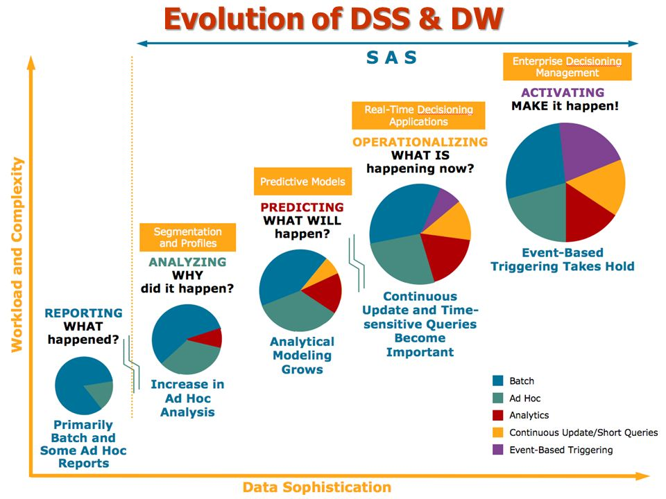
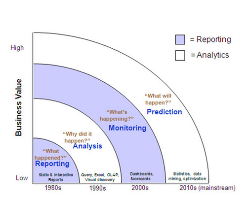

<a href="../pkb.html">pkb contents</a> \> bi | just under 823 words | updated 12/17/2017

- &nbsp;1. [What is BI?](#what-is-bi)
	- &nbsp;1.1. [History of BI](#history-of-bi)
	- &nbsp;1.2. [BI roles](#bi-roles)
		- &nbsp;1.2.1. [BI versus data science](#bi-versus-data-science)
	- &nbsp;1.3. [Trends in BI](#trends-in-bi)
- &nbsp;2. [BI systems](#bi-systems)
	- &nbsp;2.1. [Data warehouses](#data-warehouses)
		- &nbsp;2.1.1. [OLTP vs OLAP databases](#oltp-vs-olap-databases)
		- &nbsp;2.1.2. [Data warehouse architectures](#data-warehouse-architectures)
	- &nbsp;2.2. [Analytics](#analytics)
		- &nbsp;2.2.1. [Types of analytics](#types-of-analytics)
		- &nbsp;2.2.2. [Big Data](#big-data)
	- &nbsp;2.3. [Dashboards & reporting](#dashboards-reporting)
- &nbsp;3. [Sources](#sources)
	- &nbsp;3.1. [Cited](#cited)
	- &nbsp;3.2. [References](#references)
	- &nbsp;3.3. [Read](#read)
	- &nbsp;3.4. [Unread](#unread)

# 1. What is BI?

- https://en.wikipedia.org/wiki/Business_intelligence

Sharda et al. (2014) offer the “business pressures-responses-support” model of BI, in which:

- The business environment supplies pressures and opportunities (see [PESTEL analysis\)](./project-management.html#pestel-analysis);
- Managers need to respond;
- BI supports their response with analysis and predictions.

By enabling data-based decision-making, BI offers value in the form of:

- faster answers (speed = competitive edge)
- new answers to questions currently impossible
- actions that wouldn't have been performed without BI

## 1.1. History of BI

- [use of info to support decisions]
- [use of computers to support decisions]
- Executive and management information systems
- BI systems enabling broader access to data, closer to ground-level where people can base their actions on it

## 1.2. BI roles

A BI team typically has the following roles:

### 1.2.1. BI versus data science

- DS has more programming, is better at using computational power for analysis
- DS may involve more sophisticated modeling
- DS facilitates predictive and prescriptive analytics
- Because DS uses computers, it loses the context awareness that human actors supply in their interactions with BI and must recreate it somehow, for instance in training machine learning algorithms

## 1.3. Trends in BI

- Data democratization
- IoT

# 2. BI systems

Per Sharda et al. (2004), BI tools provide varying combinations of the following broad functionalities:

- data storage
- data management
- business performance management
- UI

## 2.1. Data warehouses

Data warehouse functionality

- Data visualization
- Alerts/push mechanisms that activate in response to certain conditions or as part of a routine
- Performance management capabilities (track performance vs. goals, e.g. sales quota; can be public/competitive)

### 2.1.1. OLTP vs OLAP databases

The disctinction between online transaction and analytics processing arises from the current state of computer science, viz., you must optimize for either reads or writes (Barret Rodgers: “a lot of times you can use a [specific software platform] for either purpose, you just tune it one way or another” , e.g. “they both may be SQL Server, they both may be views in SQL Server”).

| Name | AKA | Function | Goals |
| --- | --- | --- | --- |
| **OLTP** | operational database | captures each record: emails, credit card transactions, webpage views, … | efficiency, control |
| **OLAP** | n/a | ops --> data warehouse --> OLAP --> UI/dashboard | aggregation, efficiency, accuracy, access |

- http://olap.com/types-of-olap-systems/
- https://en.wikipedia.org/wiki/Online_analytical_processing
- https://en.wikipedia.org/wiki/Online_transaction_processing

### 2.1.2. Data warehouse architectures

- Online data store
- Star schema
- Data vault
- Data mart

## 2.2. Analytics

- IBM Watson
- Text analytics
- Web analytics
- Big Data
- Data mining

### 2.2.1. Types of analytics

- **Descriptive:** Asking what happened or is happening to generate well-defined business problems and opportunities; also provides answers to simple questions
- **Predictive:** Asking what’s going to happen and why, to generate accurate projections that can inform analyses
- **Prescriptive:** Asking what should be done and generating (or even executing) a specific solution

### 2.2.2. Big Data

- definition of big data
- business value of value
- big data technologies
- sources

## 2.3. Dashboards & reporting

- Business Performance Management
- Visual analytics
- Tableau

# 3. Sources

## 3.1. Cited

Sharda, R., Delen, D., & Turban, E. (2014). _Business intelligence: A managerial perspective on analytics_ (3rd ed.). New York City, NY: Pearson.

## 3.2. References

## 3.3. Read

- [UW IT - EDW 101](http://itconnect.uw.edu/work/data/training/workshops/#EDW101)
- [MapReduce - Simplified Data Processing on Large Clusters](http://research.google.com/archive/mapreduce.html)
- [Parallel MapReduce in Python in 10 Minutes](https://mikecvet.wordpress.com/2010/07/02/parallel-mapreduce-in-python/)
- [Big Data, n. A kind of black magic](http://www.talyarkoni.org/blog/2014/05/19/big-data-n-a-kind-of-black-magic/)

## 3.4. Unread

- _The Data Warehouse Lifecycle Toolkit_
- _The Data Warehouse Toolkit_
- _The Data Warehouse ETL Toolkit_
- [Demystifying data warehouses, lakes, and marts](https://www.sisense.com/blog/demystifying-data-warehouses-data-lakes-data-marts/)
- [Difference between database, data warehouse, data lake, and data cube?](https://www.quora.com/What-are-the-differences-between-a-database-data-mart-data-warehouse-a-data-lake-and-a-cube)
- [Data lake versus data warehouse](http://www.kdnuggets.com/2015/09/data-lake-vs-data-warehouse-key-differences.html)
- [No, Hadoop isn't going to replace your data warehouse](http://timoelliott.com/blog/2014/04/no-hadoop-isnt-going-to-replace-your-data-warehouse.html)
- [From data lakes to data swamps](http://timoelliott.com/blog/2014/12/from-data-lakes-to-data-swamps.html)
- [Business 104 - Information Systems and Computer Applications](http://study.com/academy/course/information-systems-and-computer-applications.html)
- [MapReduce](http://wiki.apache.org/hadoop/HadoopMapReduce)
- [Writing a Hadoop MapReduce Job In Python](http://www.michael-noll.com/tutorials/writing-an-hadoop-mapreduce-program-in-python/)
- [What MapReduce can’t do](http://www.analyticbridge.com/profiles/blogs/what-mapreduce-can-t-do)
- [Practical illustration of Map-Reduce (Hadoop-style), on real data](http://www.ap-institute.com/big-data-articles/big-data-what-is-spark-an-explanation-for-anyone.aspx)
- [What is Spark?](http://www.ap-institute.com/big-data-articles/big-data-what-is-spark-an-explanation-for-anyone.aspx)
- [What is Hadoop?](http://www.ap-institute.com/big-data-articles/big-data-what-is-hadoop-%E2%80%93-an-explanation-for-absolutely-anyone.aspx)
- [Spark or Hadoop — Which is the best big data framework?](http://www.forbes.com/sites/bernardmarr/2015/06/22/spark-or-hadoop-which-is-the-best-big-data-framework/#5928d0cd532c)
- [Hadoop Fundamentals](http://www.lynda.com/Hadoop-tutorials/Hadoop-Fundamentals/191942-2.html)
- [AWS](http://www.lynda.com/Amazon-Web-Services-tutorials/Amazon-Web-Services-Data-Services/383048-2.html)
- [Modern Enterprise Data Environment](http://www.lynda.com/Data-management-tutorials/Building-Modern-Enterprise-Data-Roadmap/420016-2.html?srchtrk=index%3a1%0alinktypeid%3a2%0aq%3amodern+enterprise+data+environment%0apage%3a1%0as%3arelevance%0asa%3atrue%0aproducttypeid%3a2)
- [Hadoop Fundamentals](http://bigdatauniversity.com/courses/hadoop-course/)
- [Hadoop Reporting &amp; Analysis](http://bigdatauniversity.com/courses/hadoop-reporting-and-analysis/)
- [Integrated Analytics: Platforms and Principles for Centralizing Your Data](https://drive.google.com/open?id=0B6XYyy1UbJ3XU0psbHFkd1ZCdXc)
- [Big data analysis with Revolution R Enterprise](https://www.datacamp.com/community/open-courses/big-data-revolution-r-enterprise-tutorial#gs.O46fnBg)
- [When data flows faster than it can be processed](http://www.bigdatanews.com/profiles/blogs/when-data-flows-faster-than-it-can-be-processed)
- [Making sense of stream processing](https://www.oreilly.com/learning/making-sense-of-stream-processing)
- [Why Python is slow](https://jakevdp.github.io/blog/2014/05/09/why-python-is-slow/)
- [Fast clustering algorithms for massive datasets](http://www.bigdatanews.com/profiles/blogs/fast-clustering-algorithms-for-massive-datasets)
- [Why and how you should build a data dictionary for big datasets](http://www.analyticbridge.com/profiles/blogs/why-and-how-you-should-build-a-data-dictionary-for-big-data-sets)
- [Database key terms](http://www.kdnuggets.com/2016/07/database-key-terms-explained.html)
- [Data governance](https://en.wikipedia.org/wiki/Data_governance)
- [Data steward](https://en.wikipedia.org/wiki/Data_steward)
- [Data custodian](https://en.wikipedia.org/wiki/Data_custodian)
- [Governed data discovery](https://www.betterbuys.com/bi/governed-data-discovery/)
- [In Search of Database Nirvana](https://drive.google.com/open?id=0B6XYyy1UbJ3XeXlnOW11bzVqc2c)
- [Data stack at Slack](https://slack.engineering/data-wrangling-at-slack-f2e0ff633b69?imm_mid=0eb8e0#.wyh01fwh4)
- [Data stack at Blue Apron](https://bytes.blueapron.com/bigquery-delivers-for-blue-apron-9acef1c1b417#.jbicbta5v)
- [What is ETL?](http://www.webopedia.com/TERM/E/ETL.html)