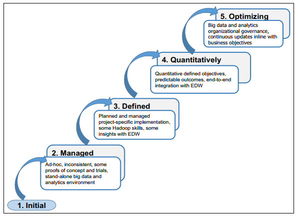
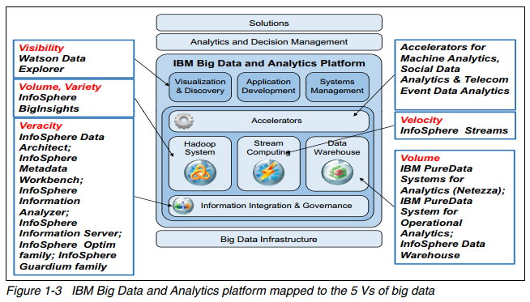
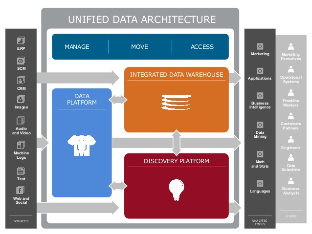

<a href="../pkb.html">pkb contents</a> \> big data | just under 1505 words | updated 12/30/2017

- &nbsp;1. [What is Big Data?](#what-is-big-data)
	- &nbsp;1.1. [Sources of Big Data](#sources-of-big-data)
	- &nbsp;1.2. [Business applications of Big Data](#business-applications-of-big-data)
		- &nbsp;1.2.1. [Business applications of stream analytics](#business-applications-of-stream-analytics)
	- &nbsp;1.3. [Implementing Big Data initiatives](#implementing-big-data-initiatives)
		- &nbsp;1.3.1. [Big Data maturity model](#big-data-maturity-model)
		- &nbsp;1.3.2. [When Big Data versus data warehousing?](#when-big-data-versus-data-warehousing)
		- &nbsp;1.3.3. [Success factors for Big Data initiatives](#success-factors-for-big-data-initiatives)
- &nbsp;2. [Big Data technologies](#big-data-technologies)
	- &nbsp;2.1. [High-performance computing](#high-performance-computing)
	- &nbsp;2.2. [Generic Big Data architectures](#generic-big-data-architectures)
	- &nbsp;2.3. [Big Data storage](#big-data-storage)
		- &nbsp;2.3.1. [Hadoop](#hadoop)
			- &nbsp;2.3.1.1. [Why use Hadoop?](#why-use-hadoop)
			- &nbsp;2.3.1.2. [Hadoop components](#hadoop-components)
				- &nbsp;2.3.1.2.1. [HDFS](#hdfs)
				- &nbsp;2.3.1.2.2. [Name node](#name-node)
				- &nbsp;2.3.1.2.3. [Secondary node](#secondary-node)
				- &nbsp;2.3.1.2.4. [Job tracker](#job-tracker)
				- &nbsp;2.3.1.2.5. [Slave nodes](#slave-nodes)
			- &nbsp;2.3.1.3. [Hadoop suprojects](#hadoop-suprojects)
		- &nbsp;2.3.2. [What are NoSQL databases?](#what-are-nosql-databases)
			- &nbsp;2.3.2.1. [NoSQL database software](#nosql-database-software)
	- &nbsp;2.4. [Big Data analytics](#big-data-analytics)
		- &nbsp;2.4.1. [MapReduce](#mapreduce)
		- &nbsp;2.4.2. [Data stream mining](#data-stream-mining)
			- &nbsp;2.4.2.1. [Critical event processing](#critical-event-processing)
			- &nbsp;2.4.2.2. [Data stream mining versus perpetual analytics](#data-stream-mining-versus-perpetual-analytics)
- &nbsp;3. [Sources](#sources)
	- &nbsp;3.1. [Cited](#cited)
	- &nbsp;3.2. [References](#references)
	- &nbsp;3.3. [Read](#read)
	- &nbsp;3.4. [Unread](#unread)

# 1. What is Big Data?

Per Sharda et al. (2014, pp. 280-282):

**Volume**

| Year | Estimated World Data |
| --- | --- |
| 2009 | 0.8 ZB |
| 2010 | >1 ZB |
| 2011 | 1.8 ZB
| 2020 | 35 ZB |

- Kilobyte (kB) = 103
- Megabyte (MB) = 106
- Gigabyte (GB) = 109
- Terabyte (TB) = 1012
- Petabyte (PB) = 1015
- Exabyte (EB) = 1018
- Zettabyte (ZB) = 1021
- Yottabyte (YB) = 1024

**Variety** (in format; about 80-85% unstructured)

- RDBMS, hierachical data stores, OLAP
- text documents, email
- XML, HTML
- meter-collected, sensor-captured data
- video, audio
- stock ticker

**Velocity**

- increased speed of data **production** ("RFID tags, automated sensors, GPS devices, and smart meters are driving an increasing need to deal with torrents of data in near-real time")
- **demand** for quicker data processing, i.e. [data stream mining](#data-stream-mining)

**Veracity**

- coined by IBM
- "conformity with facts: accuracy, quality, truthfulness, or trustiworthiness"

**Variability** ("Daily, seasonal, and event-driven peak data loads")

**Value** (one hopes)

## 1.1. Sources of Big Data

"Web logs, RFID, GPS systems, sensor networks, social networks, Internet-based text documents, Internet search indexes, detail call records, astronomy, atmospheric science, biology, genomics, nuclear physics, biochemical experiments, medical records, scientific research, military surveillance, photography archives, video archives, and large-scalre e-commerce practices" (Sharda et al., 2014, pp. 278-280).

## 1.2. Business applications of Big Data

Sharda et al. (2014, pp. 287):

- "Process efficiency and cost reduction
- Brand management
- Revenue maximization, cross-selling, and up-selling
- Enhanced customer experience
- Churn identification, customer recruiting
- Improved customer service
- Identifying new products and market opportunities
- Risk management
- Regulatory compliance
- Enhanced security capabilities"

Per Zhu et al. (2014, pp. 16-17), there are four categories of business goals that companies may fruitfully pursue with Big Data:

*REVENUE*

- **Monetize big data:** Design and execute big data analytics use cases that increase revenue, lower costs, or reduce risk.
- **Manage big data at a low cost:** Demonstrate cost savings of big data analytics styles for both MapReduce clusters and real-time analytics.
- **Improve efficiency in business operations:** Develop insight about the value of specific business processes, such as enterprise resource planning (ERP), supply chain management (SCM), and customer relationship management (CRM).

*CUSTOMER SERVICES*

- **Improve customer understanding (360-degree view of the customer):** Mine all sources of client experience and interaction from additional unstructured and semi-structured data types using real-time and batch (Hadoop) analytics.
- **Obtain behavioral insight into client transactions:** | What led to a certain business transaction? Why did the client choose us? What else can we deduce about a client’s buying behavior?
- **Attract and retain customers:** Mine and apply insight toward marketing and sales effectiveness with clients, customers, and customer support personnel.
- **Fraud detection and claims processing:** Derive and exploit additional insight from data types not previously analyzed for anti-fraud and claims processing.

*BUSINESS DEVELOPMENT*

- **Introduce new products or services:** Thanks to your new insight about target market preferences, new products and services will have higher adoption rates by the target clientele.
- **Outsource non-core functions:** Decide what to outsource without affecting the customer experience.
- **Pursue mergers, acquisitions, and divestitures:** Gather and consider marketplace insights about the potential impact of mergers, acquisitions, and divestitures.
- **Gain new competitive insights:** Mine all sources of information, even non-traditional sources of information, to learn about the brand perception of the company by its customers, its reputation, and its industry ranking. | Define metrics for improvement that are achievable if based on better insight.

*BUSINESS AGILITY & GOVERNANCE*

- **Increase business agility:** Mine real-time events for trends and apply the insight to transactions and interactions with customers.
- **Plan with greater confidence:** Build better scenario-based analysis models.
- **Make better decisions faster:** Harvest better insights from both batch (Hadoop) and real-time events and rapidly make them available to decision makers.
- **Ensure regulatory compliance:** Improve your understanding of the current regulatory climate and expectations of auditors.
- **Lower risk:** Improve the cost-benefit analysis of various risks (regulatory, market, credit, counter-party operational, and so on).

### 1.2.1. Business applications of stream analytics

Per Sharda et al. (2014, pp. 317-321):

_e-COMMERCE_ ("analysis of [clickstream] data can turn browsers into buyers and buyers into shopaholics")

- recommendations
- sales
- bundle offers

_TELECOMMUNICATIONS_

- call detail records (CDRs); identify influencers via call patterns
    - act on this to retain and recruit own customers
    - sell it?
- IP detail records, "

_LAW ENFORCEMENT & CYBER SECURITY_

- real-time situational awareness
- multimodal surveillance
- cyber-security detection
- legal wire tapping
- face recognition

_POWER INDUSTRY_ (smart meters)

- forecast energy demand
- optimize supply chain
    - capacity adjustments
    - distribution network options
    - real-time buying & selling

_FINANCIAL SERVICES_

- optimal buy/sell decisions
- detect fraud

_HEALTH SCIENCES_

- detect medical emergencies from streaming vital signs

_GOVERNMENT_

- surveil and respond to natural disasters
- monitor water and air quality
- traffic management

## 1.3. Implementing Big Data initiatives

### 1.3.1. Big Data maturity model

Per Zhu et al. (2014, p. 26):

### 1.3.2. When Big Data versus data warehousing?

Use Hadoop as:

- Repository and refinery for raw data (HDFS can capture hundreds of TB per day)
- Active archive (replacing magnetic tape archives)

Use data warehouses for:

- While performance is satisfactory
    - basic indexing
    - advanced indexing
        - materialized views
        - aggregate join indexes
        - cube indexes
        - spares join indexes
    - cost-based optimizer (analyzing SQL query, generates alternatives, compares cost)
    - partitioning

- Integration of data ("Data model designers and ETL architects armed with metadata, data-cleansing tools, and patience must rationalize data formats, source systems. and semantic meaning of the data to make it understandable and trustworthy")
- Backend for interactive BI tools

### 1.3.3. Success factors for Big Data initiatives

Sharda et al. (2014, pp. 285-286) cite Watson's (2012) "critical success factors" as follows:

- "A clear business need (alignment with the vision and the strategy)"
- "Strong, committed sponsorship (executive champion)"
- "Alignment between the business and IT strategy"
- "A fact-based decision-making culture ... also a culture of experimentation"
- "A strong data infrastructure," see [high-performance computing](#high-performance-computing)

They also synthesize Lampitt (2012) and a Tableau white paper (pp. 312-313):

- **Simplify** (the ecosystem is pretty complex)
- **Coexist** (blend legacy and new systems)
- **Empower** (support self-service)
- **Integrate** (more value from combining data across sources, despite the difficulty)
- **Evangelize**

# 2. Big Data technologies

## 2.1. High-performance computing

- In-memory analytics
- In-database analytics
- **Grid computing:** "Promotes efficiency, lower cost, and better performance by processing jobs in a shared, centrally-managed pool of IT resources"
- **Appliances:** "Brings together hardware and software in a physical unit that is not only fast but also scalable on an as-needed basis"

## 2.2. Generic Big Data architectures

Per Zhu et al. (2014, p. 6):

Per AsterData, cited in Sharda et al. (2014, p. 283):

Per Tetadata, their landscape of products AKA [Unified Data Architecture:](https://www.teradata.com/Solutions-and-Industries/unified-data-architecture)

## 2.3. Big Data storage

### 2.3.1. Hadoop

#### 2.3.1.1. Why use Hadoop?

#### 2.3.1.2. Hadoop components

##### 2.3.1.2.1. HDFS

##### 2.3.1.2.2. Name node

##### 2.3.1.2.3. Secondary node

##### 2.3.1.2.4. Job tracker

##### 2.3.1.2.5. Slave nodes

#### 2.3.1.3. Hadoop suprojects

  - Hive
  - Pig
  - ...

### 2.3.2. What are NoSQL databases?

Per Connolly and Begg (2015):

NoSQL databases use non-relational data models ...

- **Key-value model,** e.g. Dynamo, Riak, Basho: _[Key|Value|Timestamp]._ Provides easy and fast storage for simple data.
- **Columnar model,** e.g. Google’s Bigtable, Apache’s HBase (part of Hadoop): _[Row Key|Value|Timestamp|Column Family|Column Name]._ Good for retaining relationships (since columns can be grouped into families).
- **Document model,** e.g. MongoDB, JSON, XML. Good for storing complex hierarchical relationships.
- **Graph/triple model,** e.g. Neo4j. Good for capturing a web of relationships.

... plus some of these other features ...

- Open source & less costly hardware
- Distributed storage and processing rather than client/server architecture
- Memory cache
- Batch processing (Google Map Reduce) or interactive AKA stream processing (Apache Tez Framework, Apache Spark, Facebook Presto)
- Proprietary and/or (for Presto, Hive QL, Pig, Cassandra Query Language (CQL), Cosmos/Scope) SQL-like interfaces
- Analytics integration (Hive, Amazon’s Redshift, Facebook’s Presto, Airbnb’s Airpal)

... to store Big Data, achieving better performance by:

- **appending** rather than updating records, and
- **denormalizing** data upon input

#### 2.3.2.1. NoSQL database software

- MongoDB
- Cassandra
- CouchDB

## 2.4. Big Data analytics

See [notes on data science.](https://jtkovacs.github.io/refs/data-science.html)

### 2.4.1. MapReduce

### 2.4.2. Data stream mining

(AKA in-motion analytics)

#### 2.4.2.1. Critical event processing

#### 2.4.2.2. Data stream mining versus perpetual analytics

# 3. Sources

## 3.1. Cited

Connolly, T. & Begg, C. (2015). _Database systems: A practical approach to design, implementation, and management_ (6th ed.). New York City, NY: Pearson Education.

Sharda, R., Delen, D., & Turban, E. (2014). _Business intelligence: A managerial perspective on analytics_ (3rd ed.). New York City, NY: Pearson.

Zhu, W-D., Gupta, M., Kumar, V., Perepa, S., Sathi, A., & Statchuk, C. (2014). Building Big Data and analytics solutions in the cloud. IBM Redpaper. Retrieved from [https://www.redbooks.ibm.com/redpapers/pdfs/redp5085.pdf](https://www.redbooks.ibm.com/redpapers/pdfs/redp5085.pdf)

## 3.2. References

## 3.3. Read

## 3.4. Unread
