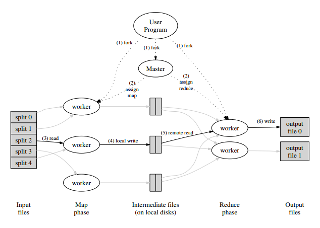

<a href="../pkb.html">pkb contents</a> \> big data | just under 2456 words | updated 12/30/2017

- &nbsp;1. [What is Big Data?](#what-is-big-data)
	- &nbsp;1.1. [Sources of Big Data](#sources-of-big-data)
	- &nbsp;1.2. [Business applications of Big Data](#business-applications-of-big-data)
		- &nbsp;1.2.1. [Business applications of stream analytics](#business-applications-of-stream-analytics)
	- &nbsp;1.3. [Implementing Big Data initiatives](#implementing-big-data-initiatives)
		- &nbsp;1.3.1. [Big Data maturity model](#big-data-maturity-model)
		- &nbsp;1.3.2. [When Big Data versus data warehousing?](#when-big-data-versus-data-warehousing)
		- &nbsp;1.3.3. [Success factors for Big Data initiatives](#success-factors-for-big-data-initiatives)
- &nbsp;2. [Big Data technologies](#big-data-technologies)
	- &nbsp;2.1. [High-performance computing](#high-performance-computing)
	- &nbsp;2.2. [Generic Big Data architectures](#generic-big-data-architectures)
	- &nbsp;2.3. [Big Data storage](#big-data-storage)
		- &nbsp;2.3.1. [Hadoop](#hadoop)
			- &nbsp;2.3.1.1. [Hadoop components](#hadoop-components)
			- &nbsp;2.3.1.2. [Hadoop suprojects](#hadoop-suprojects)
		- &nbsp;2.3.2. [What are NoSQL databases?](#what-are-nosql-databases)
			- &nbsp;2.3.2.1. [NoSQL databases versus other data store options](#nosql-databases-versus-other-data-store-options)
			- &nbsp;2.3.2.2. [NoSQL database software](#nosql-database-software)
	- &nbsp;2.4. [Big Data analytics](#big-data-analytics)
		- &nbsp;2.4.1. [MapReduce](#mapreduce)
		- &nbsp;2.4.2. [Data stream mining](#data-stream-mining)
- &nbsp;3. [Sources](#sources)
	- &nbsp;3.1. [Cited](#cited)
	- &nbsp;3.2. [References](#references)
	- &nbsp;3.3. [Read](#read)
	- &nbsp;3.4. [Unread](#unread)

# 1. What is Big Data?

Per Sharda et al. (2014, pp. 280-282):

**Volume**

| Year | Estimated World Data |
| --- | --- |
| 2009 | 0.8 ZB |
| 2010 | >1 ZB |
| 2011 | 1.8 ZB
| 2020 | 35 ZB |

- Kilobyte (kB) = 103
- Megabyte (MB) = 106
- Gigabyte (GB) = 109
- Terabyte (TB) = 1012
- Petabyte (PB) = 1015
- Exabyte (EB) = 1018
- Zettabyte (ZB) = 1021
- Yottabyte (YB) = 1024

**Variety** (in format; about 80-85% unstructured)

- RDBMS, hierachical data stores, OLAP
- text documents, email
- XML, HTML
- meter-collected, sensor-captured data
- video, audio
- stock ticker

**Velocity**

- increased speed of data **production** ("RFID tags, automated sensors, GPS devices, and smart meters are driving an increasing need to deal with torrents of data in near-real time")
- **demand** for quicker data processing, i.e. [data stream mining](#data-stream-mining)

**Veracity**

- coined by IBM
- "conformity with facts: accuracy, quality, truthfulness, or trustiworthiness"

**Variability** ("Daily, seasonal, and event-driven peak data loads")

**Value** (one hopes)

## 1.1. Sources of Big Data

"Web logs, RFID, GPS systems, sensor networks, social networks, Internet-based text documents, Internet search indexes, detail call records, astronomy, atmospheric science, biology, genomics, nuclear physics, biochemical experiments, medical records, scientific research, military surveillance, photography archives, video archives, and large-scalre e-commerce practices" (Sharda et al., 2014, pp. 278-280).

## 1.2. Business applications of Big Data

Sharda et al. (2014, pp. 287):

- "Process efficiency and cost reduction
- Brand management
- Revenue maximization, cross-selling, and up-selling
- Enhanced customer experience
- Churn identification, customer recruiting
- Improved customer service
- Identifying new products and market opportunities
- Risk management
- Regulatory compliance
- Enhanced security capabilities"

Per Zhu et al. (2014, pp. 16-17), there are four categories of business goals that companies may fruitfully pursue with Big Data:

*REVENUE*

- **Monetize big data:** Design and execute big data analytics use cases that increase revenue, lower costs, or reduce risk.
- **Manage big data at a low cost:** Demonstrate cost savings of big data analytics styles for both MapReduce clusters and real-time analytics.
- **Improve efficiency in business operations:** Develop insight about the value of specific business processes, such as enterprise resource planning (ERP), supply chain management (SCM), and customer relationship management (CRM).

*CUSTOMER SERVICES*

- **Improve customer understanding (360-degree view of the customer):** Mine all sources of client experience and interaction from additional unstructured and semi-structured data types using real-time and batch (Hadoop) analytics.
- **Obtain behavioral insight into client transactions:** | What led to a certain business transaction? Why did the client choose us? What else can we deduce about a client’s buying behavior?
- **Attract and retain customers:** Mine and apply insight toward marketing and sales effectiveness with clients, customers, and customer support personnel.
- **Fraud detection and claims processing:** Derive and exploit additional insight from data types not previously analyzed for anti-fraud and claims processing.

*BUSINESS DEVELOPMENT*

- **Introduce new products or services:** Thanks to your new insight about target market preferences, new products and services will have higher adoption rates by the target clientele.
- **Outsource non-core functions:** Decide what to outsource without affecting the customer experience.
- **Pursue mergers, acquisitions, and divestitures:** Gather and consider marketplace insights about the potential impact of mergers, acquisitions, and divestitures.
- **Gain new competitive insights:** Mine all sources of information, even non-traditional sources of information, to learn about the brand perception of the company by its customers, its reputation, and its industry ranking. | Define metrics for improvement that are achievable if based on better insight.

*BUSINESS AGILITY & GOVERNANCE*

- **Increase business agility:** Mine real-time events for trends and apply the insight to transactions and interactions with customers.
- **Plan with greater confidence:** Build better scenario-based analysis models.
- **Make better decisions faster:** Harvest better insights from both batch (Hadoop) and real-time events and rapidly make them available to decision makers.
- **Ensure regulatory compliance:** Improve your understanding of the current regulatory climate and expectations of auditors.
- **Lower risk:** Improve the cost-benefit analysis of various risks (regulatory, market, credit, counter-party operational, and so on).

### 1.2.1. Business applications of stream analytics

Per Sharda et al. (2014, pp. 317-321):

_e-COMMERCE_ ("analysis of [clickstream] data can turn browsers into buyers and buyers into shopaholics")

- recommendations
- sales
- bundle offers

_TELECOMMUNICATIONS_

- call detail records (CDRs); identify influencers via call patterns
    - act on this to retain and recruit own customers
    - sell it?
- IP detail records, "

_LAW ENFORCEMENT & CYBER SECURITY_

- real-time situational awareness
- multimodal surveillance
- cyber-security detection
- legal wire tapping
- face recognition

_POWER INDUSTRY_ (smart meters)

- forecast energy demand
- optimize supply chain
    - capacity adjustments
    - distribution network options
    - real-time buying & selling

_FINANCIAL SERVICES_

- optimal buy/sell decisions
- detect fraud

_HEALTH SCIENCES_

- detect medical emergencies from streaming vital signs

_GOVERNMENT_

- surveil and respond to natural disasters
- monitor water and air quality
- traffic management

## 1.3. Implementing Big Data initiatives

### 1.3.1. Big Data maturity model

Per Zhu et al. (2014, p. 26):

### 1.3.2. When Big Data versus data warehousing?

Use data warehouses for:

- **Integration of data** ("Data model designers and ETL architects armed with metadata, data-cleansing tools, and patience must rationalize data formats, source systems. and semantic meaning of the data to make it understandable and trustworthy")
- **Backend for interactive BI tools**

Use Hadoop as:

- **Repository and refinery for raw data** (HDFS can capture hundreds of TB per day)
- **Active archive** (replacing magnetic tape archives)

| Requirement | DW | Hadoop |
| --- | --- | --- |
| Low latency, interactive reports, and OLAP | X | |
| ANSI 2003 SQL compliance is required | X | X |
| Preprocessing or exploration of raw unstructured data | | X |
| Online archives alternative to tape | | X |
| High-quality cleansed and consistent data | X | ? |
| 100s to 1,000s of concurrent users | ? | X |
| Discover unknown relationships in the data | | X |
| [Complex parallel] process logic | ? | X |
| CPU intense analysis | X | |
| System, users, and data governance | | X |
| Many flexible programming languages running in parallel | | X |
| Unrestricted, ungoverned sandbox explorations | | X |
| Analysis of provisional data | X | |
| Extensive security and regulatory compliance | X | ? |

### 1.3.3. Success factors for Big Data initiatives

Sharda et al. (2014, pp. 285-286) cite Watson's (2012) "critical success factors" as follows:

- "A clear business need (alignment with the vision and the strategy)"
- "Strong, committed sponsorship (executive champion)"
- "Alignment between the business and IT strategy"
- "A fact-based decision-making culture ... also a culture of experimentation"
- "A strong data infrastructure," see [high-performance computing](#high-performance-computing)

They also synthesize Lampitt (2012) and a Tableau white paper (pp. 312-313):

- **Simplify** (the ecosystem is pretty complex)
- **Coexist** (blend legacy and new systems)
- **Empower** (support self-service)
- **Integrate** (more value from combining data across sources, despite the difficulty)
- **Evangelize**

# 2. Big Data technologies

## 2.1. High-performance computing

- In-memory analytics
- In-database analytics
- **Grid computing:** "Promotes efficiency, lower cost, and better performance by processing jobs in a shared, centrally-managed pool of IT resources"
- **Appliances:** "Brings together hardware and software in a physical unit that is not only fast but also scalable on an as-needed basis"

## 2.2. Generic Big Data architectures

Per Zhu et al. (2014, p. 6):

Per Tetadata, their landscape of products AKA [Unified Data Architecture:](https://www.teradata.com/Solutions-and-Industries/unified-data-architecture)

Per AsterData, cited in Sharda et al. (2014, p. 283):

## 2.3. Big Data storage

### 2.3.1. Hadoop

Per Sharda et al. (2014, pp. 291, 294), "Hadoop is an open source framework for processing, storing, and analyzing massive amounts of distibuted, unstructured data"; it is distributed storage plus distributed processing via the [MapReduce framework.](#mapreduce)

- Hadoop's native language is Java
- "Hadoop consists of multiple products"
- "HDFS is a file system, not a database management system (DBMS)"
- "Hadoop is about data diversity, not just data volume. Theoretically, HDFS can manage the storage and access of any data type as long as you can put the data in a file and copy that file into HDFS."

#### 2.3.1.1. Hadoop components

- **HDFS:** "The default storage layer in any given Hadoop cluster"
- **Name node:** "The node in a Hadoop cluster that provides the client information on where in the cluster particular data is stored and if any nodes fail"
- **Secondary node:** "A backup to the Name Node, it periodically replicates and stores data from the Name Node should it fail"
- **Job tracker:** "The node in a Hadoop cluster that initiates and coordinates MapReduce jobs or the processing of the data"
- **Slave nodes:** "The grunts of any Hadoop cluster, slave nodes store data and take direction to process it from the Job Tracker"

#### 2.3.1.2. Hadoop suprojects

Per Sharda et al. (2014, pp. 292-293):

- **Hive** (from Facebook) converts HiveQL (SQL-like) queries to MapReduce jobs, thereby enabling Hadoop to function like a data warehouse in terms of interfacing with users and BI tools
- **Pig** (from Yahoo) is a Hadoop query language that's "adept at very deep, very long data pipelines"'
- **Flume** "is a framework for populating Hadoop with data"
- **HBase** "is a nonrelational database that ... adds transactional capabilities to Hadoop, allowing users to conduct updates, inserts, and deletes"
- **Oozie** "is a workflow processing system that lets users define a series of jobs written in multiple languages---such as MapReduce, Pig, and Hive---and then intelligently link them together"
- **Ambari** "is a Web-based set of tools for deploying, administering, and monitoring Apache Hadoop clusters"
- **Avro** "is a data serialization system that allows for encoding the schema of Hadoop files"
- **Mahout** "is a data mining library [that] takes the most popular data mining algorithms for performing clustering, regression testing, and statistical modeling and implements them using the MapReduce model"
- **Sqoop** "is a connectivity tool for moving data from non-Hadoop data stores ... into Hadoop"
- **HCatalog** "is a centralized metadata management and sharing service"

### 2.3.2. What are NoSQL databases?

Per Connolly and Begg (2015):

NoSQL databases use non-relational data models ...

- **Key-value model,** e.g. Dynamo, Riak, Basho: _[Key|Value|Timestamp]._ Provides easy and fast storage for simple data.
- **Columnar model,** e.g. Google’s Bigtable, Apache’s HBase (part of Hadoop): _[Row Key|Value|Timestamp|Column Family|Column Name]._ Good for retaining relationships (since columns can be grouped into families).
- **Document model,** e.g. MongoDB, JSON, XML. Good for storing complex hierarchical relationships.
- **Graph/triple model,** e.g. Neo4j. Good for capturing a web of relationships.

... plus some of these other features ...

- Open source & less costly hardware
- Distributed storage and processing rather than client/server architecture
- Memory cache
- Batch processing (Google Map Reduce) or interactive AKA stream processing (Apache Tez Framework, Apache Spark, Facebook Presto)
- Proprietary and/or (for Presto, Hive QL, Pig, Cassandra Query Language (CQL), Cosmos/Scope) SQL-like interfaces
- Analytics integration (Hive, Amazon’s Redshift, Facebook’s Presto, Airbnb’s Airpal)

... to store Big Data, achieving better performance by:

- **appending** rather than updating records, and
- **denormalizing** data upon input

#### 2.3.2.1. NoSQL databases versus other data store options

Per Sharda et al. (2014, p. 295): "[W]hereas **Hadoop** is adept at supporting large-scale, batch-style historical analysis, **NoSQL databases** are aimed, for the most part (although there are some important exceptions), at serving up discrete data stored among large volumes of multi-structured data ... [a capability] sorely lacking in **relational database technology** ... the downside of most NoSQL databases today is that they trade ACID (atomicity, consistency, isolation, durability) compliance for performance and scalability. Many also lack mature management and monitoring tools".

#### 2.3.2.2. NoSQL database software

- HBase (a Hadoop subproject)
- Neo4j
- MongoDB
- Cassandra
- CouchDB

## 2.4. Big Data analytics

See [notes on data science.](https://jtkovacs.github.io/refs/data-science.html)

### 2.4.1. MapReduce

Per Dean and Ghemawat's seminal paper (2004): "MapReduce is a programming model and an associated implementaiton for processing and generating large data sets. Programs written in this functional style are automatically patallelized and executed on a large cluster of commodity machines. This allows programmers without any experience with parallel and distributed systems to easily utilize the resources of a large distributed system."

Another way of putting this, from Russom (2010) by way of Sharda et al. (2014, p. 295): "MapReduce provides control for analytics, not analytics per se. MapReduce is a general-purpose execution engine that handles the complexities of network communication, parallel programming, and fault-tolerance for any kind of application that you can hand code---not just analytics."

Per Sharda et al. (2014, p. 290):

- "The **MapReduce system** first reads the input file and splits it into multiple pieces ...
- These splits are then processed by **multiple map programs** running in parallel on the nodes of the cluster ...
- The **MapReduce system** then takes the ouput from each map program and merges (shuffle/sort) the results for input to
- the **reduce program,** which [aggregates the results and outputs them]"

### 2.4.2. Data stream mining

(AKA data-in-motion analytics, AKA in-motion analytics, AKA real-time data analytics)

Per Sharda et al. (2014, p. 215), stream analytics began in the energy industry, and has become important because:

- Despite Big Data storage technologies, keeping everything is impossible; "current total storage capacity lags far behind the digital information being generated in the world"
- A turbulent business environment makes "real-time detection of meaningful changes in data as well as complex pattern variations within a short time **window ...** essential to come up with the actions that better fit with the new environment"

Some related concepts:

- **Perpetual analytics** is different from data stream mining, since it "evaluates every incoming observation against all prior observations", i.e. does not use a window
- **Critical event processing** is the anticipation or extremely rapid detection of outlier events, to enable prevention or immediate response

# 3. Sources

## 3.1. Cited

Connolly, T. & Begg, C. (2015). _Database systems: A practical approach to design, implementation, and management_ (6th ed.). New York City, NY: Pearson Education.

Dean, J., & Ghemawat, S. (2004). MapReduce: Simplified data processing on large clusters. Retrieved from [https://static.googleusercontent.com/media/research.google.com/en//archive/mapreduce-osdi04.pdf](https://static.googleusercontent.com/media/research.google.com/en//archive/mapreduce-osdi04.pdf)

Sharda, R., Delen, D., & Turban, E. (2014). _Business intelligence: A managerial perspective on analytics_ (3rd ed.). New York City, NY: Pearson.

Zhu, W-D., Gupta, M., Kumar, V., Perepa, S., Sathi, A., & Statchuk, C. (2014). Building Big Data and analytics solutions in the cloud. IBM Redpaper. Retrieved from [https://www.redbooks.ibm.com/redpapers/pdfs/redp5085.pdf](https://www.redbooks.ibm.com/redpapers/pdfs/redp5085.pdf)

## 3.2. References

## 3.3. Read

- [What is MapReduce? (Youtube video)](https://www.youtube.com/watch?v=43fqzaSH0CQ)
- [What is Hadoop? (Youtube video)](https://www.youtube.com/watch?v=4DgTLaFNQq0)

## 3.4. Unread
