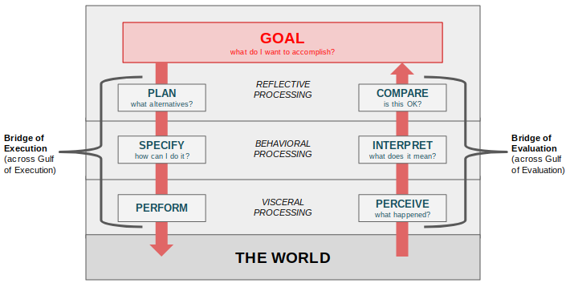

<a href="../pkb.html">pkb contents</a> \> design | just under 1659 words | updated 01/14/2018

- &nbsp;1. [What is design?](#what-is-design)
	- &nbsp;1.1. [Origins of design](#origins-of-design)
	- &nbsp;1.2. [Subfields of design](#subfields-of-design)
		- &nbsp;1.2.1. [Industrial design](#industrial-design)
		- &nbsp;1.2.2. [Interaction design](#interaction-design)
		- &nbsp;1.2.3. [Experience design](#experience-design)
- &nbsp;2. [Design philosophy](#design-philosophy)
	- &nbsp;2.1. [What is good design?](#what-is-good-design)
		- &nbsp;2.1.1. [Human-centered design](#human-centered-design)
			- &nbsp;2.1.1.1. [Gulf of Execution](#gulf-of-execution)
			- &nbsp;2.1.1.2. [Gulf of Evaluation](#gulf-of-evaluation)
	- &nbsp;2.2. [What is bad design?](#what-is-bad-design)
		- &nbsp;2.2.1. [Promoting addiction](#promoting-addiction)
		- &nbsp;2.2.2. [Neglecting or violating privacy](#neglecting-or-violating-privacy)
	- &nbsp;2.3. [Causes of poor design](#causes-of-poor-design)
- &nbsp;3. [Design thinking](#design-thinking)
	- &nbsp;3.1. [Convergence & divergence](#convergence-divergence)
	- &nbsp;3.2. [Empathy](#empathy)
- &nbsp;4. [Design processes](#design-processes)
	- &nbsp;4.1. [Design lifecycles](#design-lifecycles)
	- &nbsp;4.2. [Design subprocesses](#design-subprocesses)
		- &nbsp;4.2.1. [Co-design](#co-design)
		- &nbsp;4.2.2. [Heuristic evaluation](#heuristic-evaluation)
		- &nbsp;4.2.3. [Critique](#critique)
		- &nbsp;4.2.4. [User research](#user-research)
- &nbsp;5. [Design tools](#design-tools)
	- &nbsp;5.1. [Cards](#cards)
- &nbsp;6. [Sources](#sources)
	- &nbsp;6.1. [Cited](#cited)
	- &nbsp;6.2. [References](#references)
	- &nbsp;6.3. [Read](#read)
	- &nbsp;6.4. [Unread](#unread)

# 1. What is design?

Herbert Simon's definition (1969, p. 55) of design as the “transformation of existing conditions into preferred ones” is very popular. Also, from the editor's introduction to Johan Redström's _Making design theory:_ "All goods and services are designed. The urge to design --- to consider a situation, imagine a better situation, and act to create that improved situation --- goes back to our prehuman ancestors. Making tools helped us to become what we are --- design helped to make us human."

Per Jaime Snyder at University of Washington, the purpose of a specific **design intervention** may be (1) to solve specific problems, OR (2) to help people reach their potential (more ambitious).

## 1.1. Origins of design

Orginally applied in product development, design was imported into education in the late 1960s.

## 1.2. Subfields of design

### 1.2.1. Industrial design

Per Norman (2013, p. 5), emphasizes "form and material".

### 1.2.2. Interaction design

Per Norman (2013, p. 5), emphasizes "understandability and usability".

### 1.2.3. Experience design

Per Norman (2013, p. 5), emphasizes "emotional impact".

# 2. Design philosophy

## 2.1. What is good design?

Per Rams (n.d.; an industrial designer), good design:

- Is innovative
- Makes a product useful
- Is aesthetic
- Makes a product understandable
- Is unobtrusive
- Is honest
- Is long-lasting
- Is thorough
- Is environmentally-friendly
- Is as little design as possible

Per Labarre (2018), it is:

- Transparent
- Considers broad consequences
- Slow
- Honest
- Political
- Mindful of systems
- Good writing
- Multifaceted (pursuing a brand identity that is humerous, useful, beautiful, inspiring)
- Not risk-averse
- For people and machines (cyberagents)

### 2.1.1. Human-centered design

Per Norman, a good design is a design that addresses the two Gulfs --- of Execution, via feedforward information from the system, and of Evaluation, via feedback. He calls this **human-centered design** --- "an approach that puts human needs, capabilities, and behavior first" (Norman, 2013, p. 8). It entails:

- "starting with a good understanding of people" (general HCI principles) "and of the needs that the design is intended to meet" (user research)
- "This understanding comes about primarily through observation, for people themselves are often unaware of their true needs, even unaware of the difficulties they are encountering"
- Finally, the approach includes "rapid tests of ideas ... after each test modifying the approach and the problem definition"

Basic terms:

- **Affordances:**
- **Signifiers:**
- **Mappings:**
- **Conceptual models:**
- **Constraints:**
- **System image:**

#### 2.1.1.1. Gulf of Execution

#### 2.1.1.2. Gulf of Evaluation

- "That's the point: even experts make errors. So we must design ... on the assumption that people will make errors." (Norman, 2013, p. 8)
- "Actually, [error-handling] is where the most satisfaction can arises [for the user]" (Norman, 2013, p. 9)

## 2.2. What is bad design?

These are "dark patterns", coined and classified by Harry Brignall (n.d.):

- **Bait and Switch:** You set out to do one thing, but a different, undesirable thing happens instead.
- **Disguised Ads:** Adverts that are disguised as other kinds of content or navigation, in order to get you to click on them.
- **Forced Continuity:** When your free trial with a service comes to an end and your credit card silently starts getting charged without any warning. In some cases this is made even worse by making it difficult to cancel the membership.
- **Friend Spam:** The product asks for your email or social media permissions under the pretence it will be used for a desirable outcome (e.g. finding friends), but then spams all your contacts in a message that claims to be from you.
- **Hidden Costs:** You get to the last step of the checkout process, only to discover some unexpected charges have appeared, e.g. delivery charges, tax, etc.
- **Misdirection:** The design purposefully focuses your attention on one thing in order to distract you attention from another.
- **Price Comparison Prevention:** The retailer makes it hard for you to compare the price of an item with another item, so you cannot make an informed decision.
- **Privacy Zuckering:** You are tricked into publicly sharing more information about yourself than you really intended to. Named after Facebook CEO Mark Zuckerberg.
- **Roach Motel:** The design makes it very easy for you to get into a certain situation, but then makes it hard for you to get out of it (e.g. a subscription).
- **Sneak into Basket:** You attempt to purchase something, but somewhere in the purchasing journey the site sneaks an additional item into your basket, often through the use of an opt-out radio button or checkbox on a prior page.
- **Trick Questions:** You respond to a question, which, when glanced upon quickly appears to ask one thing, but if read carefully, asks another thing entirely.

### 2.2.1. Promoting addiction

- [https://journal.thriveglobal.com/how-technology-hijacks-peoples-minds-from-a-magician-and-google-s-design-ethicist-56d62ef5edf3](https://journal.thriveglobal.com/how-technology-hijacks-peoples-minds-from-a-magician-and-google-s-design-ethicist-56d62ef5edf3)

### 2.2.2. Neglecting or violating privacy

- [https://www.fastcodesign.com/3067094/our-apathy-toward-privacy-will-destroy-us-designers-can-help](https://www.fastcodesign.com/3067094/our-apathy-toward-privacy-will-destroy-us-designers-can-help)

## 2.3. Causes of poor design

Per Norman (2013, pp. 6 & 8):

- current technological limitations
- self-imposed restrictions
- cost
- lack of understanding of HCI, because "Engineers are trained to think logically"
- technology changes faster than design; design must be rediscovered by each field

# 3. Design thinking

Design thinking is for generating ideas. It draws on user research/contextual inquiry; it contributes to [strategy](https://jtkovacs.github.io/refs/management.html#strategy) and [performance management](https://jtkovacs.github.io/refs/performance-management.html) as well as product and service design. Vassallo (2017b) urges the incorporation of [systems thinking](management.html#systems-thinking) into design thinking, to cope with global complexity.

"Design thinking incorporates constituent or consumer insights in depth and rapid prototyping, all aimed at getting beyond the assumptions that block effective solutions. Design thinking — **inherently optimistic, constructive, and experiential** — addresses the needs of the people who will consume a product or service and the infrastructure that enables it. Businesses are embracing design thinking because it helps them be more innovative, better differentiate their brands, and bring their products and services to market faster. Nonprofits are beginning to use design thinking as well to develop better solutions to social problems. Design thinking crosses the traditional boundaries between public, for-profit, and nonprofit sectors. By working closely with the clients and consumers, design thinking allows high-impact solutions to bubble up from below rather than being imposed from the top" (Brown and Wyatt, 2010, p. 32).

## 3.1. Convergence & divergence

Keller (1983) credits Gordon (1961) for developing the concepts of divergent and convergent thinking under the banner of "synectics".

## 3.2. Empathy

"'Empathy' was Ideo founder David Kelley’s shorthand for in-the-weeds ethnographic research. And, to be fair, that’s what some design thinkers still have in mind. But as design thinking has grown in popularity, some of its core tenets have been watered down or misapplied. Perhaps as a result of overuse, when most designers talk about empathy, they don’t seem to me to be referring to fact-gathering at all, but something more like feeling-broadcasting. Empathy in design has gone from an outward-facing action to an inward-turned affect. I think it might be too late to protect the design-thinking denotation of the word from the layman’s definition. Regardless, I would urge us as a discipline to practice rigorous evidence-based compassion, rather than trying to feel people’s pain" (Vassallo, 2017a).

# 4. Design processes

## 4.1. Design lifecycles

Per Jaime Snyder (2018) at University of Washington:

1. Ideation
2. Iteration
3. Evaluation
4. Documentation (passing off to developers)

Per Birsel (2015):

1. Deconstruction
2. Point of view (see things a new way)
3. Reconstruction
4. Expression (implementation)

"The design thinking process is best thought of as a system of overlapping spaces rather than a sequence of orderly steps. There are three spaces to keep in mind: inspiration, ideation, and implementation. Think of **inspiration** as the problem or opportunity that motivates the search for solutions; **ideation** as the process of generating, developing, and testing ideas; and **implementation** as the path that leads from the project stage into people’s lives."  (Brown and Wyatt, 2010, p. 33)

## 4.2. Design subprocesses

(this list per Friedman & Hendry, 2012)

### 4.2.1. Co-design

### 4.2.2. Heuristic evaluation

### 4.2.3. Critique

### 4.2.4. User research

(AKA inquiry)

# 5. Design tools

## 5.1. Cards

Friedman & Hendry (2012):

- Envisioning Cards
- IDEO Method Cards
- Interactive Thread Cards

**Envisioning Cards** have been used to:

- 'stimulate ideation and iteration in co-design'
- explore the implications of a new technology (e.g., persuasion profiles)
- prompts for heuristic evaluation

# 6. Sources

## 6.1. Cited

Birsel, A. (2015). _Design the life you love._

Brignall, H. (n.d.). Types of dark patterns. Retrieved from [https://darkpatterns.org/types-of-dark-pattern](https://darkpatterns.org/types-of-dark-pattern)

Brown, T. & Wyatt, J. (2010). Design thinking for social innovation. _Stanford Social Innovation Review._ Retrieved from [https://5a5f89b8e10a225a44ac-ccbed124c38c4f7a3066210c073e7d55.ssl.cf1.rackcdn.com/files/pdfs/news/2010_SSIR_DesignThinking.pdf](https://5a5f89b8e10a225a44ac-ccbed124c38c4f7a3066210c073e7d55.ssl.cf1.rackcdn.com/files/pdfs/news/2010_SSIR_DesignThinking.pdf)

Friedman, B. & Hendry, D. G. (2012). The _Envisioning Cards:_ A toolkit for catalyzing humanistic and technical imaginations. In E. H. Chi & K. Höök (Eds.), _Proceedings of the 30th Annual SIGCHI Conference on Human Factors in Computing Systems (CHI ’12)_ (pp. 1145-1148). New York, NY: ACM Press.

Labarre, S. (2018, January 3). 10 new principles of good design. Co.Design. Retrieved from [https://www.fastcodesign.com/90154519/10-new-principles-of-good-design](https://www.fastcodesign.com/90154519/10-new-principles-of-good-design)

Norman, D. (2013). _The design of everyday things_ (revised and expanded edition). New York City, NY: Basic Books.

Rams, D. (n.d.). Good design. Vitsoe. Retrieved from [https://www.vitsoe.com/us/about/good-design](https://www.vitsoe.com/us/about/good-design)

Simon. H. (1969). _Sciences of the artificial._

Vassallo, S. (2017a, April 26). The case against empathy. Co.Design. Retrieved from [https://www.fastcodesign.com/90111831/the-case-against-empathy](https://www.fastcodesign.com/90111831/the-case-against-empathy)

Vassallo, S. (2017b, May 1). Design thinking needs to think bigger. Co.Design. Retrieved from [https://www.fastcodesign.com/90112320/design-thinking-needs-to-think-bigger](https://www.fastcodesign.com/90112320/design-thinking-needs-to-think-bigger)

## 6.2. References

- [Questionnaire bank for usability research](http://www.usabilitynet.org/tools/r_questionnaire.htm)
- [User Experience Questionnaire](http://www.ueq-online.org/)
- [Usability.gov](https://www.usability.gov/)
- [Simply Secure Knowledge Base](https://simplysecure.org/knowledge-base/) - Best practices for privacy, security, and transparency in design

## 6.3. Read

## 6.4. Unread

- [System Usability Scale](https://www.usability.gov/how-to-and-tools/methods/system-usability-scale.html)
- [Usability tutorial](http://www.afterhoursprogramming.com/tutorial/Usability/Introduction/)
- [Design for programmers](https://blog.prototypr.io/design-for-programmers-d38c56982cd0#.cx4hjk2o1)
- [Users’ Computer Skills: Worse Than You Think](https://www.nngroup.com/articles/computer-skill-levels/)
- [Dark Patterns: fighting user deception worldwide](http://darkpatterns.org/)
- Eyal, N. _Hooked: How to Build Habit-Forming Products_.
- Weinschenk, S. _100 Things Every Designer Needs to Know About People_.
- [Draw toast](http://www.drawtoast.com/)
- [Microsoft's radical bet on a new type of design thinking](https://www.fastcodesign.com/3054927/the-big-idea/microsofts-inspiring-bet-on-a-radical-new-type-of-design-thinking)
- [Service design toolkit](http://www.servicedesigntoolkit.org/downloads.html)
- [Principles and glossary of presencing](https://www.presencing.com/principles)
- [Design to improve life (cases and methods)](http://designtoimprovelife.dk/tools/)
- [Principles for complex systems](http://capita.wustl.edu/ME567_Informatics/contents/complex.html)