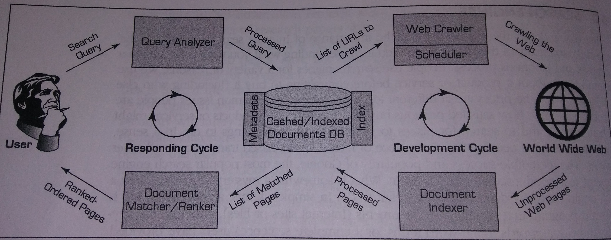

<a href="../pkb.html">pkb contents</a> \> search engines | just under 2262 words | updated 12/29/2017

- &nbsp;1. [What are search engines?](#what-are-search-engines)
	- &nbsp;1.1. [Business applications of search engines](#business-applications-of-search-engines)
		- &nbsp;1.1.1. [Enterprise IR](#enterprise-ir)
		- &nbsp;1.1.2. [Search marketing](#search-marketing)
			- &nbsp;1.1.2.1. [Search engine optimization](#search-engine-optimization)
				- &nbsp;1.1.2.1.1. [Keywords in SEO](#keywords-in-seo)
			- &nbsp;1.1.2.2. [Content marketing](#content-marketing)
				- &nbsp;1.1.2.2.1. [Content curation](#content-curation)
				- &nbsp;1.1.2.2.2. [Writing roundup posts](#writing-roundup-posts)
			- &nbsp;1.1.2.3. [Search engine marketing](#search-engine-marketing)
	- &nbsp;1.2. [Popular search engines](#popular-search-engines)
	- &nbsp;1.3. [Ethical & social dimensions of search](#ethical-social-dimensions-of-search)
- &nbsp;2. [How do search engines work?](#how-do-search-engines-work)
	- &nbsp;2.1. [Search engine process](#search-engine-process)
		- &nbsp;2.1.1. [Development cycle](#development-cycle)
			- &nbsp;2.1.1.1. [Web crawler](#web-crawler)
			- &nbsp;2.1.1.2. [Document indexer](#document-indexer)
		- &nbsp;2.1.2. [Response cycle](#response-cycle)
			- &nbsp;2.1.2.1. [Query analyzer](#query-analyzer)
			- &nbsp;2.1.2.2. [Document matcher](#document-matcher)
			- &nbsp;2.1.2.3. [Postdelivery](#postdelivery)
	- &nbsp;2.2. [Measuring search engine performance](#measuring-search-engine-performance)
	- &nbsp;2.3. [Major search algorithms](#major-search-algorithms)
		- &nbsp;2.3.1. [Simple keyword search](#simple-keyword-search)
		- &nbsp;2.3.2. [PageRank](#pagerank)
		- &nbsp;2.3.3. [Hilltop](#hilltop)
		- &nbsp;2.3.4. [Topic-Sensitive](#topic-sensitive)
		- &nbsp;2.3.5. [Hyperlink-Induced Topic Search](#hyperlink-induced-topic-search)
		- &nbsp;2.3.6. [Panda](#panda)
		- &nbsp;2.3.7. [Penguin](#penguin)
		- &nbsp;2.3.8. [Hummingbird](#hummingbird)
		- &nbsp;2.3.9. [RankBrain](#rankbrain)
- &nbsp;3. [Sources](#sources)
	- &nbsp;3.1. [Cited](#cited)
	- &nbsp;3.2. [References](#references)
	- &nbsp;3.3. [Read](#read)
	- &nbsp;3.4. [Unread](#unread)

# 1. What are search engines?

"Technically, 'search engine' is the popular term for information retrieval systems. Although Web search engines are the most popular, search engines are often used in other than the Web, such as desktop search engines and document search engines ... perhaps a more appropriate name for them would have been _finding engines"_ (Sharda et al., 2014, p. 243).

## 1.1. Business applications of search engines

### 1.1.1. Enterprise IR

### 1.1.2. Search marketing

#### 1.1.2.1. Search engine optimization

Per Sharda et al. (2014, pp. 246-248), SEO is the "intentional activity of affecting the visibility of an e-commerce site or a Web site in a search engine's natural (unpaid or organic) search results ... As an Internet marketing strategy, SEO considers how search engines work, what people search for, the actual search terms or keywords typed into search engines, and which search engines are preferred by their targeted audience. Optimizing a Web site may involve editing its content, HTML, and associated coding to both increase its relevance to specific keywords and to remove barriers to the indexing activities of search engines. Promoting a site to increase the number of backlinks, or inbound links, is another SEO tactic."

- "Cross-linking between pages of the same Web site to provide more links to the most important pages"
- "URL normalization of Web pages so that they are accessible via multiple URLs and using canonical link elements and redirects"
- "Writing content that inclues frequently searched keyword phrases"
- "Updating content so as to keep search engines crawling back"
- "Adding relevant keywords to a Web page's metadata"

From VanFossen (2006), some more SEO tactics:

- Website/blog optimization:
    - Optimize your code → “HTML/XHMTL errors, lack of connecting and navigational links, lack of text, a table-based design, 404 page not found errors or other dead or moved links, and bad Apache .htaccess or robots.txt files.”
    - Develop strong intrasite links
    - Write with strong keyword usage: “Make sure that all links and images have TITLE and ALT attributes, and again put some of your keywords in their titles and descriptions.”
    - Use categories and tags
    - Use ping services → already built in to Wordpress
- Blog promotion:
    - Submit via pings
    - Submit to search engines and directories
    - Become active and visible → e.g., comment on others’ posts
    - Build incoming links and reputation
- Track SEO efforts & results:
    - Understand visitor and traffic statistics
    - Analyze visitor length of stay
    - Analyze referers
    - Analyze search keywords
    - Analyze most popular posts
    - Check your PageRank
- Research competitors:
    - Study your competitors
    - Check who is linking to your competitors → Google search: link:http://site.address
    - Learn from their techniques and content
- Maintain your site:
    - Develop strong annual site maintenance plans
    - Check code, dead end links, and other site maintenance on a regular schedule

Per Sharda et al., (2014), 'black-hat SEO' tactics include cloaking (crawler and human see different versions of a page) and using HTML, JavaScript, etc. to create content that a crawler sees but a human doesn't (e.g., through text color).

Per VanRossen, in 2005(b) Google used the following factors to rank websites, implying some SEO practices:

- Number and quality of incoming links, where quality determinations are based on the page rank & age of the linking page
- Link anchor text, which should echo keywords (but a variety of them)
- If you have a blogroll set it so that it randomizes a partial selection from your whole blogroll
- Keep your domain name for as long as possible
- Click through rate to your site (especially your fresh content) from other sites, and from your site to ads
- Consistent and moderately frequent content addition matters more than volume
- How long users linger
- Avoid tables in favor of CSS

##### 1.1.2.1.1. Keywords in SEO

Per VanRossen (2005a):

- “Words inside of HTML heading tags get extra points when they match the keywords within your post, post title, post links, and image tags.”
- Repetition of keywords is really important
- “Putting keywords in titles, links, headings, tags, and throughout the page is still critical to the success of your site’s page ranking and keyword ranking results”

VanRossen (2005c):

- "According to experts, your keyword density for a single word should be less than 12%, though many recommend 3-10% to be safe."
- Ask: what keywords do people use to get to your site already?
- Ask: what keywords do your competitors use? (comparison tool)
    - (Who are your competitors? Check [DMOZ](http://dmoz.org/) and [All The Web](http://www.alltheweb.com/) to find other sites by category)

Tools:

- [Keyword Density Counter](http://www.keyworddensity.com/)
- [Keyword Density Compare](http://www.rankquest.com/tools/Keyword-Density-Compare.php)
- [Free Google AdWords tool for planning keyword usage](https://adwords.google.com/KeywordPlanner)

Re: long-tail (uncommon) keywords,

- http://www.wordtracker.com/academy/keyword-research/technical-guides/three-good-reasons-to-target-long-tail-keywords
- http://blog.hubspot.com/blog/tabid/6307/bid/28912/The-Ultimate-Guide-for-Mastering-Long-Tail-Search.aspx

#### 1.1.2.2. Content marketing

- http://okdork.com/2014/04/21/why-content-goes-viral-what-analyzing-100-millions-articles-taught-us/
- http://buzzsumo.com/
- https://blog.bufferapp.com/social-media-stats-studies
- http://time.com/12933/what-you-think-you-know-about-the-web-is-wrong/
- https://blog.bufferapp.com/perfect-blog-post-research-data
- https://moz.com/blog/the-generational-content-gap-three-ways-to-reach-multiple-generations
- https://moz.com/blog/how-to-conduct-creative-content-research
- http://www.svmsolutions.com/blog/content-marketing-what-should-you-write-about
- http://www.komarketingassociates.com/blog/5-content-marketing-hacks-cheat-sheet-content-brainstorming/
- http://visual.ly/portrait-content-marketer-more-marketer
- http://blogs.timesofindia.indiatimes.com/Citycitybangbang/in-praise-of-un-marketing/
- https://www.scoop.it/
- https://paper.li/

##### 1.1.2.2.1. Content curation

Good (2014), a content _curator_ is distinguished from a content marketer in the following ways; he [sic]:

1. "Is not after quantity. Quality is his key measure.
2. Does not ever curate something without having thoroughly looked at it, multiple times.
3. Always provides insight as to why something is relevant and where the item fits in its larger collection (stream, catalog, list, etc.)
4. Adds personal evaluation, judgment, critique or praise.
5. Integrates a personal touch, in the way it presents the curated object.
6. Provides useful information about other related, connected or similar objects of interest.
7. Credits and thanks anyone who has helped in the discovery, identification and analysis of any curated item and links relevant names of people present in the content.
8. Does not ever republish content “as is” without adding extra value to it.
9. Does not curate, select, personalize or republish his own content in an automated way.
10. Discloses bias, affiliation and other otherwise non self-evident contextual clues."

Or, the short version: “[never] forget what these people are looking for and what they really expect from anyone providing them with an answer”;“[take] seriously the information needs of your niche”.

Kanter (2013) provides an excellent summary (as she must) of how curation adds value to information:

- [From Ross Dawson:](http://rossdawsonblog.com/weblog/archives/2010/03/5_ways_to_add_v.html)
    - **Filtering:** Identifying groups of good sources or key words – so you can laser in on the topic
    - **Validation:** Knowing your sources and their level of expertise
    - **Synthesis:** Combining ideas and themes or boiling down a lot of information into a summary
    - **Presentation:** Putting resources together – the ordering, sub-categories, and aesthetics
    - **Customization:** Changing the title, context, or revising some of the ideas to match your audience’s needs
- [From James Mangan:](http://www.brainpickings.org/index.php/2013/04/22/14-ways-to-acquire-knowledge-james-mangan-1936/)
    - **Practice and experiment:** Read the article and try the technique and describe how it worked or didn’t for you
    - **Answer the question yourself:** Answer the question raised in the article from your own experience
    - **Change your perspective:** Describe the article or resource from a different perspective
- [From Robin Good:](http://curation.masternewmedia.org/p/4010034690/content-curation-13-sense-making-approaches-to-add-value-to-information)
    - **Comparing:** Compare the strengths and weaknesses of different sources
    - **Finding related items:** Search and find other sources or articles that are talking about the same idea, putting the resource into a different context
    - **Illustrating / Visualizing:** Add an illustration to the resource or collection
    - **Evaluating:** Rate and rank items in your collection
    - **Crediting & Attributing:** Giving credit to the original source
- [From R. W. Paul, re: critical thinking:](https://www.brainpickings.org/index.php/2013/04/22/14-ways-to-acquire-knowledge-james-mangan-1936/)
    - **Clarification:** How can the information be explained in another way? Is it accurate? It is well organized? Is it missing something?
    - **Assumptions:** What are the writer’s assumptions? Can we verify or disapprove the assumption?
    - **Reasons and Evidence:** What are some other examples of this idea? Is the same as something else?
    - **Viewpoints and Perspectives:** What is another way to look at this idea? Is it the best? Why or why not? What are the strengths and weaknesses? What would be an alternative? What is the counter argument?
    - **Implications and Consequences:** What generalization can or can’t be made? How does this tie into what I already know about the topic?
    - **Questions about Questions:** Why is x important? What does this mean?

##### 1.1.2.2.2. Writing roundup posts

Per Daly (2015):

1. Identify and automate the collection of good content
    - RSS readers (Feedly)
    - Google Alerts
    - Facebook, Google+ hashtags
    - Twitter lists and hashtags
    - IFTTT
    - [Prismatic](http://getprismatic.com/)
    - [StumbleUpon](http://www.stumbleupon.com/)
    - [Klout](http://klout.com/)
    - [Scoopit](https://www.scoop.it/)
    - [Paperli](https://paper.li/)

2. Get inspired by top-notch curators
    - NextDraft
    - Digg
    - Longreads
    - Drudge Report
    - The Verge
    - Nieman Journalism Lab
    - Digiday
3. Establishing a well-trafficked blog takes 6-12 months; be patient, consistent, and promote the blog through links and complementary media channels

#### 1.1.2.3. Search engine marketing

AKA SEM; paid search

- [https://searchengineland.com/guide/what-is-paid-search](https://searchengineland.com/guide/what-is-paid-search)

## 1.2. Popular search engines

[Per EBizMBA,](http://www.ebizmba.com/articles/search-engines) based on 2017 traffic data from Alexa, Compete, and Quantcast, ordered most to least popular:

1. Google
2. Bing
3. Yahoo
4. Baidu
5. Ask
6. AOL Search
7. DuckDuckGo
8. WolframAlpha
9. Yandex
10. WebCrawler
11. Search
12. dogpile
13. ixquick
14. excite
15. Info

## 1.3. Ethical & social dimensions of search

- Information overload
- Privacy vs. personalization
- Political & cultural influences on search
- Effect on traditional media
    - [http://www.theguardian.com/technology/2014/mar/10/journalism-democracy-algorithms-facebook-google-twitter](http://www.theguardian.com/technology/2014/mar/10/journalism-democracy-algorithms-facebook-google-twitter )
- Social networks as IR tools
- Adversarial IR (spam)

# 2. How do search engines work?

In general, search engines work by crawling and [automatically indexing](information-architecture.html#cataloging-&-indexing) content, thus creating metadata. This index may be fairly shallow, e.g. based on contents of the <meta> tag or headers; it may also be quite deep, using natural language process (NLP) techniques like grammatical stemming. User search terms are then matched to the index.

In the early days, there was a strong distinction in techniques used between search engines and library catalogs. Increasingly, though, [KOSs from IA](information-architecture.html#koss-by-role-in-ir) --- which take advantage of human knowledge by formalizing it for use by an information system --- play a role in improving search engine performance.

## 2.1. Search engine process

Per Sharda et al. (2014, pp. 243-246), a search engine involves two simultaneous cycles: "[w]hile one is interfacing with the World Wide Web, the other is interfacing with the user."

### 2.1.1. Development cycle

#### 2.1.1.1. Web crawler

(AKA Web spider, spider)

"A Web crawler starts with a list of URLs to visit, which are listed in the schedule and are often called the _seeds._ These URLs may come from submissions made by Webmasters, or, more often, they come from the internal hyperlinks of previously crawled documents/pages. As the crawler visits these URLs, it identifies all the hyperlinks in the page and adds them to the list of URLs to visit. As the documents are found and fetched by the crawler, they are stored in a temporary staging area for the document indexer to grab and process."

#### 2.1.1.2. Document indexer

- **Pre-processing**
    - format conversions
    - separation of different content types
- **Parsing the documents**
    - with text mining/NLP/computational linguistics techniques
    - to [create the term-by-document matrix](text-analytics.html#create-term-by-document-matrix)

### 2.1.2. Response cycle

#### 2.1.2.1. Query analyzer

"[R]esponsible for receiving a search request from the user (via the search engine's Web server interface) and converting it into a standardized data structure, so that it can be easily queried/matched against the entries in the document database ... quite similar to what the document indexer does ..."

#### 2.1.2.2. Document matcher

Per some [search algorithm,](#major-search-algorithms)

- **Identify eligible results**
- Return results, **ranked by relevance**

#### 2.1.2.3. Postdelivery

"Leading search engines like Google monitor the performance of their search results by capturing, recording, and analyzing postdelivery user actions amd experiences. These analyses often lead to more and more rules to further refine the ranking of the documents/pages so that the links at the top are more preferable to the end users" (Sharda et al., 2014, p. 246).

## 2.2. Measuring search engine performance

Per Sharda et al. (2014):

- Effectiveness AKA quality of results
    -  Recall
    -  Precision
- Efficiency AKA speed

## 2.3. Major search algorithms

### 2.3.1. Simple keyword search

"[E]arly search engines used a simple keyword match against the document database and returned a list of ordered documents/pages, where the determinant of the order was a function that used the number of words/terms matched between the query and the document along with the weights of those words/terms" (Sharda et al., 2014, p. 246)

### 2.3.2. PageRank

- Developed by Google in 1997

### 2.3.3. Hilltop

### 2.3.4. Topic-Sensitive

### 2.3.5. Hyperlink-Induced Topic Search

(or Hypertext Induced Topic Selection??)

### 2.3.6. Panda

### 2.3.7. Penguin

### 2.3.8. Hummingbird

(semantic reasoning and query rewriting)

### 2.3.9. RankBrain

(machine learning)

# 3. Sources

## 3.1. Cited

Daly, J. (2015, May 5). How to write a great roundup post. Retrieved from [http://www.cornerstonecontent.com/how-to-write-a-great-roundup-post/](http://www.cornerstonecontent.com/how-to-write-a-great-roundup-post/)

Good, R. (2014, March 18). Content curation is not content marketing. MasterNewMedia. Retrieved from [http://www.masternewmedia.org/content-curation-is-not-content-marketing/](http://www.masternewmedia.org/content-curation-is-not-content-marketing/)

Kanter, B. (2013, December 13). How nonprofits get significant value from content curation. Beth's Blog. Retrieved from [http://www.bethkanter.org/content-curation-2/](http://www.bethkanter.org/content-curation-2/)

Sharda, R., Delen, D., & Turban, E. (2014). _Business intelligence: A managerial perspective on analytics_ (3rd ed.). New York City, NY: Pearson.

VanFossen, L. (2005a, October 16). How people search the web, and how they can find your blog. Retrieved from [https://lorelle.wordpress.com/2005/10/16/how-people-search-the-web-and-how-they-can-find-your-blog/](https://lorelle.wordpress.com/2005/10/16/how-people-search-the-web-and-how-they-can-find-your-blog/)

VanFossen, L. (2005b, September 19). Secret out -- How Google ranks websites. Retrieved from [https://lorelle.wordpress.com/2005/09/19/secret-out-how-google-ranks-websites/](https://lorelle.wordpress.com/2005/09/19/secret-out-how-google-ranks-websites/)

VanFossen, L. (2005c, November 26). What are keywords? Retrieved from [https://lorelle.wordpress.com/2005/11/26/what-are-keywords/](https://lorelle.wordpress.com/2005/11/26/what-are-keywords/)

VanFossen, L. (2006, January 15) Do-It-Yourself Search Engine Optimization. Retrieved from [https://lorelle.wordpress.com/2006/01/15/dyi-search-engine-optimization/](https://lorelle.wordpress.com/2006/01/15/dyi-search-engine-optimization/)

## 3.2. References

- [https://searchengineland.com/](https://searchengineland.com/)

## 3.3. Read

Hedden, H. (2016). _The accidental taxonomist_ (2e). Medford, NJ: Information Today, Inc.

## 3.4. Unread

- [Computational Advertising on Social Networks](http://www.datasciencecentral.com/profiles/blogs/computational-advertising-on-social-network)
- [SEO tutorial](http://www.afterhoursprogramming.com/tutorial/SEO/Introduction/)
- [https://moz.com/blog/keyword-research-for-the-modern-customer-journey](https://moz.com/blog/keyword-research-for-the-modern-customer-journey)

