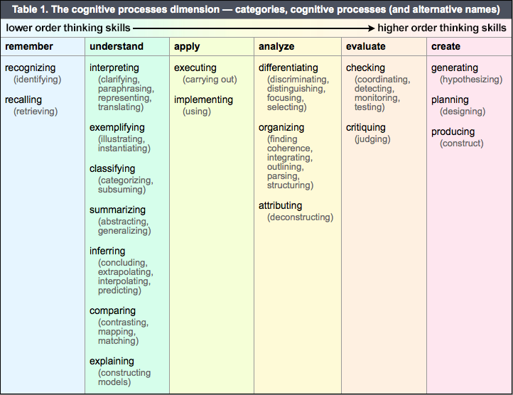
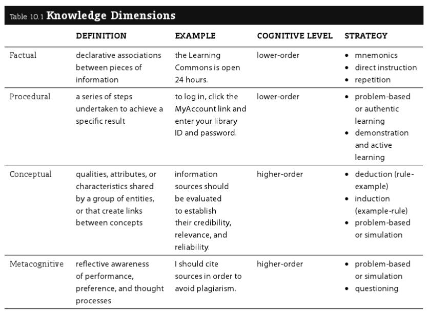

<a href="../pkb.html">pkb contents</a> \> sotl | just under 6389 words | updated 10/31/2017

- &nbsp;1. [What is instruction?](#what-is-instruction)
	- &nbsp;1.1. [How does instruction vary by context?](#how-does-instruction-vary-by-context)
	- &nbsp;1.2. [What competencies should instructors have?](#what-competencies-should-instructors-have)
- &nbsp;2. [Educational theory](#educational-theory)
	- &nbsp;2.1. [Learning theory](#learning-theory)
		- &nbsp;2.1.1. [Timeline of major learning theories](#timeline-of-major-learning-theories)
		- &nbsp;2.1.2. [Implications for instruction](#implications-for-instruction)
			- &nbsp;2.1.2.1. [Motivation](#motivation)
				- &nbsp;2.1.2.1.1. [Interest](#interest)
				- &nbsp;2.1.2.1.2. [Relevance](#relevance)
				- &nbsp;2.1.2.1.3. [Expectancy](#expectancy)
				- &nbsp;2.1.2.1.4. [Satisfaction](#satisfaction)
			- &nbsp;2.1.2.2. [Transfer](#transfer)
				- &nbsp;2.1.2.2.1. [Types of transfer](#types-of-transfer)
				- &nbsp;2.1.2.2.2. [How to promote transfer](#how-to-promote-transfer)
			- &nbsp;2.1.2.3. [Multiple intelligences](#multiple-intelligences)
	- &nbsp;2.2. [Instructional theory](#instructional-theory)
		- &nbsp;2.2.1. [Alignment](#alignment)
		- &nbsp;2.2.2. [Objectives](#objectives)
			- &nbsp;2.2.2.1. [Learning objectives in context](#learning-objectives-in-context)
				- &nbsp;2.2.2.1.1. [Targets](#targets)
				- &nbsp;2.2.2.1.2. [Phillips model](#phillips-model)
			- &nbsp;2.2.2.2. [Purpose and value of learning objectives](#purpose-and-value-of-learning-objectives)
			- &nbsp;2.2.2.3. [Writing good learning objectives](#writing-good-learning-objectives)
				- &nbsp;2.2.2.3.1. [Bloom's modified taxonomy](#blooms-modified-taxonomy)
				- &nbsp;2.2.2.3.2. [Task analysis for procedural knowledge](#task-analysis-for-procedural-knowledge)
				- &nbsp;2.2.2.3.3. [Schulman's learning process stages](#schulmans-learning-process-stages)
				- &nbsp;2.2.2.3.4. [SOLO taxonomy](#solo-taxonomy)
				- &nbsp;2.2.2.3.5. [Feisel-Schmidt technical taxonomy](#feisel-schmidt-technical-taxonomy)
				- &nbsp;2.2.2.3.6. [Examples](#examples)
		- &nbsp;2.2.3. [Instructional strategies](#instructional-strategies)
			- &nbsp;2.2.3.1. [Choosing strategies](#choosing-strategies)
				- &nbsp;2.2.3.1.1. [Strategies by knowledge dimension](#strategies-by-knowledge-dimension)
				- &nbsp;2.2.3.1.2. [Accessibility and universal design](#accessibility-and-universal-design)
			- &nbsp;2.2.3.2. [Activities](#activities)
				- &nbsp;2.2.3.2.1. [Stop and think](#stop-and-think)
		- &nbsp;2.2.4. [Assessment](#assessment)
			- &nbsp;2.2.4.1. [Proper role of assessment](#proper-role-of-assessment)
		- &nbsp;2.2.5. [Buzzwords, schools and movements](#buzzwords-schools-and-movements)
			- &nbsp;2.2.5.1. [Connectivism](#connectivism)
			- &nbsp;2.2.5.2. [Active learning](#active-learning)
			- &nbsp;2.2.5.3. [Flipped classroom](#flipped-classroom)
			- &nbsp;2.2.5.4. [Critical pedagogy](#critical-pedagogy)
			- &nbsp;2.2.5.5. [Transformative learning theory](#transformative-learning-theory)
			- &nbsp;2.2.5.6. [Problem-based learning](#problem-based-learning)
			- &nbsp;2.2.5.7. [Integrative learning](#integrative-learning)
			- &nbsp;2.2.5.8. [Mastery learning](#mastery-learning)
			- &nbsp;2.2.5.9. [Experiential learning](#experiential-learning)
	- &nbsp;2.3. [Curriculum theory](#curriculum-theory)
		- &nbsp;2.3.1. [Information literacy](#information-literacy)
- &nbsp;3. [Instructional design](#instructional-design)
	- &nbsp;3.1. [Instructional design frameworks](#instructional-design-frameworks)
		- &nbsp;3.1.1. [ADDIE model](#addie-model)
		- &nbsp;3.1.2. [Successive approximation model (SAM)](#successive-approximation-model-sam)
		- &nbsp;3.1.3. [USER method](#user-method)
			- &nbsp;3.1.3.1. [Understand](#understand)
			- &nbsp;3.1.3.2. [Structure](#structure)
			- &nbsp;3.1.3.3. [Engage](#engage)
			- &nbsp;3.1.3.4. [Reflect](#reflect)
		- &nbsp;3.1.4. [Curriculum innovation canvas](#curriculum-innovation-canvas)
		- &nbsp;3.1.5. [Diamond](#diamond)
		- &nbsp;3.1.6. [Other models](#other-models)
	- &nbsp;3.2. [Lesson planning](#lesson-planning)
		- &nbsp;3.2.1. [Gagné’s Events of Instruction](#gagné’s-events-of-instruction)
		- &nbsp;3.2.2. [Hunter lesson plan model](#hunter-lesson-plan-model)
	- &nbsp;3.3. [Learning objects](#learning-objects)
		- &nbsp;3.3.1. [Instructional messages](#instructional-messages)
		- &nbsp;3.3.2. [Visual design of learning objects](#visual-design-of-learning-objects)
			- &nbsp;3.3.2.1. [Mayer's strategies](#mayers-strategies)
			- &nbsp;3.3.2.2. [PAT model](#pat-model)
				- &nbsp;3.3.2.2.1. [Principles](#principles)
				- &nbsp;3.3.2.2.2. [Actions](#actions)
				- &nbsp;3.3.2.2.3. [Tools](#tools)
		- &nbsp;3.3.3. [Multimedia learning objects](#multimedia-learning-objects)
		- &nbsp;3.3.4. [Evaluating learning objects](#evaluating-learning-objects)
- &nbsp;4. [Reflective practice](#reflective-practice)
	- &nbsp;4.1. [Qualities of excellent teachers](#qualities-of-excellent-teachers)
	- &nbsp;4.2. [A miscellany of advice and insights](#a-miscellany-of-advice-and-insights)
- &nbsp;5. [Teaching technologies](#teaching-technologies)
	- &nbsp;5.1. [History of teaching technologies](#history-of-teaching-technologies)
	- &nbsp;5.2. [Keeping current](#keeping-current)
	- &nbsp;5.3. [Evaluating teaching technologies](#evaluating-teaching-technologies)
- &nbsp;6. [Sources](#sources)
	- &nbsp;6.1. [Cited](#cited)
	- &nbsp;6.2. [References](#references)
	- &nbsp;6.3. [Unread](#unread)

# 1. What is instruction?

## 1.1. How does instruction vary by context?

- **Education vs. training:** Booth (2011, p. 51) notes that some people distinguish between education and training on the basis of transfer (which education aims to promote, but training does not).
- - **Academia vs. real-world learning:** Via Bransford et al. (2014), academic work is typically more solitary and cognitive than other contexts, although collaboration and use of tools may be increasingly present in some disciplines.
- **Learning environments vs. instructional systems:** This distinction comes from Gagné: _"learning environments_ are constructivist educational spaces that provide the framework for self-discovery, whereas _instructional systems_ are behaviorist/cognitivist spaces that 'focus on telling ... learners what they need to know'" (Booth, 2011, p. 87).

## 1.2. What competencies should instructors have?

Per Booth (2011), core knowledge and skills for teaching (what she calls “instructional literacy”) includes:

- Capacity for **reflective practice** (not just after the fact, but primarily in the moment);
- Knowledge of **educational theories,** consisting of
    - **Learning theories,** historically the province of psychology, more abstract and fundamental;
    - **Instructional theories,** oriented towards teacher practice AKA **pedagogy;**
    - **Curriculum theories,** focused on 'genre' in teaching;
- Mastery of **teaching technologies** (for collaboration, assessment, etc.); and
- Skill in **instructional design,** a structured design process that creates learning objects, etc. for learning interactions

Booth also presents her [USER method](#user-method) primarily as an instructional design model, secondarily as an "instructional literacy framework that encourages you to [thirdly] reflect on your process in order to become a 'student of learning” as you teach' (p. 95).

# 2. Educational theory

## 2.1. Learning theory

### 2.1.1. Timeline of major learning theories

From lectures by Philip J. Reed at the University of Washington iSchool, following Booth (2011) and Keller (1983):

- CLASSICAL (philosophical):
    - **Rationalism:** (reason and debate)
    - **Empiricism** (observation and experimentation)
- SCIENTIFIC
    - PSYCHOLOGY _Reed notes that these approaches are both comfortable assessing learning through behavior change, not so for constructivism._
        - **Behaviorism** (B. F. Skinner, rote memorization, reinforcement, feedback); dominant c. 1950s as an educational theory but still has currency in psychology, still embedded in common teaching and learning practices; associated with Industrial Revolution
        - **Cognitivism** (Jean Piaget, David Ausubel) focuses on learners' information processing AKA "assimilation of information into mental models" (Reed, 2017; AKA schemata, Booth, 2011, p. 44); "how to organize instruction" for "acquisition and retention of knowledge and skills", "also studied in relation to individual differences in ability and learning style" (Keller, 1983); note that this includes a much more active role for the student, believing that "knowledge is something that depends on your perception and how you put things together" (Reed, 2017)
            - Human development and its implications for learning (Piaget's *readiness* concept)
            - Gestalt theorists
    - EDUCATION
        - **Constructivism** (John Dewey, Lev Vygotsky) focuses on how *learners* "construct their own learning process" (Reed, 2017) through "observation, translation, and imitation (mimesis, socialization, and modeling)" (Booth, 2011, p. 62), subject to *social influences*; mainstream view in education, strugges with the issue of assessment
            - Situated learning
            - Zone of proximal development

### 2.1.2. Implications for instruction

Per Booth (2011), and see also Brown et al. (2014):

- **Environment**
    - "practical factors such as room dimensions, furniture, and seating capacity; ... lighting and temperature;
    - "technical factors such as computing technology and presentation media;
    - "cultural elements such as language accessibility and inclusiveness; and
    - "instructional elements such as tone, pacing, classroom dynamics, discussion management, and opportunities for interaction" (Booth, 2011, p. 45)
- **Memory**
    - Manage cognitive overload (manage environment, curate inputs so they are of better quality)
    - Teach mnemonics (structuring information logically AKA chunking; alphabetically; metaphorically; spatially)
    - Enable elaboration (association with existing information)
- **Motivation**
    - Address relevant needs (Maslow; deprivation needs vs. growth needs)
    - Support intrinsic (inherent/already internalized) versus extrinsic (incentivized/coerced) motivation [as below](#motivation)
- **Prior knowledge** i.e. schemata AKA mental models; related to TRANSFER
    - Readiness for learning (Piaget)
    - Respecting prior knowledge
    - Activating prior knowledge

#### 2.1.2.1. Motivation

Motivation an extremely important part of learning; it is *why* people learn, rather than *how.* It's important to know that **optimal motivation is moderate motivation,** and excess motivation is anxiety; this should be considered in motivational design, e.g. when setting the level of risk/reward (it should be moderate).

In addition to the Keller model below, Bransford et al. (2014) credit the following factors with increasing motivation:

- A learning orientation and growth mindset (see Dweck et al., 2014) versus a performance orientation
- Social recognition, shared work, and solidarity

Keller (1983) writes practically on motivation but grounds it in his prior theoretical work. This work, in keeping with field theory/social learning theory, starts from the assumption that B, behavior is a function of E, the environment and P, the individual person, **B=f(E,P).** Then, as categories of behavior, Keller distinguishes between:

- **Effort** = P's level of engagement and discipline, "a direct indicator of motivation" [jtck: consider mental health though..];
- **Performance** = f(motivation/effort, ability, opportunity); and
- **Consequences** = performance + (benefits to the individual = reinforce motivation)

Determinants E and P may be examined for each behavior, identifying instructional strategies:

##### 2.1.2.1.1. Interest

Interest AKA attention = f(trait_curiosity, presentation); see [instructional messages.](#instructional-messages)

- ***Simulate curiosity*** = f(novelty, paradox, incongruity, complexity, abruptness, conflict)
    - Perceptual vs. *epistemic curiosity*
    - Trait vs. *state curiosity*
    - Note that curiosity can be fatigued by excessive stimulation
    - Appeal to emotions, personal experience, the familiar e.g. with analogies, metaphors, anecdotes, questions
- ***Sustain curiosity:***
    - Allowance to explore
    - Lower the cost of failure
    - Occasional surprises and humor
    - Make the familiar strange and vice versa
    - Separate convergent from divergent thinking (see [design thinking)](./strategy.html#design-thinking)
    - Use the **inquiry method** where students are given a genuine problem to solve, with the understanding that they are learning to navigate the process of inquiry

##### 2.1.2.1.2. Relevance

Relevance = f(alignment, clear_connections). Drawing from *drive theory,* e.g. Maslow, Keller proposes a typology of personal (relevant to self) vs. instrumental (relevant to goals) vs. cultural (relevant to group)

- **Personal**
    - Promote a sense of **achievement** by combining "standards of excellence" with moderate risks and non-zero sum grading
    - Promote **empowerment** by allowing choice, responsibility, and influence
    - Promote **affiliation** by establishing trust, which may include non-zero sum grading
- **Instrumental** relevance can be made clear through learning objectives
- **Cultural** relevance is a matter of inclusive content, approaches, and environments, but also raises the question of whether a learner's culture places a high value on the type of education being offered

##### 2.1.2.1.3. Expectancy

Expectancy AKA confidence = f(challenge, support), similar to "zone of proximal development"

- Address self-fulfilling prophecies of failure
- *[attribution theory/locus of control/personal causation/learned helplessness]*
    - Provide meaningful successes (not trivial small wins; learners know it won't transfer)
    - Make the pathway to success clear (mastery learning)
    - Give feedback that clarifies the connection between efforts and outcomes

##### 2.1.2.1.4. Satisfaction

Satisfaction = f(intrinsic\_reinforcement, extrinsic\_reinforcement)

- To preserve intrinsic motivation (which can be destroyed by extrinsic reinforcement):
    - give "endogeneous" rewards that "customarily or naturally follows from a task"
    - give exogeneous rewards unexpectedly
- Give motivational feedback verbally and immediately
- Time informative/formative feedback (rather than evaluative/summative feedback) such that it is quickly actionable

#### 2.1.2.2. Transfer

Along with **recall** (retrieve and apply this knowledge if a similar situation arises), Booth (2011, p. 43) says a fundamental goal of instruction is transfer (retrieve and apply this in novel ways). Interestingly, per Bransford et al. (2014):

- "Different kinds of learning experiences can look equivalent when test of learning focus solely on remembering ... but they can look quite different when tests of transfer are used" (p. 51).
- Classical education practices assumed transfer in their doctrine of "formal discipline", i.e. their belief that studying Latin trained the mind like a muscle for other tasks (probably not true of minds or muscles).
- Some researchers treat transfer as a matter of conceptual overlap, others as a matter of skill overlap.

##### 2.1.2.2.1. Types of transfer

- **Near vs. far:** "[T]hese terms distinguish the closeness or distance [or dis/similarity] between the original learning and the transfer task" (Leberman, 2006).
- **Positive vs. negative:** "When learning in one context improves[/inhibits] learning or performance in another context" (Leberman, 2006).
- **Simple vs. complex:** "Simple transfer happens when little or no effort is required to apply what has been learned in one situation to a new situation [and the opposite for complex transfer]" (Leberman, 2006).
- **Automatic vs. mindful:** " When an individual responds spontaneously within a transfer situation, which is very similar to the learning situation then this is  automatic transfer … In contrast, mindful [or] high road transfer is deliberate and involves conscious thought and intellectual effort, and occurs in situations where there are significant gaps or differences between the original and the transfer situations" (Leberman, 2006).
- **Overzealous:** " Of particular concern are situations where students transfer skills, knowledge, and routines that are effective for the task at hand but may nevertheless be suboptimal in the long run because they block additional learning. We will call this overzealous transfer (OZT) — people transfer solutions that appear to be positive because they are  working well enough, but they are nevertheless negative with respect to learning what is new"  (Schwartz et al., 2012).

##### 2.1.2.2.2. How to promote transfer

- Provide transfer-supportive **learning experiences:**
    - Something must be learned with sufficient depth before it can be transferred
    - Understanding promotes transfer; mere memorization does not
    - Let students engage with real problems and struggle a bit before lecturing (increases benefit of lecture)
    - Learning takes time; allow for it
    - Give feedback on transfer---how students are applying concepts in varying contexts
- Attend to [motivation](#motivation)
- Present **abstractions** and underlying logic, since "[k]nowledge that is overly contextualized [i.e., 'narrowly tailored to a given situation', NOT 'transparently placed in context'] can reduce transfer" (note that this is in keeping with cognitivist learning theories).
    - Make strong contrasts to facilitate pattern recognition
    - Show/practice applications in a range of contexts
        - Work on a problem at length, then use "what if" thought experiments
    - Help students see and represent their own problems/work in wider contexts
    - Promote metacognition
- Activate **prior knowledge:**
    - Use "graduated prompting" to cue for transfer
    - Be aware of common conceptual misunderstandings for a given field: "teachers must strive to make students' thinking visible and find ways to help them reconceptualize faulty conceptions" (p. 71)
    - Be aware that prior knowledge is not just of an individual student's construction; it is also cultural

#### 2.1.2.3. Multiple intelligences

Gardner & Hatch (1989) argue for a richer understanding of intelligence as "the capacity to solve problems or to fashion products that are valued in one or more cultural settings". They distinguish seven "intelligences" (another, **naturalist,** has been proposed):

- **Visual/spatial:** "Capacities to perceive the visual-spatial world accurately and to perform transformations on one's initial perceptions."
- **Verbal/linguistic:** "Sensitivity to the sounds, rhythms, and meanings of words; sensitivity to the different functions of language."
- **Logical/mathematical:** "Sensitivity to, and capacity to discern, logical or numerical patterns; ability to handle long chains of reasoning."
- **Bodily/kinesthetic:** "Abilities to control one's body movements and to handle objects skillfully."
- **Musical/rhythmic:** "Abilities to produce and appreciate rhythm, pitch, and timbre; appreciation of the forms of musical expressiveness."
- **Interpersonal/social:** "Capacities to discern and respond appropriately to the moods, temperaments, motivations, and desires of other people."
- **Intrapersonal/introspective:** "Access to one's own feelings and the ability to discriminate among them and draw upon them to guide behavior; knowledge of one's own strengths, weaknesses, desires, and intelligence."

While Brown et al. (2014) cite research challenging one of the main pedagogical implications of Gardner's theory --- viz., that instruction should be tailored to each learner's preferred modes (actually it should be varied for all learners) --- Eisner (2004) demonstrates the continuing (even accelerating) relevance of Gardner's work by using it to critique the educational standards movement, which in Eisner's opinion "symptomatizes a loss of faith in the professional competence of teachers" (p. 34). So this is the primary message to take from Gardner: people are gifted in different ways and that's fine (notice, however, that this leads to questions about educational in/equality and in/equity). Eisner also uses Gardner to criticize the institutionalized assumption that individual students will learn at constant rates, and a group of students will learn at a consistent pace such that they can progress as a cohort.

## 2.2. Instructional theory

The learning theories above have consequent instructional theories. Using a series of questions from Ertmer and Newby, Booth (2011, p. 73) contrasts them as follows:

| Question | Behaviorist | Cognitivist | Constructivist |
| --- | --- | --- | --- |
| How does learning occur?  | through guided behavioral change made evident by accurate answers/consistent performance | through mental processes that result in the formation of concepts and schema | through experience, sociocultural influence, and metacognition |
| What factors influence learning? | external (environment, instruction) | internal (cognitive processes, readiness, aptitude) | internal (emotional); exter (social, environmental) |
| What is the role of memory? | repetition and reinforcement facilitates memorization | short- and long-term memory interact to facilitate schema building | activated and influenced by meaningful learner experiences |
| How does transfer occur? | encouraged by positive reinforcement, learners make associations in the form of "correct" answers | learners form mental models in order to apply concepts and ideas to new scenarios | through perception of personally-relevant knowledge and application of knowledge |
| What types of learning are best suited to this theory? | fact-based; practical | concept-based; procedural | problem-based; collaborative |
| What aspects are important to instructional design? | provide feedback to reinforce learning; provide opportunities for practice and exchange | present information with targeted efficiency in order to stimulate memory and the formation of structured knowledge | provides learners with opportunties to investigate content in authentic settings |
| What teaching strategies facilitate learning? | instructor-centered; learner/instructor interaction; information organization and repetition | instructor-centered; strategic information presentation; targeted media use; cognitive load management; learner scaffolding | learner-centered; authentic stimulation; collaborative activity; hands-on practice; questioning techniques; critical inquiry |

### 2.2.1. Alignment

Per EC (2015), "Alignment is when the:

- **OBJECTIVES** [i.e. targets] articulate the knowledge and skills you want students to acquire by the end of the course
- **ASSESSMENTS** allow the instructor to check the degree to which the students are meeting the learning objectives
- **INSTRUCTIONAL STRATEGIES** are chosen to foster student learning towards meeting the objectives ...

Aligning these three components is a dynamic process, since a change in one necessarily affects the other two."

### 2.2.2. Objectives

Phillips and Phillips (2010) attribute the original use of the term in instructional design to Robert Mager for his 1967 book *Preparing instructional objectives.*

#### 2.2.2.1. Learning objectives in context

See also [http://www-tandfonline-com.offcampus.lib.washington.edu/doi/abs/10.1080/0142159022020687?src=recsys](http://www-tandfonline-com.offcampus.lib.washington.edu/doi/abs/10.1080/0142159022020687?src=recsys)

##### 2.2.2.1.1. Targets

Per Booth (2011), targets form a hierarchy:

- **OUTCOMES** = hoped-for lasting changes
- **GOALS** = express a theory of how to produce outcomes
- **OBJECTIVES** = strategies/skills needed to attain goals

##### 2.2.2.1.2. Phillips model

The Phillips and Phillips (2010) model is one common model for describing and evaluating the various levels of organizational impact a training may have; [there are others, ](https://www.watershedlrs.com/blog/phillips-model-for-learning-evaluation) but in any case the point is to cover the entire "chain of impact" to which an instructional project belongs and depends on:

| Level of Objectives | Measurement Focus | Typical Measures |
| --- | --- | --- |
| 1: Reaction | Reaction to the project or program, including the perceived value | Relevance, importance, usefulness, appropriateness, intent to use, motivation to take action |
| 2: Learning | Learning to use the content and materials, including the confidence to use what was learned | Skills, knowledge, capacity, competencies, confidence, contacts |
| 3: Application [Behavior] | Use of content and materials in the work environment, including progress with actual items and implementation | Extent of use, task completion, frequency of use, actions completed, success with use, barriers to use, enablers to use |
| 4: Impact [Results] | The consequences of the use of the content and materials expressed as business impact measures | Productivity, revenue, quality, time, efficiency, customer satisfaction, employee engagement |
| 5: ROI | Comparison of monetary benefits from program to program costs | Benefit-cost ratio (BCR), ROI (%), payback period |

_Source:_ Phillips & Phillips, 2010, p. 18.

#### 2.2.2.2. Purpose and value of learning objectives

- [I]mprove the impact of instruction", which is "particularly [true] when participants have had a hand in defining [the LOs]” (Booth, 2011; read the Eberly Center's [discussion of how)](https://www.cmu.edu/teaching/resources/Teaching/CourseDesign/Objectives/CourseLearningObjectivesValue.pdf)
- Support the instructor in reflecting and improving (Diamond, 2008)
- "Serve as the basis for selecting instructional methods" (Diamond, 2008) and "allow you to structure measurable learning interactions" (Booth, 2011)
- Proactively "[c]ommunicate to your students your expectations and how the students will be assessed", which facilitates student self-assessment, and therefore facilitates learning (Diamond, 2008)
- Retroactively "[s]erve as the basis for your assessment of student achievement" (Diamond, 2008)

#### 2.2.2.3. Writing good learning objectives

- **Student-centered:** Focus on what students should do or be able to do, not what instructors hope to 'cover' (EC, 2015). Diamond
- **Aligned,** if possible, with institutional, disciplinary, or other standards of practice and statements of purpose (Diamond, 2008)
- **Measurable,** not vague ("What would students do differently if they really 'understand' or 'appreciate' X?" ask EC, 2015). Quoted from Phillips and Phillips (2010) and echoed by Diamond (2008), LOs should speak to:
    - **Performance ---** what the participant will be able to do during the program {see [Bloom's modified taxonomy}](#blooms-modified-taxonomy)
    - **Condition ---** circumstances under which the participant will perform the task
    - **Criteria ---** degree or level [i.e. **quantification]** of proficiency that is necessary to perform the job" {see [Schulman's learning process}](#schulmans-learning-process-stages)

Diamond (2008) describes how instructors have struggled particularly with shifting perspective from content- to outcomes-focused; with writing "behavioral" objectives that are measurable but not too narrow; and with writing LOs at the right level of granularity, not too stultifying.

##### 2.2.2.3.1. Bloom's modified taxonomy

See Dr. Leslie Owen Wilson's [great discussion](http://thesecondprinciple.com/teaching-essentials/beyond-bloom-cognitive-taxonomy-revised/) for backstory. In brief, the modified taxonomy has a knowledge dimension and a cognitive process dimension. It can be used for:

- Analyzing content and generating suitable learning objectives
- Evaluating learning objectives
- Scaffolding learning materials or instructional messages

Per the [Center for Excellence in Learning and Teaching](http://www.celt.iastate.edu/teaching/effective-teaching-practices/revised-blooms-taxonomy) at Iowa State University:

##### 2.2.2.3.2. Task analysis for procedural knowledge

Booth (2011) suggests task analysis as a strategy for decomposing one's own expert procedural knowledge and thereby reacquainting oneself with the topic from a beginner's perspective.

##### 2.2.2.3.3. Schulman's learning process stages

Alonso et al. (2008) characterize Schulman's learning process model (2002) as having the following stages, representing different degrees of mastery that an objective may specify:

- engagement and motivation
- knowledge and understanding
- performance and action
- reflection and critique
- judgement and design
- commitment and identity

##### 2.2.2.3.4. SOLO taxonomy

[http://www.innomet.ee/innomet/Reports/Report_WP1.pdf](http://www.innomet.ee/innomet/Reports/Report_WP1.pdf)

##### 2.2.2.3.5. Feisel-Schmidt technical taxonomy

[http://www.innomet.ee/innomet/Reports/Report_WP1.pdf](http://www.innomet.ee/innomet/Reports/Report_WP1.pdf)

##### 2.2.2.3.6. Examples

From Diamond (2008, pp. 135-136):

- *__Government.__ When given a major decision made by a governmental leader, you will be able to identify the major factors that the leader had to consider and discuss why the action was taken and what apparent trade-offs were made.*
- *__Economics.__ Demonstrate graphically and explain how a change in expectations will affect the loanable funds market. (Begin with an appropriately labeled graph that represents the initial equilibrium.)*
- *__Management.__ Identify (based on readings, case studies, and/ or personal  experiences) those activities that are most likely to distinguish effective, well-managed technology development programs from ineffective programs.*
- *__Statistics.__ When given two events, you will be able to determine whether they are independent or whether there is a relationship between them (that is, one event affects the probability of the other). On the basis of this determination, you will be able to select and use the appropriate rules of conditional probability to determine the probability that a certain event will occur.*
- *__Religion.__ When given a definition of the term _religion,_ you will be able to identify which of the following characteristics is emphasized: feeling, ritual activity, belief, monotheism, the solitary individual, social valuation, illusion, ultimate reality, and value.*
- *__Music.__ On hearing musical selections, you will be able to identify those that are examples of chamber music and be able to identify the form, texture, and makeup of the ensemble.*
- *__Art.__ When shown a print, you will be able to identify whether it is a woodcut, an etching, or a lithograph, and you will be able to list the characteristics on which this identification was based.*
- *__Psychology.__ When given a case study, you will be able to identify whether it describes a case of schizophrenia and, if it does, which of the following schizophrenic reactions are involved: hebephrenic, catatonic, or paranoid.*

### 2.2.3. Instructional strategies

#### 2.2.3.1. Choosing strategies

##### 2.2.3.1.1. Strategies by knowledge dimension

From Booth, 2011, p. 116:

##### 2.2.3.1.2. Accessibility and universal design

Williams, J., Evans, C., & King, L. (2012). The impact of universal design for learning Instruction on lesson planning. International Journal of Learning, 18(4).

#### 2.2.3.2. Activities

##### 2.2.3.2.1. Stop and think

### 2.2.4. Assessment

#### 2.2.4.1. Proper role of assessment

Diamond (2008, p. 128) quotes Theodore Marchese:

**"Assessment per se guarantees nothing by way of improvement, no more than a thermometer cures a fever. Only when used in combination with good instruction (that evokes involvement in coherent curricula, etc.) in a program of improvement, can the device strengthen education."**

See Torrance (2007) for some additional caution regarding assessment.

### 2.2.5. Buzzwords, schools and movements

#### 2.2.5.1. Connectivism

Per Booth (2011, p. 81), "a theoretical approach that emphasizes the impact of information technology on learning".

#### 2.2.5.2. Active learning

#### 2.2.5.3. Flipped classroom

#### 2.2.5.4. Critical pedagogy

#### 2.2.5.5. Transformative learning theory

Per Mezirow (2009), transformative learning is a subset of "learning that transforms problematic [NB: different interpretations of this] frames of reference to make them more inclusive, discriminating, reflective, open, and emotionally able to change". Mezirow has defended the importance of rationality in transformative learning practices, contra other theorists in the field.

#### 2.2.5.6. Problem-based learning

Per Stevens and Tieman (2017), the origin of PBL was contemporanous with critical pedagogy (Freire, 2009; Shore, 1996; hooks, 1994) but elsewhere---in McMaster's medical schools, spreading to libraries c. 1990s. They identify the following open questions in PBL, at least in the context of library instruction:

- How important is group work when it comes to problem-solving? Should groups report to the class?
- How much time, how many sessions, or what kind of timeline is required for PBL versus lectures?
- How much collaboration with instructors, to integrate course goals, content, or messaging re: library research?
- How much foundational instruction, versus 'thrown directly into the pool'?

While admitting that their own experiment with PBL differed in important ways (e.g. they presented fairly tidy questions rather than "ill-structured problems"), they claim that PBL is only superficially aligned with critical pedagogy. They say that, despite rebranding teachers as facilitators/tutors/etc. who guide small groups, in PBL the oppressive dichotomy (see Freire, 2009) of student/teacher is left intact because "students are seen only as objects to control ... student are never seen as teachers".

#### 2.2.5.7. Integrative learning

#### 2.2.5.8. Mastery learning

#### 2.2.5.9. Experiential learning

## 2.3. Curriculum theory

Est. Franklin Bobbitt, c. 1920s.

### 2.3.1. Information literacy

# 3. Instructional design

Instructional design combines [educational theory](#educational-theory) with [design thinking methods](./strategy.html#design-thinking) to create a variety of instructional products. Per Booth (2011, p. 106), "ID is a systematic instructional planning approach that channels ... insight and awareness [from reflective practice, educational theory, and teaching technologies] into efficient, learner-focused pedagogy". Booth notes that ID is communicated in the form of models/frameworks and guiding principles.

Via Booth (2011, pp. 41-42), Robert Gagné, a founder of instructional design, believes learning is a function of the "interplay" between the following factors (note that not all of them are under the instructor's control):

| Internal | External |
| --- | --- |
| cognition | environment |
| emotion | instructor |
| desire | culture |

## 3.1. Instructional design frameworks

### 3.1.1. ADDIE model

Molenda (2003) explains that ADDIE is an authorless abstraction that might form the foundation or core of other more specific instructional design methodologies. Per Piskurich (2000) and Booth (2011):

- **Analyze:** These pre-ID activities should be performed, then presented in a report. For large projects, this phase might consume the majority of time:
    - needs assessment
    - performance assessment
    - cost-benefit analysis
- **Design:**  This phase is strategic or conceptual, producing the following artifacts:
    - instructional plan
    - lesson plan
    - assessment plan
- **Develop:** This phase involves building the actual instructional product.
- **Implement** AKA roll-out.
- **Evaluate,** to guide iteration.

### 3.1.2. Successive approximation model (SAM)

Allen Interactions (2017) has adapted Agile software methods for ID:

### 3.1.3. USER method

Booth (2011, p. 95) calls her USER method a "streamlined version of ADDIE" that is more realistic in practice.

Source: Booth, 2011, p. 19.

#### 3.1.3.1. Understand

- **Identify the problem:** "What is the challenge learners face, and how can I help them meet it?" (I assume she means for this question to be posed at the strategic level)
- **Analyze the scenario** in terms of
    - **Learner:** attributes, motivation, prior knowledge, and barriers to learning
    - **Content:** knowledge, skills and attributes that will later be translated into [targets](#targets)
    - **Context**
    - **Educator**

Booth (2011, p. 105):

#### 3.1.3.2. Structure

- **Create targets,** i.e. [goals, objectives and outcomes](#targets)
- "Identify methods to **involve** learners using delivery techniques, technologies, and activities and **extend** [before, during, after; see [integrative learning]](#integrative-learning) the interaction by supporting students along the continuum of learning." Consider:
    - "Control of Learning . Which areas of the interaction will be teacher centered (direct instruction), and which will be more student centered (discovery instruction)?
    - Grouping for Learning . Will you ask learners to work as individuals, pairs, teams, or groups?
    - Interactions for Learning. Will you create learning interactions that are human (student/teacher, student/student, other) or nonhuman (student/ tools, student/information, student/environment, other)?
    - Support for Learning . Will you provide cognitive support or emotional support?" (p. 120)

#### 3.1.3.3. Engage

- **Develop materials** through a process of prototyping and revision
    - Craft [instructional messages](#instructional-messages)
    - Create **learning objects,** which includes paying attention to [information design and visualization](#visual-design-of-learning-objects)
- **Deliver instruction:**
    - [Plan implementation](#lesson-planning)
    - Deliver in a way that **captures attention** and **sustains interest;** see [motivation](#motivation)

#### 3.1.3.4. Reflect

- **Assess impact** on learners
    - Formative
    - Summative
- **Reflect** to identify what should be preserved, revised, or discarded

### 3.1.4. Curriculum innovation canvas

Willness, C. & Bruni-Bossio, B. (2017). The curriculum innovation canvas: A design-thinking framework for the engaged educational entrepreneur. _Journal of Higher Education Outreach and Engagement,_ 21(1).

### 3.1.5. Diamond

### 3.1.6. Other models

... mentioned by Booth (2011, p. 86):

- Morrison, Ross, and Kemp's _Designing effective instruction_
- Dick, Carey, and Carey's _The systematic design of instruction_
- Bell and Shaank's BLAAM method

## 3.2. Lesson planning

- Reeves (2011):
- Williams, J., Evans, C., & King, L. (2012). The impact of universal design for learning Instruction on lesson planning. International Journal of Learning, 18(4).
- Rusznyak, L. & Walton, E. (2011). Lesson planning guidelines for student teachers: A scaffold for the development of pedagogical content knowledge. Education as Change, 15(2).
- Uhrmacher, P., Conrad, B. M., & Moroye, C. M. (2013). Finding the balance between process and product through perceptual lesson planning. Teachers College Record, 115, 1-27.

### 3.2.1. Gagné’s Events of Instruction

From Booth (2011, p. 132):

- "Gain attention.
- Inform learner of objectives.
- Stimulate recall of prior learning.
- Present stimulus material.
- Provide learner guidance.
- Elicit performance.
- Provide feedback.
- Assess performance.
- Enhance retention transfer."

### 3.2.2. Hunter lesson plan model

Paraphrased from a handout provided by Reed (2017):

- **Prepare students to learn**
    - Review foundational material
    - Build anticipation
    - State lesson objectives
- **Deliver instruction**
    - Present information and verify understanding during presentation
    - Show examples of what's expected from students (modeling)
- Immediately check understanding with **guided practice**
- After some time, **require independent practice**, and after some time again, **provide feedback**

## 3.3. Learning objects

### 3.3.1. Instructional messages

Booth (2011) calls instructional messages "elevator pitches" for the class; it's about knowing and conveying what you have to offer in a particular instructional situation. Messages should be clearly relevant and actionable ("WIIFM/what's in it for me principle"). In addition, Booth (2011) summarizes Chip and Dan Heath’s best practices for powerful messages, which they organize as an acronym (SUCCESs) but I present here differently:

- get attention, hold interest: **UNEXPECTED, STORIES**
- facilitate comprehension: **SIMPLE, CONCRETE**
- appeal and persuade: **CREDIBLE, EMOTIONAL**

### 3.3.2. Visual design of learning objects

#### 3.3.2.1. Mayer's strategies

Per Booth (2011, p. 127): "Richard Mayer lists seven such strategies that make more efficient use of cognitive processing capacity in instructional interfaces, materials, and graphics:

- **Concentrated:** Core ideas are emphasized via highlighting, bolding, and other strategies.
- **Concise:** Brevity and simplicity are achieved by eliminating extraneous text and images.
- **Correspondent:** Pictures, charts, and tables and their captions are placed close to one another.
- **Concrete:** Images provide clear visualizations of the subjects in question.
- **Coherent:** Picture choices are logical and correspond with narration, captions, or surrounding text.
- **Comprehensible:** Graphics and text or narration reflect the prior knowledge of the viewer.
- **Codable:** Graphics and text or narration lend themselves to being integrated into memory."

#### 3.3.2.2. PAT model

Booth (2011) summarizes Linda Lohr's approach to visual design for instructional purposes:

##### 3.3.2.2.1. Principles

These are the broad "cognitive functions" that comprise someone's interaction with a visual instructional object:

- **Selection** (filtering what's important): guided by the **figure/ground** principle (people can't pay attention to everything, so know what you want to emphasize and then make the emphasis obvious)
- **Organization** (parsing the 'figure;): supported by "clear and consistent navigational elements, chunking information into content units that reflect instructional objectives, providing scaffolding in the form of assistance and support, and incorporating hierarchical elements such as lists, charts, and outlines that suggest relationships"
- **Integration** (situating the figure)

##### 3.3.2.2.2. Actions

- **Contrast** to emphasize dissimilarity and create interest
- **Proximity** to convey relatedness
- **Repetition** to reduce cognitive burden and emphasize structure (pathways)
- **Alignment** to maximize readability and reduce visual noise

##### 3.3.2.2.3. Tools

For mood, readability, accessibility, etc.:

- Font & typeface
- Color
- Shapes
- Depth/details/realism
- Whitespace

### 3.3.3. Multimedia learning objects

Booth summarizes Mayer again (2011, p. 130):

- **"Coherence:** Extraneous words, sounds, and pictures are minimized. Modality : Narration occurs as speech rather than printed text in multimedia presentations.
- **Personalization:** Narration occurs in conversational rather than formal style.
- **Pretraining:** The learner knows the names and characteristics of the key concepts. Redundancy : Animation and narration are preferable in multimedia presentations over animation, narration, and on-screen text (to reduce cognitive overload).
- **Segmenting:** A fast-paced, complex multimedia lesson is presented in user-paced segments rather than as a continuous presentation.
- **Signaling:** The essential material is highlighted. Spatial contiguity : Corresponding words and pictures are presented in proximity to one another on a page or screen.
- **Temporal contiguity:** Corresponding words and pictures are presented simultaneously rather than successively in time.
- **Voice:** Narration occurs in a friendly human voice rather than a machine voice."

### 3.3.4. Evaluating learning objects

Booth presents a modified version of Lohr's schema for evaluating learning objects (2011, p. 130):

- **"Effectiveness**
    - Does the learning object cover the correct content?
    - Does the learning object cover an optimal amount of information (not too much and not too little content)?
    - Does the learning object “work” instructionally?
- **Efficiency**
    - Does the learning object make important information (selection) easy to perceive?
    - Is the learning object organized (organization) so that information is easy to access?
    - Does the learning object help the user relate the information to the overall instructional or performance target (integration)?
- **Appeal**
    - Does the design of learning object motivate the user to engage with it?
    - Is the information in the learning object relevant and important to the user in the instructional context?
    - Is the learning object clear enough to convince users that they will understand it?"

# 4. Reflective practice

Booth presents her [USER method](#user-method) primarily as an instructional design model, but secondarily as an "instructional literacy framework that encourages you to reflect on your process in order to become a 'student of learning” as you teach' (p. 95).

## 4.1. Qualities of excellent teachers

Per Booth (2011):

- [logistics]
    - Focus on goals
    - Be organized enough to achieve them
- [interpersonal]
    - Be authentic
    - Show your personal investment in the class and the students

## 4.2. A miscellany of advice and insights

- Be vigilant against the “curse of knowledge”, i.e. losing the ability to communicate with inexperts and to effectively anticipate knowledge gaps in one’s teaching (Booth, 2011)
- Diversify the kinds of thinking you ask learners to do; try to activate as many parts of the brain as possible; don't try to favor people's preferred learning styles (Beneteau, 2017; also Brown et al., 2014)

# 5. Teaching technologies

## 5.1. History of teaching technologies

Alonso et al. (2008) provides a brief review of the history of eLearning technologies.

## 5.2. Keeping current

Per Booth (2011), an educator can use the following process and skills to find their bearing in a constantly evolving technology landscape:

- **Experience** the technologies in a personal authentic way (see pp. 66-68 for Booth's summary of Web 2.0 and emerging technologies as relevant to education);
- **Evaluate** them with respect to educational objectives; and
- **Customize** tools for the given learning scenario

## 5.3. Evaluating teaching technologies

Booth identifies these ten affordances AKA functionality AKA features (quoted; 2011, p. 65):

- *assessment:* template/customizable evaluation and analysis
- *collaboration:* shared effort, cooperation, and/or crowd-sourcing
- *communication:* contant and exchange among participants
- *customization:* personalizable features or appearance
- *documentation:* information recording for future use and access
- *play:* diversion and/or creative expression
- *portability:* mobile communication, creation, and access
- *productivity:* task-oriented learning and time management
- *sharing:* dissemination of ideas or information for public consumption
- *visualization:* graphical information display

She suggests evaluating technologies in this format, which I've slightly adapted (p. 73):

<table>
    <tr>
        <th>PERSPECTIVE</th>
        <th>CHARACTERISTICS</th>
        <th>OUTCOMES</th>
        <th>CAVEATS</th>
        <th>AFFORDANCES</th>
    </tr>
    <tr>
        <th>TEACHER</th>
        <td rowspan="2">[list]</td>
        <td>[list]</td>
        <td>[list]</td>
        <td>[score as above]</td>
    </tr>
    <tr>
        <th>LEARNER</th>
        <td>[list]</td>
        <td>[list]</td>
        <td>[score as above]</td>
    </tr>
</table>

# 6. Sources

## 6.1. Cited

Allen Interactions. (2017). Agile eLearning development with SAM. Retrieved from [http://www.alleninteractions.com/sam-process](http://www.alleninteractions.com/sam-process)

Alonso, F., Lopez, G., Manrique, D., & Vines, J. M. (2008). Learning objects, learning objectives and learning design. _Innovations in Education and Teaching International,_ 45(4), 389-400.

Beneteau, E. (2017). Lecture for LIS 570. University of Washington.

Bransford, J., Brown, A. & Cocking, R. (2000). Learning and transfer. In _How people learn: Brain, mind, experience, and school._ Washington, DC: The National Academies Press. [https://doi.org/10.17226/9854](https://doi.org/10.17226/9854)

Brown, P. C., Roediger III, H. L., & McDaniel, M. A. (2014). _Make it stick: The science of successful learning._ Cambridge, MA: Belknap Press.

Diamond, R. M. (2008). Clarifying instructional goals and objectives (ch. 9). In _Designing and assessing courses and curricula: A practical guide (3rd ed.)._ San Francisco, CA: Jossey-Bass.

Dweck, C. S., Walton, G. M., & Cohen, G. L. (2014). Academic tenacity: Mindsets and skills that promote long-term learning. Bill & Melinda Gates Foundation. Retrieved from [https://ed.stanford.edu/sites/default/files/manual/dweck-walton-cohen-2014.pdf](https://ed.stanford.edu/sites/default/files/manual/dweck-walton-cohen-2014.pdf) (PDF)

Eberly Center for Teaching Excellence & Educational Innovation (EC). (2015). Learning objectives. Carnegie Mellon University. Retrieved from [https://www.cmu.edu/teaching/designteach/design/learningobjectives.html](https://www.cmu.edu/teaching/designteach/design/learningobjectives.html)

Eisner, E. (2004). Multiple intelligences: Its tensions and possibilities. _Teachers College Record,_ 106(1), 31-39.

Freire, P. (2009). _Pedagogy of the oppressed_ (30th anniversary ed.). New York City, NY: Continuum.

Gardner, H. & Hatch, T. (1989). Multiple intelligences go to school: Educational implications of the theory of multiple intelligences. _Educational Researcher,_ 18(8).

hooks, b. (1994). _Teaching to transgress: Education as the practice of freedom._ New York City, NY: Routledge.

Keller, J. M. (1983). Motivational design of instruction. In C. M. Reigeluth (Ed.), *Instructional-design theories and models: An overview of their current status.* Hillsdale, NJ: Lawrence Erlbaum Associates.

Leberman, S.,  McDonald, L., & Doyle, S. (2006). _The transfer of learning: Participants’ perspectives of adult education and training._ Burlington, VT: Gower Publishing Company.

Medina, J. (2008). _Brain rules: 12 principles for surviving and thriving and work, home, and school._ Seattle, WA: Pear Press.

Mezirow, J. (2009). Transformative learning theory. In _Transformative learning in practice: Insights from community, workplace, and higher education._ J. Mezirow & E. Taylor, Eds. Hoboken, NJ: Jossey-Bass.

Molenda, M. (2003). In search of the elusive ADDIE model. _Performance improvement,_ 42(5), 34-37.

Phillips, J. J., & Phillips, P. P. (2010). The power of objectives: Moving beyond learning objectives. _Performance Improvement,_ 49(6), 17-24.

Piskurich, G. M. (2000). _Rapid instructional design: Learning ID fast and right._ San Francisco, CA: Jossey-Bass.

Reed, P. J. (2017). Lecture comments. University of Washington iSchool.

Reeves, A. R. (2011). Creating plans for learning. In _Where great teaching begins: Planning for student thinking and learning._ Alexandria, VA: ASCD.

Schwartz, D. L., Chase, C. C., & Bransford, J. D. (2012). Resisting overzealous transfer: Coordinating previously successful routines with needs for new learning. _Educational Psychologist, 47_(3).

Shore, I. (1996). _When students have power: Negotiating authority in critical pedagogy._ Chicago, IL: University of Chicago Press.

Stevens, E. & Tieman, A. (2017). We used problem-based learning in library instruction and came to question its treatment of students. _In The Library With The Lead Pipe._ Retrieved from (http://www.inthelibrarywiththeleadpipe.org/2017/we-used-problem-based-learning-in-library-instruction-and-came-to-question-its-treatment-of-students/)[http://www.inthelibrarywiththeleadpipe.org/2017/we-used-problem-based-learning-in-library-instruction-and-came-to-question-its-treatment-of-students/]

Torrance, H. (2007). Assessment as learning? How the use of explicit learning objectives, assessment criteria and feedback in post‐secondary education and training can come to dominate learning. _Assessment in Education: Principles, Policy & Practice_ 14(3). [http://dx.doi.org.offcampus.lib.washington.edu/10.1080/09695940701591867](http://dx.doi.org.offcampus.lib.washington.edu/10.1080/09695940701591867)

## 6.2. References

- [Washington Center's learning communities repository](http://wacenter.evergreen.edu/)
- [MERLOT II online teaching resources](https://www.merlot.org/merlot/index.htm)
- [Association for Talent Development](https://www.td.org/)
- [InstructionalDesign.org](http://www.instructionaldesign.org/index.html)

## 6.3. Unread

- Callahan, R. (1962). _Education and the cuilt of efficiency._ Chicago: University of Chicago Press. _(This is a history of the efficiency movement in education.)_
- Tye, B. B. (2000). _Hard truths: Uncovering the deep structure of schooling._ New York: Teachers College Press.
- [Transfer of learning](http://www.nwlink.com/~donclark/hrd/learning/transfer.html)
- [High-impact or engaged learning practices](https://uwaterloo.ca/centre-for-teaching-excellence/resources/integrative-learning/high-impact-practices-hips-or-engaged-learning-practices)
- [Building a better discussion](http://www.chronicle.com/article/Building-a-Better-Discussion/231685/)
- [Arizona State & Knewton's grand experiment with adaptive learning](https://www.insidehighered.com/news/2013/01/25/arizona-st-and-knewtons-grand-experiment-adaptive-learning)
- [Sharing slow ideas](http://www.newyorker.com/magazine/2013/07/29/slow-ideas)
