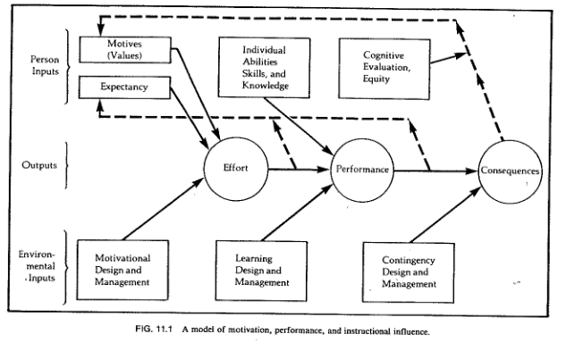

<a href="../pkb.html">pkb contents</a> \> sotl | just under 4425 words | updated 10/25/2017

- &nbsp;1. [What is instruction?](#what-is-instruction)
	- &nbsp;1.1. [Booth's elements of instructional literacy](#booths-elements-of-instructional-literacy)
	- &nbsp;1.2. [Genres and mediums of instruction](#genres-and-mediums-of-instruction)
		- &nbsp;1.2.1. [Education vs. training](#education-vs.-training)
		- &nbsp;1.2.2. [Academia vs. real-world learning](#academia-vs.-real-world-learning)
		- &nbsp;1.2.3. [Learning environments vs. instructional systems](#learning-environments-vs.-instructional-systems)
- &nbsp;2. [Reflective practice](#reflective-practice)
	- &nbsp;2.1. [Qualities of excellent teachers](#qualities-of-excellent-teachers)
	- &nbsp;2.2. [Instructional messages](#instructional-messages)
	- &nbsp;2.3. [A miscellany of advice and insights](#a-miscellany-of-advice-and-insights)
- &nbsp;3. [Educational theory](#educational-theory)
	- &nbsp;3.1. [Learning theory](#learning-theory)
		- &nbsp;3.1.1. [Summary of conclusions](#summary-of-conclusions)
		- &nbsp;3.1.2. [Timeline of learning theories](#timeline-of-learning-theories)
		- &nbsp;3.1.3. [Motivation](#motivation)
			- &nbsp;3.1.3.1. [Interest](#interest)
			- &nbsp;3.1.3.2. [Relevance](#relevance)
			- &nbsp;3.1.3.3. [Expectancy](#expectancy)
			- &nbsp;3.1.3.4. [Satisfaction](#satisfaction)
		- &nbsp;3.1.4. [Transfer](#transfer)
			- &nbsp;3.1.4.1. [Types of transfer](#types-of-transfer)
			- &nbsp;3.1.4.2. [How to promote transfer](#how-to-promote-transfer)
	- &nbsp;3.2. [Assessment](#assessment)
		- &nbsp;3.2.1. [Alignment](#alignment)
		- &nbsp;3.2.2. [Objectives](#objectives)
			- &nbsp;3.2.2.1. [Bloom's modified taxonomy](#blooms-modified-taxonomy)
			- &nbsp;3.2.2.2. [Task analysis](#task-analysis)
		- &nbsp;3.2.3. [Kirkpatrick/Phillips model](#kirkpatrickphillips-model)
			- &nbsp;3.2.3.1. [Reaction objectives](#reaction-objectives)
			- &nbsp;3.2.3.2. [Learning and application/behavior objectives](#learning-and-applicationbehavior-objectives)
	- &nbsp;3.3. [Instructional theory](#instructional-theory)
		- &nbsp;3.3.1. [Connectivism](#connectivism)
		- &nbsp;3.3.2. [Active learning](#active-learning)
			- &nbsp;3.3.2.1. [Flipped classroom](#flipped-classroom)
		- &nbsp;3.3.3. [Critical pedagogy](#critical-pedagogy)
			- &nbsp;3.3.3.1. [Transformative learning theory](#transformative-learning-theory)
		- &nbsp;3.3.4. [Problem-based learning](#problem-based-learning)
		- &nbsp;3.3.5. [Integrative learning](#integrative-learning)
		- &nbsp;3.3.6. [Mastery learning](#mastery-learning)
		- &nbsp;3.3.7. [Experiential learning](#experiential-learning)
	- &nbsp;3.4. [Curriculum theory](#curriculum-theory)
		- &nbsp;3.4.1. [Information literacy](#information-literacy)
- &nbsp;4. [Teaching technologies](#teaching-technologies)
	- &nbsp;4.1. [Evaluating teaching technologies](#evaluating-teaching-technologies)
- &nbsp;5. [Instructional design](#instructional-design)
	- &nbsp;5.1. [ID process models](#id-process-models)
		- &nbsp;5.1.1. [ADDIE model](#addie-model)
		- &nbsp;5.1.2. [Successive approximation model (SAM)](#successive-approximation-model-sam)
		- &nbsp;5.1.3. [Booth’s USER method](#booth’s-user-method)
			- &nbsp;5.1.3.1. [Understand](#understand)
			- &nbsp;5.1.3.2. [Structure](#structure)
			- &nbsp;5.1.3.3. [Engage](#engage)
			- &nbsp;5.1.3.4. [Reflect](#reflect)
		- &nbsp;5.1.4. [Curriculum innovation canvas](#curriculum-innovation-canvas)
		- &nbsp;5.1.5. [Other models](#other-models)
	- &nbsp;5.2. [Activities](#activities)
		- &nbsp;5.2.1. [Stop and think](#stop-and-think)
- &nbsp;6. [Sources](#sources)
	- &nbsp;6.1. [Cited](#cited)
	- &nbsp;6.2. [References](#references)
	- &nbsp;6.3. [Read](#read)
	- &nbsp;6.4. [Unread](#unread)

# 1. What is instruction?

## 1.1. Booth's elements of instructional literacy

Per Booth (2011), core knowledge and skills for teaching (what she calls “instructional literacy”) includes:

- Capacity for **reflective practice** (not just after the fact, but primarily in the moment);
- Knowledge of **educational theories,** consisting of
    - **Learning theories,** historically the province of psychology, more abstract and fundamental;
    - **Instructional theories,** oriented towards teacher practice AKA **pedagogy;**
    - **Curriculum theories,** focused on 'genre' in teaching;
- Mastery of **teaching technologies** (for collaboration, assessment, etc.); and
- Skill in **instructional design,** a structured process that creates instructional products

Booth presents her [USER method](#user-model) primarily as an instructional design model, but secondarily as an "instructional literacy framework that encourages you to reflect on your process in order to become a 'student of learning” as you teach' (p. 95).

## 1.2. Genres and mediums of instruction

### 1.2.1. Education vs. training

Booth (2011, p. 51) notes that some people distinguish between education and training on the basis of transfer (which education aims to promote).

### 1.2.2. Academia vs. real-world learning

Via Bransford et al. (2014), academic work is typically more solitary and cognitive than other contexts, although collaboration and use of tools may be increasingly present in some disciplines.

### 1.2.3. Learning environments vs. instructional systems

This distinction comes from Gagné: _"learning environments_ are constructivist educational spaces that provide the framework for self-discovery, whereas _instructional systems_ are behaviorist/cognitivist spaces that 'focus on telling ... learners what they need to know'" (Booth, 2011, p. 87).

# 2. Reflective practice

## 2.1. Qualities of excellent teachers

Per Booth (2011):

- [logistics]
    - Focus on goals
    - Be organized enough to achieve them
- [interpersonal]
    - Be authentic
    - Show your personal investment in the class and the students

## 2.2. Instructional messages

Booth (2011) summarizes Chip and Dan Heath’s best practices for powerful messages, which they organize as an acronym (SUCCESs) but I present here differently:

- get attention, hold interest: **UNEXPECTED, STORIES**
- facilitate comprehension: **SIMPLE, CONCRETE**
- appeal and persuade: **CREDIBLE, EMOTIONAL**

Also:

- clearly relevant, clearly actionable ("WIIFM/what's in it for me principle")

## 2.3. A miscellany of advice and insights

- Be vigilant against the “curse of knowledge”, i.e. losing the ability to communicate with inexperts and to effectively anticipate knowledge gaps in one’s teaching (Booth, 2011)
- Diversify the kinds of thinking you ask learners to do; try to activate as many parts of the brain as possible; don't try to favor people's preferred learning styles (Beneteau, 2017; also Brown et al., 2014)

# 3. Educational theory

## 3.1. Learning theory

### 3.1.1. Summary of conclusions

See also: Brown et al. (2014)

Per Booth (2011):

- **Memory**
    - Manage cognitive overload (manage environment, curate inputs so they are of better quality, which includes their structure)
    - Mnemonics (structuring information logically AKA chunking; alphabetically; metaphorically; spatially)
    - Elaboration (associating with existing information)
- **Motivation**
    - Maslow and deprivation needs vs. growth needs
    - Intrinsic (inherent/already internalized) versus extrinsic (incentivized/coerced) motivation
- **Environment**
    - "practical factors such as room dimensions, furniture, and seating capacity; ... lighting and temperature;
    - "technical factors such as computing technology and presentation media;
    - "cultural elements such as language accessibility and inclusiveness; and
    - "instructional elements such as tone, pacing, classroom dynamics, discussion management, and opportunities for interaction" (Booth, 2011, p. 45)
- **Prior knowledge** i.e. schemata AKA mental models
    - Readiness for learning (Piaget)
    - Respecting prior knowledge
    - Activating prior knowledge

Via Booth (2011, pp. 41-42), Robert Gagné, a founder of instructional design, believes learning is a function of the "interplay" between the following factors (note that not all of them are under the instructor's control):

| Internal | External |
| --- | --- |
| cognition | environment |
| emotion | instructor |
| desire | culture |

### 3.1.2. Timeline of learning theories

From lectures by Philip J. Reed at the University of Washington iSchool, following Booth (2011) and Keller (1983):

- Classical (philosophical):
    - **Rationalism**
    - **Empiricism**
- Scientific:
    - Psychology: _Reed notes that these approaches are both comfortable assessing learning through behavior change, not so for constructivism._
        - **Behaviorism** (B. F. Skinner, rote memorization, reinforcement, feedback); dominant c. 1950s as an educational theory but still has currency in psychology, still embedded in common teaching and learning practices; associated with Industrial Revolution
        - **Cognitivism** (Jean Piaget, David Ausubel) focuses on learners' information processing AKA "assimilation of information into mental models" (Reed, 2017; AKA schemata, Booth, 2011, p. 44); "how to organize instruction" for "acquisition and retention of knowledge and skills", "also studied in relation to individual differences in ability and learning style" (Keller, 1983); note that this includes a much more active role for the student, believing that "knowledge is something that depends on your perception and how you put things together" (Reed, 2017)
            - Human development and its implications for learning (Piaget's *readiness* concept)
            - Gestalt theorists
    - Education
        - **Constructivism** (John Dewey, Lev Vygotsky) focuses on how *learners* "construct their own learning process" (Reed, 2017) through "observation, translation, and imitation (mimesis, socialization, and modeling)" (Booth, 2011, p. 62), subject to *social influences*; mainstream view in education, strugges with the issue of assessment
            - Situated learning
            - Zone of proximal development

### 3.1.3. Motivation

Motivation an extremely important part of learning; it is *why* people learn, rather than *how.*

In addition to the Keller model below, Bransford et al. (2014) credit the following factors with increasing motivation:

- A "performance orientation" (citng Dweck, 1989) tends to sap motivation, versus a "learning orientation" (AKA growth mindset?)
- Social recognition, shared work, solidarity

Keller (1983) writes practically on motivation but grounds it in his prior theoretical work. This work, in keeping with field theory/social learning theory, starts from the assumption that B, behavior is a function of E, the environment and P, the individual person, **B=f(E,P).** Then, as categories of behavior, Keller distinguishes between:

- **Effort** = P's level of engagement and discipline, "a direct indicator of motivation" [jtk: I dispute this, because e.g. mental health];
- **Performance** = f(motivation/effort, ability, opportunity); and
- **Consequences** = performance + (benefits to the individual = reinforce motivation)

Determinants E and P may be examined for each behavior, identifying instructional strategies:

A very important note: **optimal motivation is moderate motivation** (excess motivation is anxiety). This should be considered in motivational design, e.g. when setting the level of risk/reward (it should be moderate).

#### 3.1.3.1. Interest

Interest AKA attention = f(trait_curiosity, presentation); see [instructional messages.](#instructional-messages)

- ***Simulate curiosity*** = f(novelty, paradox, incongruity, complexity, abruptness, conflict)
    - Perceptual vs. *epistemic curiosity*
    - Trait vs. *state curiosity*
    - Note that curiosity can be fatigued by excessive stimulation
    - Appeal to emotions, personal experience, the familiar e.g. with analogies, metaphors, anecdotes, questions
- ***Sustain curiosity:***
    - Allowance to explore
    - Lower the cost of failure
    - Occasional surprises and humor
    - Make the familiar strange and vice versa
    - Separate convergent from divergent thinking (see [design thinking)](./strategy.html#design-thinking)
    - Use the **inquiry method** where students are given a genuine problem to solve, with the understanding that they are learning to navigate the process of inquiry

#### 3.1.3.2. Relevance

Relevance = f(alignment, clear_connections). Drawing from *drive theory,* e.g. Maslow, Keller proposes a typology of personal (relevant to self) vs. instrumental (relevant to goals) vs. cultural (relevant to group)

- **Personal**
    - Promote a sense of **achievement** by combining "standards of excellence" with moderate risk and feedback that may be non-zero sum
    - Promote **empowerment** by allowing choice, responsibility, and influence
    - Promote **affiliation** by establishing trust, which may include non-zero sum grading
- **Instrumental** relevance can be made clear through learning objectives
- **Cultural** relevance is a matter of inclusive content, approaches, and environments, but also raises the question of whether a learner's culture places a high value on the type of education being offered

#### 3.1.3.3. Expectancy

Expectancy AKA confidence = f(challenge, support), similar to "zone of proximal development"

- Address self-fulfilling prophecies of failure
- *[attribution theory/locus of control/personal causation/learned helplessness]*
    - Provide meaningful successes (not trivial small wins; learners know it won't transfer)
    - Make the pathway to success clear (mastery learning)
    - Give feedback that clarifies the connection between efforts and outcomes

#### 3.1.3.4. Satisfaction

Satisfaction = f(intrinsic\_reinforcement, extrinsic\_reinforcement)

- To preserve intrinsic motivation (which can be destroyed by extrinsic reinforcement):
    - give "endogeneous" rewards that "customarily or naturally follows from a task"
    - give exogeneous rewards unexpectedly
- Give motivational feedback verbally and immediately
- Time informative/formative feedback (rather than evaluative/summative feedback) such that it is quickly actionable

### 3.1.4. Transfer

Along with **recall** (retrieve and apply this knowledge if a similar situation arises), Booth (2011, p. 43) says a fundamental goal of instruction is transfer (retrieve and apply this in novel ways). Interestingly, per Bransford et al. (2014):

- "Different kinds of learning experiences can look equivalent when test of learning focus solely on remembering ... but they can look quite different when tests of transfer are used" (p. 51).
- Classical education practices assumed transfer in their doctrine of "formal discipline", i.e. their belief that studying Latin trained the mind like a muscle for other tasks (probably not true of minds or muscles).
- Some researchers treat transfer as a matter of conceptual overlap, others as a matter of skill overlap.

#### 3.1.4.1. Types of transfer

- **Near vs. far:** "[T]hese terms distinguish the closeness or distance [or dis/similarity] between the original learning and the transfer task" (Leberman, 2006).
- **Positive vs. negative:** "When learning in one context improves[/inhibits] learning or performance in another context" (Leberman, 2006).
- **Simple vs. complex:** "Simple transfer happens when little or no effort is required to apply what has been learned in one situation to a new situation [and the opposite for complex transfer]" (Leberman, 2006).
- **Automatic vs. mindful:** " When an individual responds spontaneously within a transfer situation, which is very similar to the learning situation then this is  automatic transfer … In contrast, mindful [or] high road transfer is deliberate and involves conscious thought and intellectual effort, and occurs in situations where there are significant gaps or differences between the original and the transfer situations" (Leberman, 2006).
- **Overzealous:** " Of particular concern are situations where students transfer skills, knowledge, and routines that are effective for the task at hand but may nevertheless be suboptimal in the long run because they block additional learning. We will call this overzealous transfer (OZT) — people transfer solutions that appear to be positive because they are  working well enough, but they are nevertheless negative with respect to learning what is new"  (Schwartz et al., 2012).

#### 3.1.4.2. How to promote transfer

- Provide transfer-supportive **learning experiences:**
    - Something must be learned with sufficient depth before it can be transferred
    - Understanding promotes transfer; mere memorization does not
    - Let students engage with real problems and struggle a bit before lecturing (increases benefit of lecture)
    - Learning takes time; allow for it
    - Give feedback on transfer---how students are applying concepts in varying contexts
- Attend to [motivation](#motivation)
- Present **abstractions** and underlying logic, since "[k]nowledge that is overly contextualized [i.e., 'narrowly tailored to a given situation', NOT 'transparently placed in context'] can reduce transfer" (note that this is in keeping with cognitivist learning theories).
    - Make strong contrasts to facilitate pattern recognition
    - Show/practice applications in a range of contexts
        - Work on a problem at length, then use "what if" thought experiments
    - Help students see and represent their own problems/work in wider contexts
    - Promote metacognition
- Activate **prior knowledge**:
    - Use "graduated prompting" to cue for transfer
    - Be aware of common conceptual misunderstandings for a given field: "teachers must strive to make students' thinking visible and find ways to help them reconceptualize faulty conceptions" (p. 71)
    - Be aware that prior knowledge is not just of an individual student's construction; it is also cultural

## 3.2. Assessment

**What's the proper role of assessment?** See Torrance, 2007 for some caution regarding assessment, and see also the concept of aligment.

**What kind of learning?** In assessing learning, we acknowledge that there are different depths of mastery. See Bloom's taxonomy, Phillips & Phillips (2010), and Schulman, 2002 referenced by Alonso et al. (2008).

### 3.2.1. Alignment

Per EC, 2015: "Alignment is when the:

- **OBJECTIVES** [i.e. targets] articulate the knowledge and skills you want students to acquire by the end of the course
- **ASSESSMENTS** allow the instructor to check the degree to which the students are meeting the learning objectives
- **INSTRUCTIONAL STRATEGIES** are chosen to foster student learning towards meeting the objectives ...

Aligning these three components is a dynamic process, since a change in one necessarily affects the other two."

### 3.2.2. Objectives

Booth calls these "targets", not objectives, but Phillips and Phillips (2010) attribute the original use of the term in instructional design to Robert Mager for his 1967 book *Preparing instructional objectives.* Per Booth (2011), targets “allow you to structure measurable learning interactions” and “improve the impact of instruction, particularly when participants have had a hand in defining them” ([read more](https://www.cmu.edu/teaching/resources/Teaching/CourseDesign/Objectives/CourseLearningObjectivesValue.pdf) about how learning outcomes support student learning from the Eberly Center). Per Diamond (2008), targets are meant to:

- "Communicate to your students your expectations and how the students will be assessed.
- Serve as the basis for selecting instructional methods.
- Serve as the basis for your assessment of student achievement."

Booth (2011, p. 116) also categorizes the "knowledge dimensions" that learning objectives may speak to as "factual, procedural, conceptual, or metacognitive". She suggests mapping the content of an instructional scenario in terms of these categories.

Targets form a hierarchy:

- **OUTCOMES** = hoped-for lasting changes
- **GOALS** = express a theory of how to produce outcomes
- **OBJECTIVES** = strategies/skills needed to attain goals

Per EC (2015) and Diamond (2008), good targets:

- Focuse on what students should do or be able to do, not what instructors hope to 'cover';
- Expose the cognitive tasks inside the larger skill, e.g. [Bloom's taxonomy](http://thesecondprinciple.com/teaching-essentials/beyond-bloom-cognitive-taxonomy-revised/)
- Are measurable, not vague ("What would students do differently if they really 'understand' or 'appreciate' X?")

Per Phillips and Phillips (2010), target design should account for:

- Level of objectives (see [Kirkpatrick/Phillips model;](#kirkpatrickphillips-model))
- Dependencies between objectives (they call this the "chain of impact");
- Any conditions on the applicability of the objective ("given X, ...");
- Quantification or at least precision of objectives

#### 3.2.2.1. Bloom's modified taxonomy

See Dr. Leslie Owen Wilson's [great discussion](http://thesecondprinciple.com/teaching-essentials/beyond-bloom-cognitive-taxonomy-revised/) of the updates to Bloom's taxonomy.

#### 3.2.2.2. Task analysis

Per Booth (2011), task analysis can be used by the teacher to decompose their own expert procedural knowledge and thereby reacquaint themself with the topic from a beginner's perspective.

### 3.2.3. Kirkpatrick/Phillips model

This is a common model for evaluating the various levels of impact a corporate training may have; [there are others:](https://www.watershedlrs.com/blog/phillips-model-for-learning-evaluation)

- Level 1, **reaction:** gauging people's *perceptions* of the impact of what you've done
- Level 2, **learning:** impact on learner's knowledge
- Level 3, **behavior:** impact on learner's conduct (application of knowledge)
- Level 4, **results:** impact of changed conduct on business outcomes (i.e., the ID project's deliverable)
- Level 5, **ROI:** the financial outcome of the change in business outcomes

From Phillips & Phillips, 2010, p. 18:

#### 3.2.3.1. Reaction objectives

"The best reaction objectives:

- Identify issues that are important and measurable
- Are attitude based, clearly worded, and specific
- Underscore the linkage between reaction and the success of the program
- Represent a satisfaction index from key stakeholders
- Can predict program success"

#### 3.2.3.2. Learning and application/behavior objectives

"The best learning [and applicaiton] objectives have three components:

- Performance—what the participant will be able to doduring the program
- Condition—circumstances under which the participant will perform the task
- Criteria—degree or level of proficiency that is necessary to perform the job"

## 3.3. Instructional theory

The learning theories above have consequent instructional theories. Using a series of questions from Ertmer and Newby, Booth (2011, p. 73) contrasts them as follows:

| Question | Behaviorist | Cognitivist | Constructivist |
| --- | --- | --- | --- |
| How does learning occur?  | through guided behavioral change made evident by accurate answers/consistent performance | through mental processes that result in the formation of concepts and schema | through experience, sociocultural influence, and metacognition |
| What factors influence learning? | _external_ (environment, instruction) | _internal_ (cognitive processes, readiness, aptitude) | _internal_ (emotional); _external_ (social, environmental) |
| What is the role of memory? | repetition and reinforcement facilitates memorization | short- and long-term memory interact to facilitate schema building | activated and influenced by meaningful learner experiences |
| How does transfer occur? | encouraged by positive reinforcement, learners make associations in the form of "correct" answers | learners form mental models in order to apply concepts and ideas to new scenarios | through perception of personally-relevant knowledge and application of knowledge |
| What types of learning are best suited to this theory? | fact-based; practical | concept-based; procedural | problem-based; collaborative |
| What aspects are important to instructional design? | provide feedback to reinforce learning; provide opportunities for practice and exchange | present information with targeted efficiency in order to stimulate memory and the formation of structured knowledge | provides learners with opportunties to investigate content in authentic settings |
| What teaching strategies facilitate learning? | instructor-centered; learner/instructor interaction; information organization and repetition | instructor-centered; strategic information presentation; targeted media use; cognitive load management; learner scaffolding | learner-centered; authentic stimulation; collaborative activity; hands-on practice; questioning techniques; critical inquiry |

### 3.3.1. Connectivism

Per Booth (2011, p. 81), "a theoretical approach that emphasizes the impact of information technology on learning".

### 3.3.2. Active learning

#### 3.3.2.1. Flipped classroom

### 3.3.3. Critical pedagogy

#### 3.3.3.1. Transformative learning theory

Per Mezirow (2009), transformative learning is a subset of "learning that transforms problematic [NB: different interpretations of this] frames of reference to make them more inclusive, discriminating, reflective, open, and emotionally able to change". Mezirow has defended the importance of rationality in transformative learning practices, contra other theorists in the field.

### 3.3.4. Problem-based learning

Per Stevens and Tieman (2017), the origin of PBL was contemporanous with critical pedagogy (Freire, 2009; Shore, 1996; hooks, 1994) but elsewhere---in McMaster's medical schools, spreading to libraries c. 1990s. They identify the following open questions in PBL, at least in the context of library instruction:

- How important is group work when it comes to problem-solving? Should groups report to the class?
- How much time, how many sessions, or what kind of timeline is required for PBL versus lectures?
- How much collaboration with instructors, to integrate course goals, content, or messaging re: library research?
- How much foundational instruction, versus 'thrown directly into the pool'?

While admitting that their own experiment with PBL differed in important ways (e.g. they presented fairly tidy questions rather than "ill-structured problems"), they claim that PBL is only superficially aligned with critical pedagogy. They say that, despite rebranding teachers as facilitators/tutors/etc. who guide small groups, in PBL the oppressive dichotomy (see Freire, 2009) of student/teacher is left intact because "students are seen only as objects to control ... student are never seen as teachers".

### 3.3.5. Integrative learning

### 3.3.6. Mastery learning

### 3.3.7. Experiential learning

## 3.4. Curriculum theory

### 3.4.1. Information literacy

# 4. Teaching technologies

Per Booth (2011), an educator can use the following process and skills to find their bearing in a constantly evolving technology landscape:

- **Experience** the technologies in a personal authentic way (see pp. 66-68 for Booth's summary of Web 2.0 and emerging technologies as relevant to education);
- **Evaluate** them with respect to educational objectives; and
- **Customize** tools for the given learning scenario

Alonso et al. (2008) provides a brief review of the history of eLearning technologies.

## 4.1. Evaluating teaching technologies

Booth identifies these ten affordances AKA functionality AKA features (quoted; 2011, p. 65):

- *assessment:* template/customizable evaluation and analysis
- *collaboration:* shared effort, cooperation, and/or crowd-sourcing
- *communication:* contant and exchange among participants
- *customization:* personalizable features or appearance
- *documentation:* information recording for future use and access
- *play:* diversion and/or creative expression
- *portability:* mobile communication, creation, and access
- *productivity:* task-oriented learning and time management
- *sharing:* dissemination of ideas or information for public consumption
- *visualization:* graphical information display

She suggests evaluating technologies in this format, which I've slightly adapted (p. 73):

<table>
    <tr>
        <th>PERSPECTIVE</th>
        <th>CHARACTERISTICS</th>
        <th>OUTCOMES</th>
        <th>CAVEATS</th>
        <th>AFFORDANCES</th>
    </tr>
    <tr>
        <th>TEACHER</th>
        <td rowspan="2">[list]</td>
        <td>[list]</td>
        <td>[list]</td>
        <td>[score as above]</td>
    </tr>
    <tr>
        <th>LEARNER</th>
        <td>[list]</td>
        <td>[list]</td>
        <td>[score as above]</td>
    </tr>
</table>

# 5. Instructional design

Instructional design combines [educational theory](#educational-theory) with [design thinking methods](./strategy.html#design-thinking) to create a variety of instructional products. Per Booth (2011, p. 106), "ID is a systematic instructional planning approach that channels ... insight and awareness [from reflective practice, educational theory, and teaching technologies] into efficient, learner-focused pedagogy". Booth notes that ID is communicated in the form of models/frameworks and guiding principles.

## 5.1. ID process models

### 5.1.1. ADDIE model

Molenda (2003) explains that ADDIE is an authorless abstraction that might form the foundation or core of other more specific instructional design methodologies. Per Piskurich (2000) and Booth (2011):

- **Analyze:** These pre-ID activities should be performed, then presented in a report. For large projects, this phase might consume the majority of time:
    - needs assessment
    - performance assessment
    - cost-benefit analysis
- **Design:**  This phase is strategic or conceptual, producing the following artifacts:
    - instructional plan
    - lesson plan
    - assessment plan
- **Develop:** This phase involves building the actual instructional product.
- **Implement** AKA roll-out.
- **Evaluate,** to guide iteration.

### 5.1.2. Successive approximation model (SAM)

Allen Interactions (2017) has adapted Agile software methods for ID:

### 5.1.3. Booth’s USER method

Booth (2011, p. 95) calls her USER method a "streamlined version of ADDIE" that is more realistic in practice.

Source: Booth, 2011, p. 19.

#### 5.1.3.1. Understand

- **Identify the problem:** "What is the challenge learners face, and how can I help them meet it?" (I assume she means for this questin to be posed at the strategic level)
- **Analyze the scenario** in terms of "learner, content, context and educator"

#### 5.1.3.2. Structure

- **Create targets,** i.e. [goals, objectives and outcomes](#targets)
- "Identify methods to **involve** learners using delivery techniques, technologies, and activities and **extend** [before, during, after; see [integrative learning](#integrative-learning)] the interaction by supporting students along the continuum of learning." Consider:
    - "Control of Learning . Which areas of the interaction will be teacher centered (direct instruction), and which will be more student centered (discovery instruction)?
    - Grouping for Learning . Will you ask learners to work as individuals, pairs, teams, or groups?
    - Interactions for Learning. Will you create learning interactions that are human (student/teacher, student/student, other) or nonhuman (student/ tools, student/information, student/environment, other)?
    - Support for Learning . Will you provide cognitive support or emotional support?" (p. 120)

#### 5.1.3.3. Engage

- **Develop materials** (craft "instructional messages" into "learning objects")
- **Deliver instruction:**
    - Plan implementation, e.g. lesson plan
    - Deliver

#### 5.1.3.4. Reflect

- **Assess impact** on learners
    - Formative
    - Summative
- **Reflect** to identify what should be preserved, revised, or discarded

### 5.1.4. Curriculum innovation canvas

Willness, C. & Bruni-Bossio, B. (2017). The curriculum innovation canvas: A design-thinking framework for the engaged educational entrepreneur. _Journal of Higher Education Outreach and Engagement,_ 21(1).

### 5.1.5. Other models

... mentioned by Booth (2011, p. 86):

- Morrison, Ross, and Kemp's _Designing effective instruction_
- Dick, Carey, and Carey's _The systematic design of instruction_
- Bell and Shaank's BLAAM method

## 5.2. Activities

From Booth, 2011, p. 116:

### 5.2.1. Stop and think

# 6. Sources

## 6.1. Cited

Allen Interactions. (2017). Agile eLearning development with SAM. Retrieved from [http://www.alleninteractions.com/sam-process](http://www.alleninteractions.com/sam-process)

Alonso, F., Lopez, G., Manrique, D., & Vines, J. M. (2008). Learning objects, learning objectives and learning design. _Innovations in Education and Teaching International,_ 45(4), 389-400.

Beneteau, E. (2017). Lecture for LIS 570. University of Washington.

Booth, C. (2011). *Reflective Teaching, Effective Learning: Instructional Literacy for Library Educators.* Chicago, IL: American Library Association Editions.

Bransford, J., Brown, A. & Cocking, R. (2000). Learning and transfer. In _How people learn: Brain, mind, experience, and school._ Washington, DC: The National Academies Press. [https://doi.org/10.17226/9854](https://doi.org/10.17226/9854)

Brown, P. C., Roediger III, H. L., & McDaniel, M. A. (2014). _Make it stick: The science of successful learning._ Cambridge, MA: Belknap Press.

Diamond, R. M. (2008). Clarifying instructional goals and objectives (ch. 9). In _Designing and assessing courses and curricula: A practical guide (3rd ed.)._ San Francisco, CA: Jossey-Bass.

Eberly Center for Teaching Excellence & Educational Innovation (EC). (2015). Learning objectives. Carnegie Mellon University. Retrieved from [https://www.cmu.edu/teaching/designteach/design/learningobjectives.html](https://www.cmu.edu/teaching/designteach/design/learningobjectives.html)

Freire, P. (2009). _Pedagogy of the oppressed_ (30th anniversary ed.). New York City, NY: Continuum.

hooks, b. (1994). _Teaching to transgress: Education as the practice of freedom._ New York City, NY: Routledge.

Keller, J. M. (1983). Motivational design of instruction. In C. M. Reigeluth (Ed.), *Instructional-design theories and models: An overview of their current status.* Hillsdale, NJ: Lawrence Erlbaum Associates.

Leberman, S.,  McDonald, L., & Doyle, S. (2006). _The transfer of learning: Participants’ perspectives of adult education and training._ Burlington, VT: Gower Publishing Company.

Medina, J. (2008). _Brain rules: 12 principles for surviving and thriving and work, home, and school._ Seattle, WA: Pear Press.

Mezirow, J. (2009). Transformative learning theory. In _Transformative learning in practice: Insights from community, workplace, and higher education._ J. Mezirow & E. Taylor, Eds. Hoboken, NJ: Jossey-Bass.

Molenda, M. (2003). In search of the elusive ADDIE model. _Performance improvement,_ 42(5), 34-37.

Phillips, J. J., & Phillips, P. P. (2010). The power of objectives: Moving beyond learning objectives. _Performance Improvement,_ 49(6), 17-24.

Piskurich, G. M. (2000). _Rapid instructional design: Learning ID fast and right._ San Francisco, CA: Jossey-Bass.

Reed, P. J. (2017). Lecture comments. University of Washington iSchool.

Schwartz, D. L., Chase, C. C., & Bransford, J. D. (2012). Resisting overzealous transfer: Coordinating previously successful routines with needs for new learning. _Educational Psychologist, 47_(3).

Shore, I. (1996). _When students have power: Negotiating authority in critical pedagogy._ Chicago, IL: University of Chicago Press.

Stevens, E. & Tieman, A. (2017). We used problem-based learning in library instruction and came to question its treatment of students. _In The Library With The Lead Pipe._ Retrieved from (http://www.inthelibrarywiththeleadpipe.org/2017/we-used-problem-based-learning-in-library-instruction-and-came-to-question-its-treatment-of-students/)[http://www.inthelibrarywiththeleadpipe.org/2017/we-used-problem-based-learning-in-library-instruction-and-came-to-question-its-treatment-of-students/]

Torrance, H. (2007). Assessment as learning? How the use of explicit learning objectives, assessment criteria and feedback in post‐secondary education and training can come to dominate learning. _Assessment in Education: Principles, Policy & Practice_ 14(3). [http://dx.doi.org.offcampus.lib.washington.edu/10.1080/09695940701591867](http://dx.doi.org.offcampus.lib.washington.edu/10.1080/09695940701591867)

## 6.2. References

- [Washington Center's learning communities repository](http://wacenter.evergreen.edu/)
- [MERLOT II online teaching resources](https://www.merlot.org/merlot/index.htm)
- [Association for Talent Development](https://www.td.org/)

## 6.3. Read

## 6.4. Unread

- [Transfer of learning](http://www.nwlink.com/~donclark/hrd/learning/transfer.html)
- [High-impact or engaged learning practices](https://uwaterloo.ca/centre-for-teaching-excellence/resources/integrative-learning/high-impact-practices-hips-or-engaged-learning-practices)
- [Building a better discussion](http://www.chronicle.com/article/Building-a-Better-Discussion/231685/)
- [Arizona State & Knewton's grand experiment with adaptive learning](https://www.insidehighered.com/news/2013/01/25/arizona-st-and-knewtons-grand-experiment-adaptive-learning)
- [Sharing slow ideas](http://www.newyorker.com/magazine/2013/07/29/slow-ideas)
